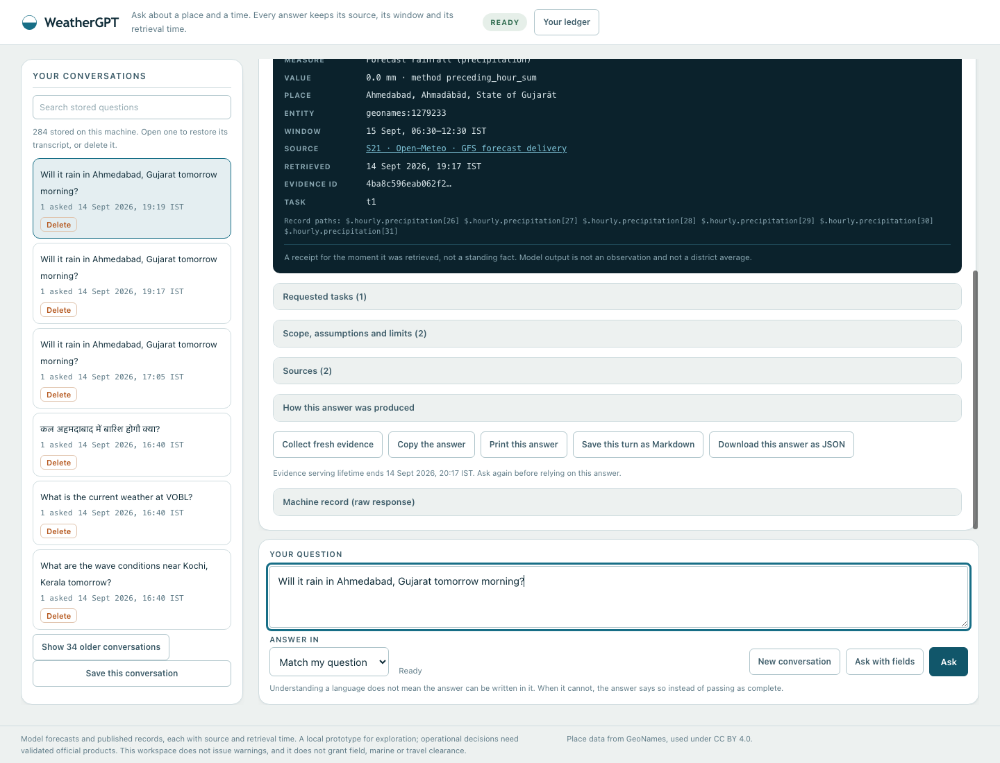

# WeatherGPT — SIH26068

A local conversational weather prototype for India. Ask about a place and a time in your own words and get an answer that keeps its **source, its window and its retrieval time attached to every value** — backed by governed numerical adapters, published records and a local model.

Nationwide and specialist **operational acceptance is not achieved**. This is an evidence-conscious prototype whose limits are part of the interface, not a finished service.



## Run it

```sh
python3 scripts/start_weather.py
```

Open <http://127.0.0.1:8765>. The launcher starts installed Ollama if needed and uses `qwen3.6:latest`; set `WEATHERGPT_MODEL` to another installed model. No paid gateway is required, and the server answers only on loopback with a per-process session token.

Try “Will it rain in Ahmedabad, Gujarat tomorrow morning?”, then “And what about the afternoon?”. Or ask “Show the annual rainfall trend for Ahmedabad district, Gujarat from 1981 to 2010.”, or “कल अहमदाबाद में बारिश होगी क्या?” and choose the intended place.

## What works today

Each answer is presented answer-first — an exact value with its unit and window — followed by a **validity ruler** of the covered source hours, a structured **evidence receipt** (entity, window, method, source, retrieval time, page/row locator, record paths, evidence id) and expandable disclosures for requested tasks, scope, sources and provenance.

- **Point forecasts** at a named place or pinned coordinate: rainfall totals on whole source hours, hourly rain probability, temperature, feels-like temperature, wind and gusts, humidity and visibility, with a bounded refresh when stored evidence is stale.
- **Historical and climate records**: published district rainfall and national climate lookups, comparisons, period totals, charts with exact-value and evidence-id inspection, and a short daily reanalysis window labelled as modeled.
- **Specialist tools**: airport reports for supported ICAO codes (METAR observations and TAF forecasts, each with its own station and validity), modeled wave height, direction and period near a coastal place, and modeled river discharge near a resolved place — each naming the answering model cell and its distance.
- **Published bulletins**: crop/stage passages with page locators and saved source PDFs you can open and download, kept separate from general and warning context.
- **Conversation control**: follow-ups and corrections in one thread, clarify-on-ambiguity with every candidate offered, a stop control, elapsed time, a conversation ledger with search, restore and local delete, and a read-only collection-health panel.
- **Portable output**: copy, print a stylesheet-stripped answer, save a turn as Markdown, download the JSON receipt, or save a whole stored conversation.

## What is not connected

The interface states these limits rather than filling the gaps:

- **No official warning applicability.** CAP lifecycle diagnostics exist, but chat cannot confirm a current applicable official warning. Warning material is shown as reference. Rain, model output and a resolved document hash are never presented as an alert, and there is no subscription, delivery or update/cancel service.
- **No live station observation for an arbitrary place**, no observed water level, gauge reading, danger level, flood extent, tide or current, and no road, route or travel clearance.
- **No field or marine clearance**, no crop diagnosis, no pesticide dosage, and no flood-impact prediction.
- **No invented scores.** No confidence, risk, suitability or probability value is computed for display.
- **Language output is limited.** Hindi and Hinglish questions are understood in scoped paths, and a requested output language is expressible, but fluent Hindi or Gujarati output is **not achieved**; when the answer cannot be written in the requested language, it says so instead of passing as complete.
- **Desktop web only.** Small screens are usable, but this is not mobile platform compliance, and voice is not implemented.
- **Hosting and sharing remain on hold** at the user's request.

## How it is checked

```sh
python3 -m pytest tests/ -q                          # 374 Python tests
node tests/test_charts.js                            #  2 of 34 component checks
node tests/test_views.js                             # 14
node tests/test_bulletin_ui.js                       #  5
node tests/test_conversation_ui.js                   # 13
python3 scripts/audit_workspace_frontend.py --baseline
```

The component checks run against a small DOM shim, so they are **not** browser, visual, load or fluent-language acceptance. What they do hold is specific: every displayed number must come from the returned packet with no arithmetic applied, no renderer may leak a stylesheet class name into visible text, a clarification must offer every candidate, an unverified warning must stay held, and stopping a turn must not claim the server stopped working.

Real journeys are recorded with screenshots in [the frontend batch evidence](research/reviews/frontend-overhaul-20260914/after/live-checks.json). The suite counts are not a completion measure.

## Status and open work

- [Critical full-solution review](docs/21-full-solution-critical-review.md) — the current verdict, findings A01–A08 and the recommended trajectory.
- [Frontend overhaul batch](docs/25-frontend-overhaul-batch.md) — this surface, its findings FE01–FE06 and what it does not establish.
- [Frontend overhaul plan](docs/24-frontend-overhaul-plan.md) — scope, design direction and batch gates.
- [Machine-readable product plan](data/registry/product-progress.json) and [living hardening checklist](data/registry/hardening-progress.json) — stage and finding status.
- [RAG readiness decision](data/registry/rag-readiness.json) and [source registry](data/registry/README.md).

Known-open highlights: **P11** (the server holds one non-blocking conversation lock; there is no bounded queue, no stage streaming, and stopping a turn does not cancel server work), **P10** (collection is request-driven and narrow), **P12** (no user-level acceptance benchmark), **P13** (mobile and voice), **P14** (packaging), plus engine findings A01–A04 on context retention, language output, explanation dependencies and place aliases. No accessibility audit, sustained-load measurement or scientific forecast-skill evaluation has been performed.

## Milestones, newest first

Each links to the batch that recorded it. Older entries are **historical evidence, not current completion claims**.

- [Frontend overhaul batch](docs/25-frontend-overhaul-batch.md) — 374 Python tests, 34 component checks, five recorded journeys.
- [Marine wave and river discharge tools](docs/23-marine-and-river-tools.md) — 374 tests, nine local-model turns.
- [Engine context, language disclosure and task dependency](docs/22-engine-context-repairs.md) — 362 tests, eight component checks.
- [Bulletin parent context and qualified guidance](docs/20-bulletin-parent-context.md) — 356 tests, 16 HTTP turns, four saved PDFs matched by hash.
- [Context and retrieval coverage](docs/19-context-and-retrieval-coverage.md) — 340-test checkpoint.
- [Bulletin retrieval and warning lifecycle](docs/18-bulletin-retrieval-and-warning-lifecycle.md) — 319 tests, 15 HTTP turns.
- [Conversation engine refinement](docs/17-conversation-engine-refinement.md) — 280 tests.
- [Hourly and daily point tools](docs/16-hourly-and-daily-point-tools.md).
- [Answer fidelity and historical analysis](docs/15-answer-fidelity-and-historical-analysis.md).
- [Product review and progress plan](docs/14-product-review-and-progress-plan.md) — the standing stage plan.
- [Conversational recovery](docs/13-conversational-recovery.md), [product workspace and repairs](docs/12-product-workspace-and-repairs.md), [extensive validation and RAG gate](docs/11-extensive-validation-and-rag-gate.md), [grounded answer workflow](docs/10-grounded-answer-workflow.md).
- [Bounded ingestion](docs/09-bounded-ingestion.md), [geography and coverage](docs/07-geography-and-coverage.md), [hardening batch one](docs/06-hardening-batch-one.md), [foundation hardening plan](docs/05-foundation-hardening-plan.md), [data foundation](docs/04-data-foundation.md), [climate pipeline](docs/03-climate-pipeline.md), [data layer design](docs/02-data-layer-design.md), [idea analysis](docs/01-idea-analysis-and-critique.md).
- [The recorded problem statement](docs/00-problem-statement.md) distinguishes the authoritative SIH26068 summary from team interpretation.

## Ground rules

The user-supplied SIH26068 statement is authoritative, and final scope includes nationwide and specialist coverage. Reuse the existing adapters, source registries, numerical contracts and provenance rather than replacing them. Keep entity, time, parameter, unit and source attached to every factual claim, and preserve unknown, missing, stale, cancelled and reference-only states. Credentials belong in local backend configuration and must not reach browser code or chat. Do not publish runtime conversations, logs or restricted source material. GeoNames place data is used under CC BY 4.0.
