# WeatherGPT — SIH26068

A local, evidence-first conversational weather workspace for India. Ask about a place and a time in your
own words; **the model decides what to retrieve and writes the answer**, and every value it writes keeps its
**entity, window, unit and source** attached. A greeting is answered as a conversation, with no source read
and no fact invented.


**Operational acceptance is not achieved.** This is a working prototype whose limits are part of the
interface: it says what it did not read, which state is unknown, and when a value is model output, published
wording, an observation or an official warning. The requirement-by-requirement verdict is
[the PS progress assessment](docs/84-ps-progress-and-pictures.md); the current review and the ordered closure
queue are in [docs/93](docs/93-ps-closure-queue.md).

**How the conversation is measured.** 276 scenarios across the eight features, multi-turn context and
adversarial boundaries (`data/registry/chat-atlas.json`), each declaring the outcomes that would be honest for
it, and a twelve-question battery across twelve intents on the live engine (`tmp/battery.py`). The number that
matters is the **avoidable** refusal rate — a refusal because a publisher issued nothing is the product
working, and is counted separately from one caused by a failed fetch, a bad route or a mishandled window. On
the smaller 51-question corpus that rate went from 19% to 13% on 20 September; the atlas run is larger and
slower and its figures are in [docs/119](docs/119-what-the-atlas-measured.md).

## The answer

The chat is the front door, so this is the part that matters. On 21 September 2026 the engine was measured
against itself and three things were wrong: what the model was *given* was a database, what it was *allowed*
was narrower than what it was shown, and what it was *told to append* repeated itself.

| Question | Before | After |
| --- | --- | --- |
| *What is it like right now in Surat?* | "wind speed 0.0, wind direction 0.0, pressure 1009.0" | 26 °C, mist, 94.0 % humidity — and the model's own next hours, said to be grid-cell output |
| *and tomorrow?* (the very next turn) | 2.3 s, `unavailable`, "No supported parameters requested" | answered: 5.3 mm, 26.3–31.1 °C, 72–94 % humidity over the window |
| *why?* (after a warning turn) | "no source is wired to this chat" | a real explanation of the day-2 row, 2.8 s |
| *Will it rain in Ahmedabad tomorrow?* | 109 words, the same caveat twice | **45–61 words**, the finding first, the source named once |
| *Air quality in Delhi today?* | 199 words, 41 numerals, opening on a place label | 111 words: the index, its 24-hour range, PM2.5 and PM10, the rest as ranges |

Three repairs carry that table, and each is recorded with its measurement in
[docs/133](docs/133-the-message-the-reader-gets.md):

- **The station fields a reader means are read.** The two station layers spell the same measurement
  differently and neither says so — the METAR layer prints `temp`, `rh`, `windsp` — and the reader that
  consumed them accepted the product's own spellings, which neither layer emits. Temperature and humidity
  could not be produced by any METAR. Wind and pressure matched only because their spellings happened to be
  the layer's, which is why a question about the weather was answered with an air-pressure reading.
- **The composer is handed the answer's material, not the database.** Widening what the model could see made
  the answers right and long — nineteen facts produced an answer naming eleven separate measures, while the
  numeral budget sat happily at 0.20 numerals per word. The composer now receives the measures that answer the
  question, ranked, with a series longer than three rows arriving as its range and the rest travelling as
  citable further evidence; a draft that still recites is sent back to the model once with its own shape
  quoted at it.
- **A caveat the answer already carries is not appended under it.** Two mechanisms put a caveat in front of a
  reader — the model writes it, and the engine appended a held clause when the prose did not carry it
  *verbatim*. The Ahmedabad answer said "not an observation or a district average" and then "not observed
  conditions or district averages"; the card batch measured **481 of that reply's 667 characters (72 %)** as
  caveat-said-twice or a place note the packet already carried as fields.

Measured at the end of the batch: **14 of 14 answers in the battery are model-written**, median 4.7 s. The
answer card is [docs/136](docs/136-the-answer-as-a-page.md): the finding first, the engine's clause once under
a hairline, the remaining sentences behind a closed fold whose label carries the ruler's own finding, a byline
that says whether a model wrote it or the tools did, the claim stating **which kind of thing** its value is,
and the register — brief, conversational, full — wired to something a reader can actually reach.

**What keeps that safe is the check, not the prompt.** Every number in the prose must come from the
evidence the model was shown, every unit must match its source, the place must be named, an invented
link or certainty is refused, and the language must be the one asked for. When any of it fails the
deterministic renderer's text stands instead, and the reason is recorded on the turn. That text is
kept on every turn as `tool_answer` whether or not the prose replaced it.

Three things a rewrite can never drop: a published passage the answer cites is quoted verbatim, in
the publisher's own words; the safety clauses are *held* and put back if the prose loses them — that
an absence of official guidance is not an all-clear, that a warning reading is not an instruction,
that two sources agreeing is not confirmation when one may feed the other; and a turn whose evidence
is a bulletin must cite the bulletin or keep the floor.

A turn that has to ask something back is written too, under a stricter rule: it may not state a
value, name a place the tool did not name, or introduce a digit the tool did not write.

**The check also has to know when it is not needed.** The mechanism that puts a held safety clause back
could not tell a paraphrase from an omission, so it appended a statement the answer had already made:
"not an observation or a district average" and then "not observed conditions or district averages", in one
paragraph. A clause the prose already carries is no longer appended — the comparison runs over the clause's
own content words with a prefix match, so `forecast`/`forecasts` and `observed`/`observation` count as the
same claim — and the clauses it did carry are recorded on the turn rather than silently dropped.

## The day

The palette is not a theme. It is computed from the sun's real altitude and hour angle at the reader's own
latitude, once a minute, and the ground is bimodal because it has to be: with these inks there is no ground
luminance at which both the dark and the light ink clear 4.5:1 — the crossover is 3.84:1 — so the page flips
between the two ink families at the same two altitudes the ink does (sun at −6° and +8°) and drifts only
inside each regime. `frontend/tools/hours.mjs` installs a fixed clock in the page and captures the same route
across the day, because a screenshot at the hour this machine happens to be in proves nothing about the other
twenty-three.

| 06:00 — daybreak | 10:00 — morning | 14:00 — afternoon | 18:00 — golden | 22:00 — night |
| --- | --- | --- | --- | --- |
| 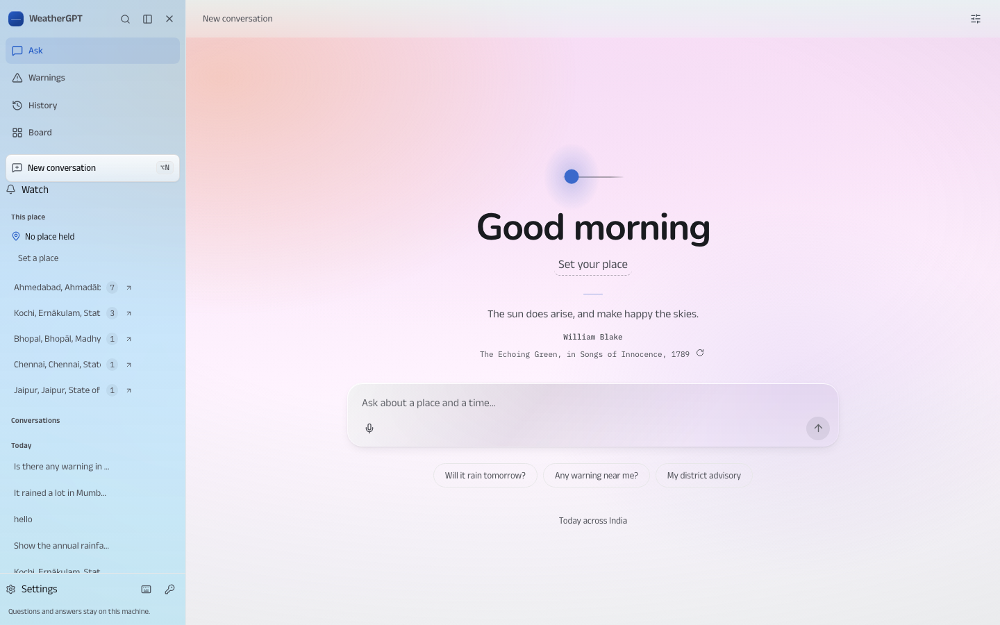 | 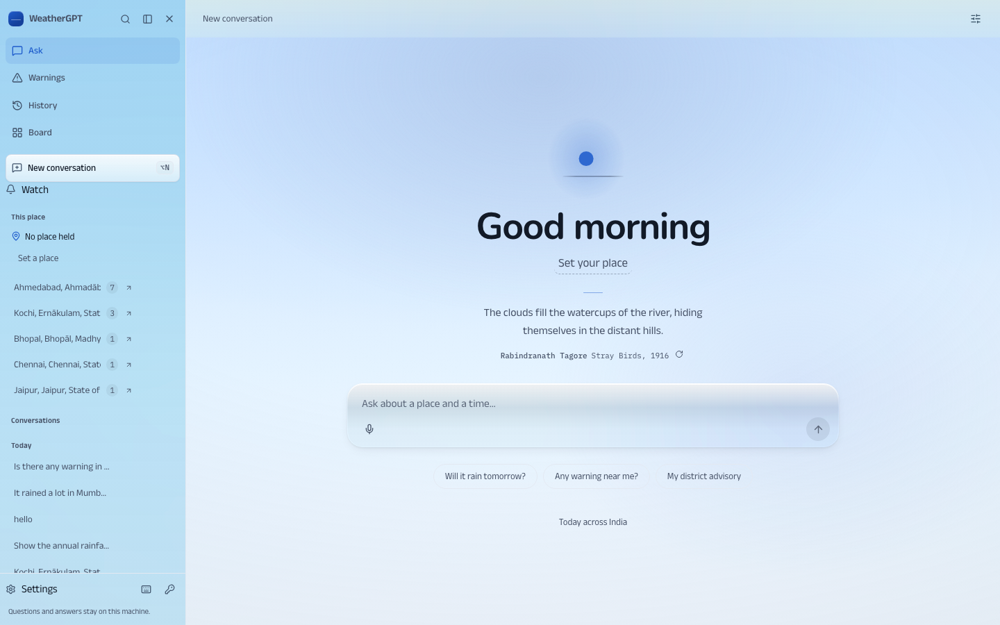 | 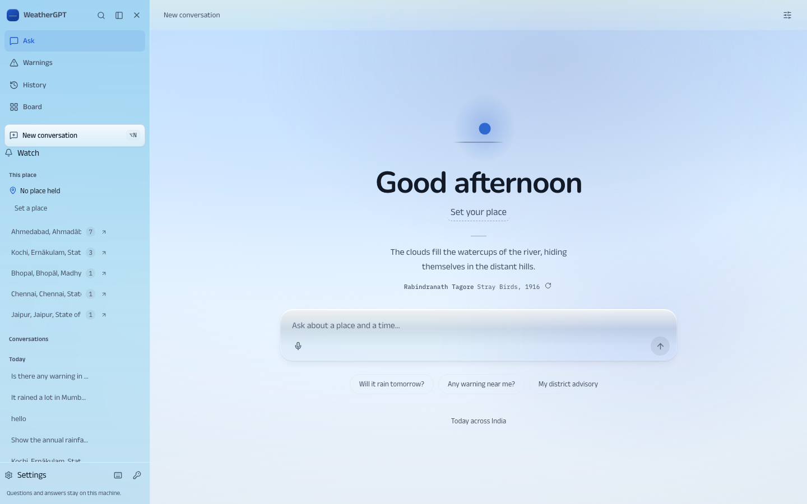 | 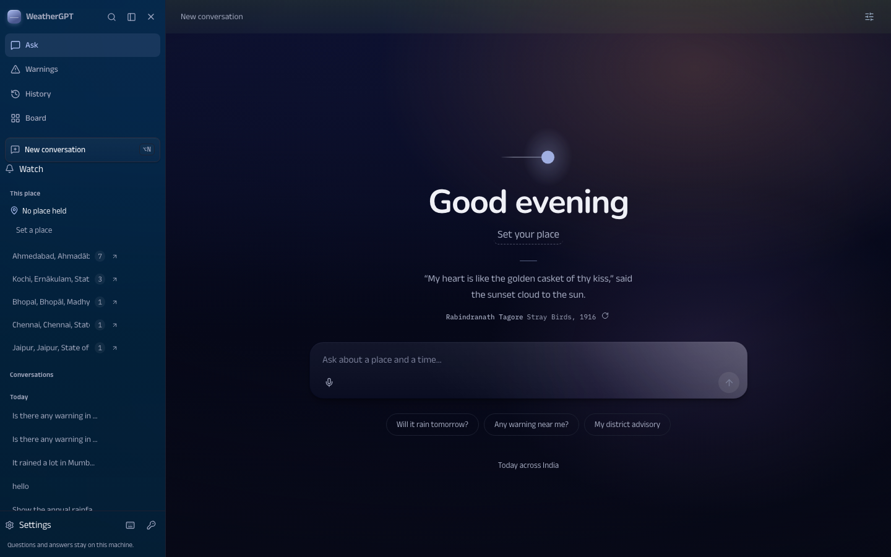 | 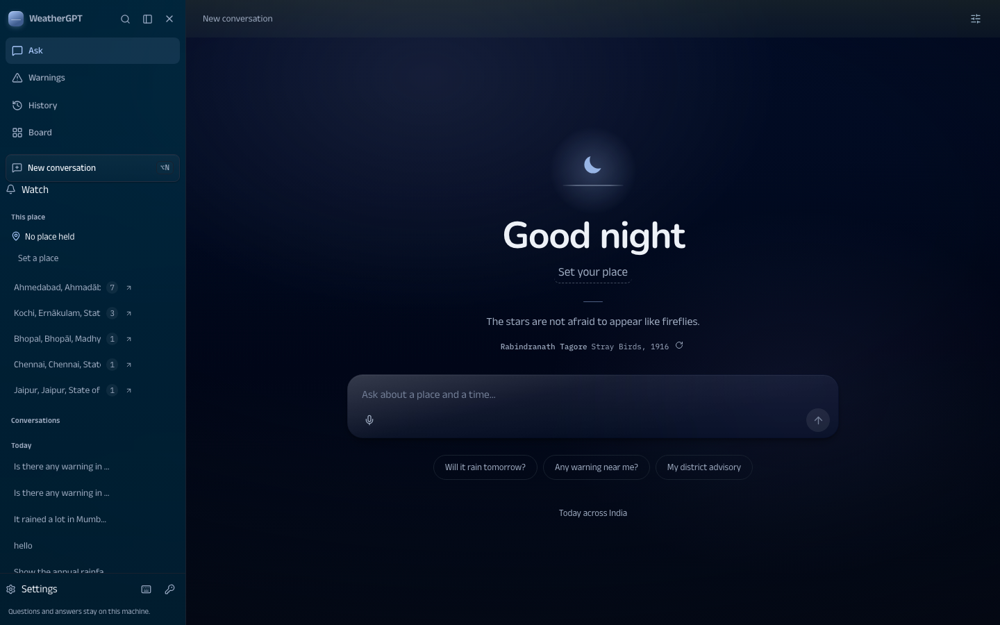 |

The rail, the top bar, the reader's own bubble and a pane each take their own material from the same hour:
how much of the hour's light each surface catches, warm or cool, how opaque. The numbers that hold the design
are measured in vitest against computed colours rather than against the four old phase anchors, which is why
they can be checked at all — jsdom has no layout engine for axe's own contrast rule — and the hazard distance
is measured in a browser as well, because a translucent film has to be composited before it can be compared
with anything.

| What was measured | Result |
| --- | --- |
| Ink on the gradient band the text actually sits on, 3 latitudes × both solstices × every 15 solar-minutes, plus minute sweeps through both regime flips | worst **12.13:1** for paper, **5.55:1** for mist |
| The same sweep *before* the batch | **22,619 readings under 4.5:1, worst 1.001:1** — near-black ink on a violet sky at 8.1° solar altitude |
| Separation between the four materials, in OKLab | rail/bar 0.0303 chroma and 21.3° hue; bar/bubble 0.0508 and 98.8°; the floors in the test are 0.010 and 15°, set from the measurement |
| How far any material stands from the four published IMD hazard colours (`tools/hazard-distance.mjs`, composited, OKLab) | **nothing within 39 ΔE of a hazard colour** — and the honest residue: the reader's own bubble sits in the *same chroma and hue family* as IMD yellow for 12 of 66 material-hours, as close as 0.7 chroma and 1.0° at noon, separated from it by lightness alone |

Two faults were found and repaired on the way, and the first is worth stating plainly because it is the shape
of most of this repository's defects: **the continuous spectrum was written on the document element while
`data-hour` sat on two, so `.g`'s match on the static hour block beat the parent's inline style.** At 17:00
IST the root computed `--g-sky-1 #332a43` and the sky the reader was looking at read `#c4d9f5` — the static
noon palette. The previous batch's claim was true of the function and false of the page. That is recorded in
[docs/134](docs/134-light-and-material.md), together with what was refused: `transitions.dev` was fetched whole
(32 patterns, the author of the thinking-orbs docs/130 already integrated) and read as a set of decisions
about duration, easing and asymmetry, **not copied** — that repository carries no licence file; `rareui.com`,
`obsidianui.dev` and `21st.dev` were browsed as interaction references and no component library was adopted;
`designspells.com` sits behind a bot check from this machine and was not used.

## What it looks like

The eighteen guided surfaces are the other half of the product, and the judgement they were reworked against
was not "is this correct" — it is — but **would anybody choose to open it, and would it tell them something
the chat would not**. Measured before anything changed: **eight of the eighteen printed "No point was named,
so no … was requested."** where the answer belongs, and a ninth opened on "Choose your place". The six that a
previous pass had called "dense, honest instrument tables" opened on their own disclaimers — the
forecast-verification surface spent its first screen on *"What this comparison is"*.


|  |  |
| --- | --- |
| 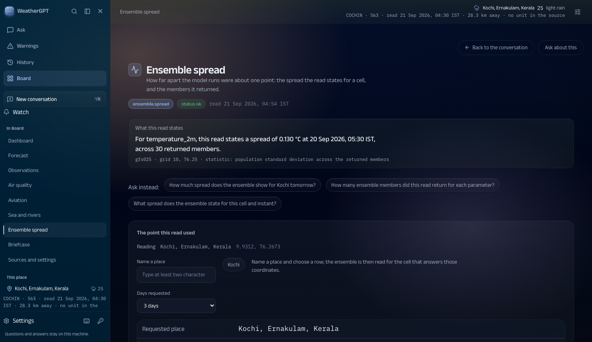 | 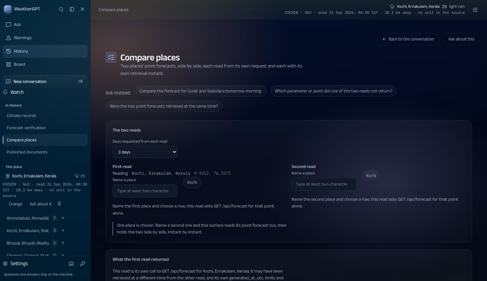 |
| **Ensemble** opens on the spread the read states, at an instant, across the members it returned — and says the spread is not a probability, a confidence or a skill score. | **Compare** opens on both places' own readings, side by side, with the boundary stated once: not a ranking, not an average, not a confidence. |
| 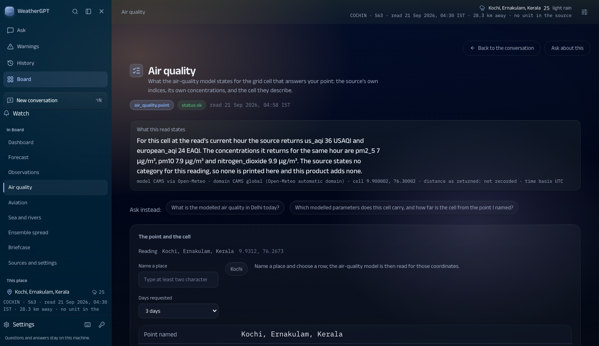 | 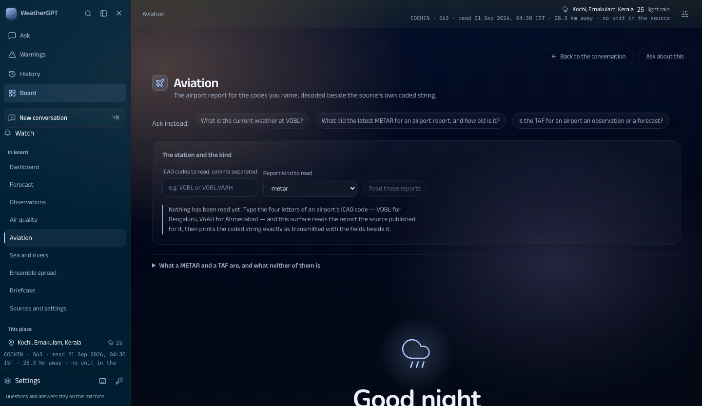 |
| **Air quality** names both indices and the concentrations, and says the source states **no category** for this hour rather than grading it — no health advice, no protective action. | **Aviation** leads with the report decoded into words and keeps the raw METAR string verbatim beside it, because the publisher's own characters are the evidence. |
| 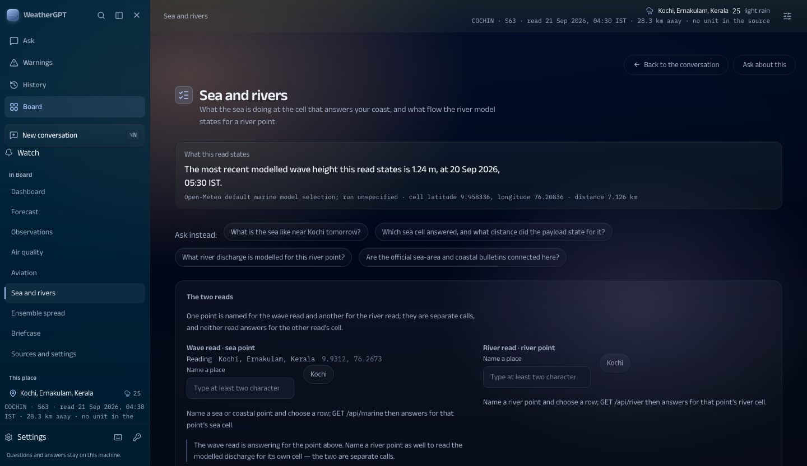 | 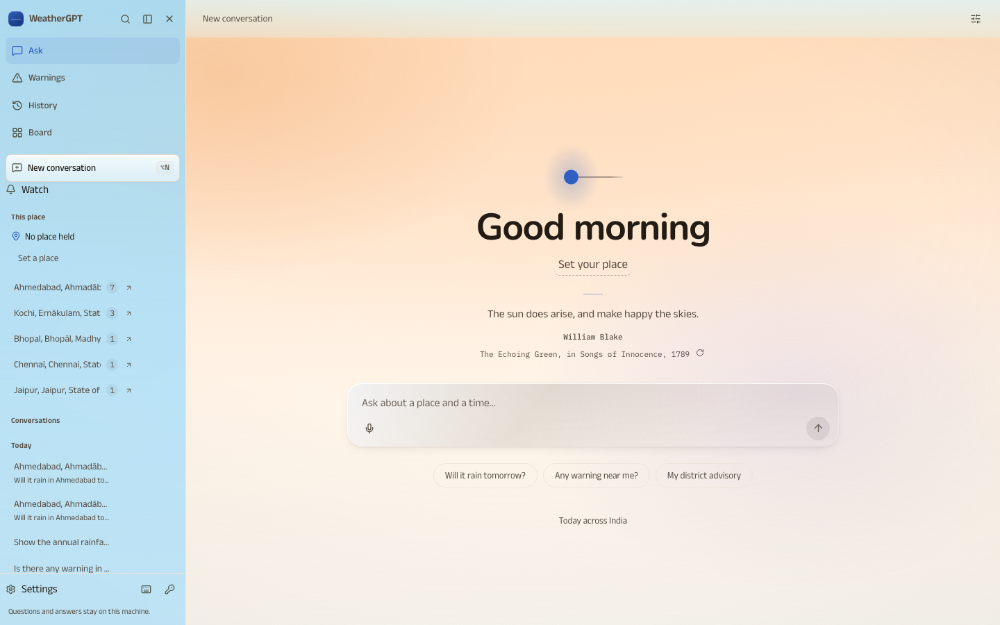 |
| **Sea and rivers** opens on the most recent wave height the read states, the answering cell and its distance — never an observed water level, a gauge reading, a tide or a current. | **Ask is the front door.** One rail: the four homes, the place the answers are about, the reader's conversations with their own pins above the recency groups. |

**Where these pictures come from.** The five guided surfaces are this machine's React build, captured
21 September 2026 through `frontend/tools/capture.mjs` at 1440×900 in headless Chrome on loopback with a place
held in the rail, so no reader's own question appears in them; the full set — both themes, four widths, and a
held-place set — is in `research/reviews/final-overhaul-20260921/modules-batch/` with its own report, and it
reports 48 captures with zero overflow and zero failed requests. The answer card is a recorded live turn
(`research/reviews/final-overhaul-20260921/chat/`), with the packet it was rendered from beside it and the
printed page measured with `pypdf`. The two Ask screens are `frontend/tools/journey.mjs` (a real question typed,
a real answer waited for) and the day strip is `frontend/tools/hours.mjs`, which installs a fixed clock so the
hour in the picture is the hour the sun is at rather than the hour the capture ran. Every one of those tools is
in the repository and prints what it measured.

Each surface's verdict — INVEST, LEAVE or CUT, with the reader's own question beside it, what was deleted and
what was left alone — is [docs/135](docs/135-what-each-surface-is-for.md). Ten blocks were deleted from first
screens and moved word-for-word into a `<details>` under the evidence rather than rewritten, with the same
test ids: the five disclaimer cards, Map's build manifest (file names and byte budgets, which left the opening
of the map surface), Aviation's route note, and the "No point was named" sentence on eight surfaces. One
written decision was reversed and said so: a *held* place is a request the reader already made, so the
point-taking surfaces now start from it — and nothing is fetched when none is held.

Two defects the surfaces lane found outside its own files are repaired in the same batch: `GET /api/marine`
answered `status ok` for **inland Patna** with a "sea cell" 3.66 km away and `wave_height` null at all 216
points (the 50 km guard tests distance, and the provider answers with the nearest grid point whether or not it
is sea — a series view that states no value anywhere is now `unavailable`, while a genuine zero still counts
as a value); and the welcome screen was rendered underneath an open module, so a reader saw the module and
then "Good morning" below it.

## Status at a glance

| | |
|---|---|
| **Delivered in scope** | Point forecasts and cross-source comparison, published historical and climate records, official district-warning applicability resolved against IMD's own geometry, plan monitoring with a local inbox, published-document retrieval with page/issue/currency attached, marine and river point products, airport reports, air quality, ensemble spread, archived-run forecast verification against reanalysis, farming advisories, a desktop workspace with eighteen guided surfaces beside Ask, and a model-planned conversation that decides when to retrieve, answers a greeting without inventing anything, writes the sentence around tool-owned facts, and carries its artefacts. |
| **Partial** | Warning delivery (canonical warning state with a named change detector, a claim/lease outbox with a retry taxonomy, consented Web Push, acknowledgements and a supervision heartbeat exist, and since 20 Sep the service worker and manifest that make them reachable in a real browser; **no live device journey and no sustained live-IMD run have been demonstrated**), language output and voice (measured per direction, not accepted by native speakers), retrieval breadth (whole-document and contradiction handling remain open). |
| **Not connected** | Radar/satellite **imagery**, official sea-area and coastal bulletins as live products, observed water level or gauge readings, danger levels, flood extent, tide, current, sea-surface temperature, ground air-quality monitors, SMS/IVR/WhatsApp delivery, road or route clearance, crop diagnosis or pesticide dosage, and any confidence, risk or skill score. |
| **Not accepted** | Nationwide corpus acceptance, mobile and rural journeys, noisy-input and native-speaker review, live changed-edition to device notification, fresh-machine and cross-platform installation, sustained load. Hosting is no longer held — `Dockerfile`, `fly.toml` and [docs/118](docs/118-deploying-this-workspace.md) exist — but **the image is unbuilt and nothing is deployed**. |

## Progress against the problem statement

The eight features SIH26068 names, read against this repository today. The full assessment, with the evidence and
the explicit gaps for each row, is [docs/84](docs/84-ps-progress-and-pictures.md); no row claims acceptance from a
check, a count or a screenshot.

| PS requirement | State | One line |
| --- | --- | --- |
| 1 Real-time weather information | **partial** | Refreshable forecasts, station reports, published warning days and a composed Now reading; coverage, freshness and station quality vary by place. |
| 2 Natural-language querying | **delivered in scope, partial overall** | The model plans every turn, a conversation is answered without retrieval, and a fact turn gets a written answer behind checks; unfamiliar compound requests are not independently adjudicated. |
| 3 NWP integration (GFS/WRF named) | **delivered in scope** | Governed GFS and best-match products with comparison and provenance; WRF is not connected, and a comparison can share lineage. |
| 4 Alerts and early-warning dissemination | **partial — reachable now, still not demonstrated** | District warning applicability, plans, an outbox and consented push exist, and so, since 20 Sep, does the service worker the app had always registered but this repository never contained — until then no push could have arrived in any browser. A question naming a state now sweeps that state's districts. No live changed-edition to a real device has been demonstrated, and CAP reference resolution never authorises dissemination. |
| 5 Location-based forecasts and advisories | **partial** | Place resolution, district identity, crop/stage intake and cited bulletins; nationwide advisory acceptance and field applicability remain open. |
| 6 Indian-language support | **partial, measured, awaiting a speaker** | 22 measurable languages are checked. Two rendering defects were found and fixed on 20 Sep: a bare metre unit ate the first letter of the following word, and the value placeholders were numbered in a sequence the translator would happily continue past the end. Sixteen live Hindi and Gujarati answers now render 15/16 in the requested script, and are with a native speaker for acceptance. |
| 7 Climate trends and historical analysis | **partial** | Published history, source-constrained trends and charts, and reanalysis windows up to a year — a month or a season is one question since 20 Sep, where the seven-day cap used to push "rain in August 2026" onto an annual series that ends in 2010 and could only refuse. Not a climate-research workspace, and no attribution claims. |
| 8 Voice for rural accessibility | **path implemented, not accepted** | Transcription, spoken output, Hindi/Gujarati round trips and a Listen control; no noisy-field or native-speaker validation. |
| Mobile-based platform | **not accepted** | Responsive layouts are checked; the desktop web is the current surface by user direction, and touch/permission/low-bandwidth journeys remain open. |
| Met databases/APIs and an LLM query engine | **delivered in scope, breadth partial** | 70 ledger entries with a recorded status and probe; governed tools, an index and provenance; registration is not selection. |
| Scalable real-time ingestion | **not demonstrated at service scale** | Bounded queues, leases, retries and retention, and the gate now runs on every push. No load, uptime or fresh-machine acceptance. The stores are SQLite and a 306-question run alongside the test suite is enough to make them contend, which is the honest ceiling of this architecture rather than a tuning problem. |

## Run it

```sh
python3 -m venv .venv
source .venv/bin/activate
python -m pip install -r requirements.txt      # runtime, including the optional PDF stack
python scripts/start_weather.py                # preflight first, then serve on 127.0.0.1:8765
```

Open <http://127.0.0.1:8765>. **The served surface is the built React frontend**: build it once with cd frontend && npm install && npm run build; a missing build is refused in words rather than served as a blank page. The vanilla web/*.js frontend was deleted when R6 closed; the built React frontend is the only served surface (docs/92, §5). The server answers only on loopback, behind a per-process session
token, and it refuses to start on a check it cannot pass (a registry that does not parse, an unusable
store, a taken port) rather than serving a half-working workspace. **Restart a running server after
pulling**: changing files does not update a process that is already serving. That one has bitten a
measurement run, not just a reader — a scenario sweep against an unrestarted server reported, in
detail, the behaviour the edit had just replaced.

### On a phone, and on a real URL

    ./scripts/demo_on_phone.sh      # an HTTPS link for a phone, in about a minute

The Web Push API, service worker registration and PWA install all require a **secure context**, so a
phone opening `http://192.168.1.x:8765` gets none of them — the browser refuses before any of this
product's code runs. `localhost` is also a secure context, which is exactly why none of this shows
up while developing. The script opens a Cloudflare quick tunnel (no account), reads the hostname and
starts the workspace with that hostname allowed and an access key required.

For a real deployment see [docs/118](docs/118-deploying-this-workspace.md), `Dockerfile` and
`fly.toml`. Three things change outside loopback and each takes a deliberate flag rather than a new
default: `--host` (still `127.0.0.1` by default), `--public-host` (the Host and Origin checks are a
DNS-rebinding guard, and a mismatch refuses every request in a way that looks like a total outage),
and `WEATHERGPT_ACCESS_KEY`. The last one matters because the page token stops another origin but
not a person: anyone who can load the page is handed one. **The access key is a door key for a demo,
not user authentication** — everyone holding it is the same anonymous visitor — and it exists so a
public URL cannot spend this workspace's provider budget on whoever finds it.

### The React frontend (shell, transcript, and every surface as a module)

The frontend overhaul is planned in [docs/86](86-react-frontend-overhaul-plan.md), researched in
[docs/87](87-frontend-research-and-inspiration.md) and reported per batch — the R6 batch and the record of its execution are
[docs/92](92-r6-decommission-readiness.md). **The React build is the default and the only served surface**: R6
deleted the vanilla tree on 17 September 2026, having first ported the component checks (docs/92 §5). Build it,
serve it, and check it:

    cd frontend && npm install && npm run build    # builds web/dist
    python3 -m weathergpt_data.workspace --port 8790
    cd frontend && npm test                        # 80 component suites, 516 checks, run under Vitest
    python3 scripts/audit_react_frontend.py        # 18 checks over the built page and its sources
    python3 scripts/audit_react_build.py           # 11 checks over the built output

**The shell was rebuilt on 19 September 2026** ([docs/113](docs/113-shell-and-chat-surface.md),
[docs/114](docs/114-places-and-search.md)): one rail does all the navigation — four homes, the two actions, the
places this machine knows, the reader's conversations with their own pinned ones above the recency groups, ⌥N and
⌥1–⌥9 beside the rows they open, and ⌥/ for the list of keys — and it collapses to 60px, remembering the
arrangement in this browser. **A place is the second entity**: each conversation row carries the place its own
answers resolved (the engine's resolution, never a city name read out of the question), the places are listed with
their counts, choosing one holds it and narrows the list, and a row can be pinned with the same store the module
surfaces write — or given the reader's own name, which is a display name and never the label an answer is read
with. The search reaches every stored turn rather than only the opening question, and says which turn matched.
A running conversation can be saved whole as one markdown file, each answer keeping its own values, windows and
source ids. A right-hand panel holds the three things an answer depends on (place, language, persona) and states the
nearest station's report as its source printed it. The bar names the thread. The welcome states the reader's own
sky, lets a reader name a place from the screen itself, and carries a line of verse — fourteen lines, each checked
against the edition it came from ([docs/112](docs/112-welcome-screen-and-sky-mark.md)). The legacy chat surface and ten other unreachable
modules were deleted in the same batch after measuring that nothing served still read them.

The React surface has the transcript (the question kept above its answer, the working turn naming the engine's
stages, its provisional first reading and the elapsed time, the validity ruler, the receipt, the sources, the
reading register, stored conversations, and a voice path that keeps the measured-language rules and reads the
recogniser's own report back as recognition only), eighteen real modules
(Today, Warnings, Forecast, Observations, Published documents, Sources and settings, Map, What changed,
Farm advisories, Air quality, Climate records, Aviation, Ensemble spread, Forecast verification, Compare places, Sea and rivers, Briefcase, Workspace).
**Each of the eighteen now opens on a reading of its own** rather than on a card of disclaimers or a request for
a place ([docs/135](docs/135-what-each-surface-is-for.md)): verification on the error this read measured, ensemble on
the spread and the member count, sea and rivers on the latest wave height with the answering cell and its distance,
air quality on both indices the source returns and the category it does NOT state, aviation on the report decoded
into words with the raw string kept verbatim beside it, and compare on both places' readings with the boundary
stated once., the chart block, a command palette, the
front door and the local owner gate. Every surface in the frozen registry is a real module — eighteen of them, with Ask as the conversation
itself, and `scripts/audit_surface_registry.py` holds the served surfaces against the same ids the vanilla build
answered ([docs/91](91-frontend-r3-r5-all-surfaces.md)). Renderings: [docs/90](90-frontend-r2-flagship-transcript.md),
[docs/91](91-frontend-r3-r5-all-surfaces.md), the React picture set above, and `frontend/public/shots/`.

The served page keeps the session-token contract and the **strict** CSP (`script-src 'self'`, `style-src
'self'`): docs/87 predicted a `style-src-attr` relaxation would be needed for Radix, TanStack Virtual and
Motion, and the R0 probe measured that it is not — all three get the computed styles they need under the
existing policy. A missing build is refused with the command to build it, never served as a blank page.

The push suites and the push panel need `pywebpush` and `cryptography` from the project
environment; a bare system `python3` runs everything else but reports the push checks as missing
dependencies, and the preflight names that state too.

Try *“Will it rain in Ahmedabad, Gujarat tomorrow morning?”*, then *“And what about the evening?”*.
Or *“Show the annual rainfall trend for Ahmedabad district, Gujarat from 1981 to 2010.”*, or
*“कल अहमदाबाद में बारिश होगी क्या?”*.

## Ask it anything — how the conversation decides

**The model plans every turn** (`WEATHERGPT_PLANNER=model`, recorded on the turn as
`trace.planning.planner_policy`). The deterministic rules are not a silent fallback: they plan only when
the policy asks for them, and a provider outage is reported by name instead of being answered from a floor.

- **It decides when to retrieve.** A short first look (`WEATHERGPT_ROUTER`) asks *conversation or task*.
  A conversation is answered in that same call; a task goes to the full planner, which owns every task.
  A route the model cannot decide is a task, so the safe path is the default.
- **It talks.** Greetings, thank-yous, capability questions, meta questions, general reasoning and
  off-topic messages are answered from a deterministic picture of this workspace — the clock, the callable
  tools, the source-ledger counts and what it does not do — with **no tool run**. The turn carries
  `status: conversation`, no fact and no citation, and the card says *No source read*.
- **Nothing is invented.** A conversational reply is rejected if it states a measurement unit, a date or a
  time, a number beside a weather word, a warning claim, a source identifier, a link or present weather at a
  place. One repair is attempted with the violation named; a reply that still fails is withheld and the turn
  says so.
- **A turn with facts gets a written answer** from those facts, behind number, unit, evidence-id, place,
  link, certainty and language checks. Any failure leaves the tool-owned renderer stating the facts, with the
  refusal recorded in `trace.generation`. The fact row, the ruler and the receipt stay tool-owned.
- **The conversation carries.** A continuation inherited from the last turn says what it kept and what
  changed (*"Continuing from your last message · changed: time. Context the engine kept. Not new evidence."*),
  and the four continuity journeys are measured end to end.

| Message | Provider | Result |
| --- | --- | --- |
| "hello" | DeepSeek | 0.93 s, a conversational reply, no source read |
| "what can you do?" | DeepSeek | 1.11 s, the real tools and limits, from the workspace ledger |
| "what is 17 times 3?" | DeepSeek | 0.89 s, "51", stated as general knowledge |
| "नमस्ते" | DeepSeek | 1.14 s, answered in Devanagari |
| "Will it rain in Surat tomorrow morning?" | DeepSeek | 5.9 s, one tool-owned fact (0.4 mm, GFS) with a written sentence |
| "thanks!" | DeepSeek | 0.73 s, continuity kept |

## Providers: free cloud models, the reader's key first

The configured order is stated on the **Sources and settings** surface, with each provider's availability and
the last failure, so a reader never has to guess who answered or why something was slow.

- **`WEATHERGPT_PROVIDERS`** takes `deepseek_first` (the configured default when a DeepSeek key is
  present), `deepseek`, `cloud_free` or `local`. `deepseek_first` answers from the paid DeepSeek endpoint
  and keeps the curated free OpenRouter ids behind it as failover.
- **Keys live in local configuration only** — `data/runtime/model-config.json`, git-ignored, mode 0600,
  never printed and never logged. Only ids ending in `:free` are ever routed on OpenRouter, so that
  configuration cannot bill an account.
- **The local model is frozen**, not a fallback that runs by itself: it is used only under
  `WEATHERGPT_PROVIDERS=local`, which exists to diagnose an offline machine.
- **Whole-step budgets** bound every call (12 s for the first look, 25 s for a written answer, 45 s for a
  plan), so a refused endpoint reaches the reader with an honest error instead of a two-minute retry loop.

```sh
python3 scripts/models.py                     # routing order, availability, key source
python3 scripts/models.py --set-key deepseek  # hidden prompt; writes the local config at mode 0600
python3 scripts/models.py --set-key           # the same, for OpenRouter
python3 scripts/models.py --check             # plan two questions through the router and print the trace
```

Whichever provider plans a turn, it supplies **candidates only**: model output never executes code, never
supplies a measurement, and never decides an entity, window, unit or source. Every answer's trace names the
provider, the model and any failover. Routing a question to a hosted model is a stated trade — the question
text leaves this machine, and the paid endpoint is billed to the key the reader configured.

## Watch delivery, and the supervision truth

Watches are checked in the foreground: by the API when you ask, by `scripts/check_watches.py`, or by
the supervised loop below. **No hosted daemon is installed**, and the product says so rather than
implying a service. An OS schedule now exists for the daily data refresh — see below — but it is a
refresh schedule, not a delivery service:

    python3 scripts/watch_daemon.py --interval 900   # check, dispatch, escalate, heartbeat
    curl -s -H "X-WeatherGPT-Token: $TOKEN" http://127.0.0.1:8765/api/watch-health

GET /api/watch-health reports the supervision mode (foreground-supervised when a fresh daemon heartbeat is
present, manual-recent after a manual run, otherwise manual-only), the heartbeat and its freshness, the
outbox counts by state (including claimed and dead), the watch counts and the plan watcher. The **Plans &
inbox** panel renders the same truth, including dead-letter rows with their last error, so a queue is never
read as a delivery service. For unattended operation the loop belongs under an OS supervisor; a stale
heartbeat is what would prove it stopped.

## Keeping the data current, and knowing when it is not

    scripts/install_daily_schedule.sh            # install or update the twice-daily refresh
    scripts/install_daily_schedule.sh --show     # what is installed, and when it LAST ACTUALLY RAN
    python3 scripts/audit_freshness.py           # what each shelf covers, and whether it is firing

Twice a day, not once: a weather product refreshed once is stale for most of the day, and IMD
publishes the district bulletins in the morning and updates the warning layer through the afternoon.

**On macOS this is a LaunchAgent, not a crontab, and the reason matters.** The crontab entries were
installed on 20 September and both of that day's slots passed without running — the laptop entered
sleep ten minutes before the first one and cycled sleep/wake all morning, and macOS cron skips a job
it missed while asleep rather than running it on wake. `crontab -l` showed two correct entries the
whole time. On a laptop, that is worse than no schedule: it looks like one. launchd's
`StartCalendarInterval` runs a missed slot as soon as the machine wakes, which is the behaviour a
daily refresh actually needs. On Linux, where a server does not sleep, it stays a crontab.

**And installed is still not running.** Proving it exposed a second, larger blocker: with this
project on the **Desktop**, the scheduled job cannot run at all. macOS protects Desktop, Documents
and Downloads, and a launchd- or cron-spawned process does not inherit the Full Disk Access your
terminal has — launchd fired the job, bash could not `getcwd` into the directory, and it exited 126
having done nothing. Two ways out, the first needing no permission grant:

1. Move the project somewhere unprotected (`~/WeatherGPT`) and re-run the installer.
2. System Settings › Privacy & Security › Full Disk Access, add `/bin/bash`, re-run with `--verify`.

`scripts/install_daily_schedule.sh --verify` runs the job through launchd and checks whether the
refresh record actually moved, so this failure is loud instead of silent. **Until one of those two
is done, the daily refresh on this machine runs only when someone runs it by hand.**

That episode also changed what the audit asks. Reporting *scheduled* was true throughout the
failure. It now reports **installed**, **by what mechanism**, and whether it is **firing** — judged
from when the refresh last ran, not from what is configured — and says `NOT FIRING` past a
twenty-four hour budget.

## What it answers today

Each answer leads with the value, its unit and its window, then shows a **validity ruler** over the
covered source hours, a structured **evidence receipt** (entity, window, method, source, retrieval
time, page/row locator, evidence id) and disclosures for requested tasks, scope and provenance.

- **Right now, and what happens next.** The nearest station reports with distance and age, the
  published district day, and the next model hours — kept apart, with one line naming what is not
  connected. The Today surface opens with a **Now band** that places the observed instant, the published district
  window and the model hours on one time axis, with the read-at instant taken from the payload. Point forecasts cover rainfall totals on whole source hours, rain probability,
  temperature, feels-like temperature, wind and gusts, humidity and visibility, with a bounded refresh
  when stored evidence is stale. Two sources can be compared with their difference and the
  shared-lineage caveat, never a score; ensemble member statistics (mean, spread, range, nearest-rank
  p10/p50/p90) are drawn as an ensemble plume (p10-p90 band, median, mean, min-max whiskers) with an
  exact-value table, never as probability or skill; the hourly forecast is drawn as a meteogram, and every
  answer window carries a validity ruler whose covered spans and gaps can each be inspected.
- **Air quality.** CAMS modelled concentrations and the source’s own indices at a grid cell, with
  the provider’s current hour kept apart from the window; no health advice, no risk score, no
  protective action and no ground monitor connected.
- **Published records.** District rainfall and national climate series with charts, exact-value
  inspection and page/row locators; a daily reanalysis window of up to a year, labelled as modelled,
  so a month or a season is one question and a window running into the publication delay serves its
  published part and says where it stops; airport METAR and TAF reports each with their own station
  and validity, reachable by the city name a reader actually uses rather than a four-letter ICAO code.
- **Warnings and plans.** The official district warning day resolved to your place against IMD's own
  geometry, with the CAP relay reported separately and never merged into one verdict. **A question
  that names a state, or no place at all, sweeps districts rather than hunting for a settlement**:
  "any warnings in Kerala today?" used to offer four hamlets in Rajasthan spelled like it, because
  the thirty-six states were sitting in the geography database unconsulted. A state answer reports
  how many districts it could *not* attribute — the warning product publishes no state of its own, so
  attribution is by name against the reviewed directory and is partial — because a count whose
  incompleteness is invisible is worse than no count. an alert brief
  you can keep, a plan-monitoring inbox, and legacy watches that record a changed official state.
  A no-match is never an all-clear and origin authentication remains unverified. Each of the five days carries
  its own derived IST date and window (Day 1 is the bulletin date), and every surface says the window is
  derived rather than published per day. The national product is
  also drawn as a district x day matrix whose cells carry only the colour the source printed, with an unknown
  hazard code flagged on the cell rather than dropped.
- **The published corpus.** A named national, state, district or marine product answers from the
  indexed documents with its family, region, physical page, printed issue date, measured currency and
  retrieval instant attached; warning-classified text stays reference-only, earlier editions are
  retired from current retrieval, and a saved PDF opens from this origin on request. A **Published
  documents** surface lists every edition this machine holds with its printed issue date, measured
  currency and the state of its saved body — as cards and as a table — so the corpus can be browsed rather
  than only asked about.
- **Specialist products.** Modelled wave height, direction and period near a coastal place, and
  modelled river discharge near a point — each naming the answering cell and its distance, never
  standing in for an observed water level, gauge, danger level, flood extent, tide or current. The
  national sub-basin list is shown with its day fields verbatim and no derived flood class.
- **The published days are laid out beside the reading.** Each day carries the colour the source printed and its
  hazard wording; the model hours are counted into the IST day their timestamp falls in, the station is placed on
  the day it reported, and the surface states that it computes no daily value.
- **The map is an instrument.** Districts read out their published day and hazard wording on hover or focus; a
  vendored city can be selected to make it the working place at the geometry's own coordinates; and the legend
  states what is drawn and how many of each.
- **Station networks.** A search-radius reading of the METAR and AWS networks, a single-network
  inventory, and the radar **status** layer reporting on itself with status codes and remarks shown as
  published. Radar imagery is not retrieved.
- **Farming advisories.** Published district agromet passages for a district, crop and stage, with page
  locators and the source's own conditions quoted as conditions; no diagnosis, dosage or field
  clearance.
Places can be pinned from the command palette (⌘K) and switched from the topbar; the shortlist is local and a
  pin without coordinates is refused.
- **Conversation control and output.** Follow-ups and corrections in one thread, clarify-on-ambiguity
  with every candidate offered, a stop control, elapsed time, and a conversation ledger with search,
  restore and local delete. Any answer can be copied, printed, saved as Markdown, downloaded as a JSON
  receipt, or kept in a briefcase; briefings can be written into a dated local series.
- **Language and voice, measured.** A selector offers only languages that pass a measured write gate
  (19 of 23 registered). Rendering keeps a deterministic gate between evidence and reader: values are
  substituted, safety-critical clauses are held, and a rendering in the wrong script is refused in
  favour of the source language. Press-to-talk shows a transcript for correction before it becomes a
  question; Listen speaks answers already produced. No native speaker has reviewed any output.
Places can be read side by side in a local compare tray (⌘K → *Add this place to compare*, then the Compare
  surface): each column keeps its own timestamps and sources and the page computes no difference between them.
  Loading states reserve the shape of the answer without showing a number, and the evidence receipt can be
  copied or printed.
- **Reading positions.** Farmer, district officer and traveller change which surfaces and questions
  open first; every answer names the position it was read under and states that it changes no value,
  unit, window, warning level or source.

## What it deliberately does not do

The interface states these limits instead of filling them:

- **No invented warnings or all-clears.** CAP lifecycle diagnostics never authorise dissemination, and
  a resolved document hash or a quiet day is never an alert.
- **No invented numbers.** No confidence, risk, suitability or probability value is computed for
  display; no arithmetic is applied to source values; no skill claim is made from prototype checks.
- **No observation where none exists.** No observed water level, gauge reading, danger level, flood
  extent, tide, current or sea-surface temperature, and no station observation for an arbitrary place.
- **No field, marine, medical or travel clearance.** No crop diagnosis, no pesticide dosage, no
  flood-impact prediction, no road or route advice.
- **No delivery service.** Plans and watches are evaluated while the workspace runs; notifications are
  local or consented browser push. SMS, IVR and WhatsApp are not connected channels.
- **No universal language claim.** Coverage is per direction and measured; the four refused languages
  are named with their reasons.

## How it is checked

```sh
python3 -m pytest tests/ -q                          # 1531 Python tests
cd frontend && npx tsc --noEmit && npm test          # 80 React suites, 516 component checks
python3 scripts/audit_react_frontend.py              # 19 checks over the built page and its sources
python3 scripts/audit_react_build.py                 # 11 checks over the built output
python3 scripts/audit_port_ledger.py                 # every component check the ledger names, verified in its spec
python3 scripts/audit_surface_registry.py            # the served surfaces against the frozen registry
python3 scripts/decommission_vanilla.py              # dry run: what remains of the vanilla tree, and why
python3 scripts/doctor.py                            # environment, providers and corpus presence
python3 scripts/models.py --check                    # the rules-first floor and the configured providers
python3 scripts/models.py --probe-free               # the curated free ranking measured against the live catalogue
python3 scripts/verify_all.py                        # environment, registries, drift guard, Python tests, the React specs, four built-output gates
python3 scripts/run_atlas.py --base http://127.0.0.1:8765   # 276 scenarios over all eight features
python3 scripts/audit_freshness.py                   # what each shelf covers, and whether the schedule is FIRING
cd frontend && node tools/journey.mjs                # arrive, ask, open every fold, click every control, then do it at 390px
cd frontend && node tools/hours.mjs --hours 6,9,12,15,18,21  # the same route across the day, at a clock the sun stands at
```

**The gate also runs on every push.** [`.github/workflows/gate.yml`](.github/workflows/gate.yml) runs
all of the above on Python 3.9 — the version the demo machine runs — after building the frontend, so
the React audits audit something instead of reporting a skip. The suite is deliberately network-free
(`tests/conftest.py` fails any test that reaches a provider), so a green run on a machine that has
never seen this code means what a green run here means. It has already caught two defects a laptop
hid: a test that passed only because this machine had API keys, and a stale test count in this file.

**The scenario atlas is the chat measurement.** `data/registry/chat-atlas.json` holds 276 scenarios
across the eight features, multi-turn context and adversarial boundaries, each declaring the
outcomes that would be *honest* for it — a correct refusal is a pass, because a corpus that expects
an answer to an unanswerable question teaches the wrong lesson. The number it exists to produce is
the **avoidable** refusal rate, split from the publisher's own gaps and from the honest edge of what
any product could answer. Three traps make it easy to measure the wrong thing, and all three were
hit before they were understood: it talks to a *running* server, so an unrestarted one reports the
behaviour your edit replaced; other work against the same store makes SQLite contend; and the shared
provider ceiling, once spent, makes unrelated tools fail in ways that read as product defects.

These are regression checks, not acceptance. The React component checks run in jsdom (Vitest with Testing
Library and MSW), so they are **not** browser, visual, load or fluent-language acceptance. What they do hold is specific: every displayed number must come from the
returned packet with no arithmetic applied, no renderer may leak a stylesheet class name into visible
text, a clarification must offer every candidate, an unverified warning must stay held, and every
request must carry the workspace token. The suite counts measure regression coverage, not completion.

All 110 vanilla component checks are named against a React spec now, and the ledger is held to account rather
than trusted: `research/reviews/frontend-react-r2-20260917/check-port.json` records 110 of 110, and
`scripts/audit_port_ledger.py` — a gate step — re-reads it and refuses any claimed test name that is not written in
the spec it names (199 names across 33 spec files at this writing; three checks moved with the rail that drives
them on 19 September 2026, and the ledger was repointed rather than loosened). The last nine are the chart-engine checks:
`frontend/src/charts/viz.parity.test.ts` reads the served `web/viz.js` from disk and runs it in the stand-in DOM the
vanilla suite used, so those checks exercise the same bytes a React chart draws with.
[docs/92](docs/92-r6-decommission-readiness.md) §4d.2 records the fork and §4d.3 its closure. A named spec is
regression coverage, not acceptance — the stand-in DOM is not a browser.

The saved bulletin layout fixtures resolve from tracked curated evidence under
`research/implementation/*` (see `tests/source_fixtures.py`), not from the git-ignored
`data/runtime` cache, so the layout tests run on a clean checkout. The test runner and the remaining
development dependencies are declared in `requirements-dev.txt`; the optional multilingual embedding
stack (`requirements-bulletins.txt`) is only needed to build the real indexed corpus. Recorded real
journeys, accessibility scans and viewport measurements live in
[the frontend batch evidence](research/reviews/frontend-v2-20260915/after/live-checks.json), and the
most recent chat records in `research/reviews/chat-overhaul-20260916/` (six live journeys on the configured
provider, ten language deliveries, four continuity journeys, three browser runs) and the newest screenshots in
`docs/images/`.

## What it feels like to use

Open the workspace and it lands on **Ask**. Say *hello* and the turn is answered as a conversation, with no
source read. Ask *Will it rain in Surat tomorrow morning?* and the first reading appears while the work runs,
then the finding as a sentence, the engine's one caveat under it, and the rest of the answer behind a closed
fold whose label carries the ruler's own finding. The next questions are offered as chips, the claim states
which kind of thing its value is, and a one-line fold at the card's foot is the register's own control —
*brief*, *conversational* or *full* — which changes how much unfolds and no value at all. Switch the language selector to Hindi and ask again: the reply is written in Devanagari, and an
evidence answer is only rewritten when the value-protecting gate passes.

Every guided surface is still there beside the conversation: open **Today** and it shows the working place, the
published district warning days, and the same composer. That answer leads with the freshest station report
(name, distance, age), then the published district day with its issue instant, then the next six model
hours, then one line naming what is not connected. Ask *Is any warning in force for Patna, Bihar
today?* and the answer offers **Write the alert brief** and **Save to briefcase**; ask about a district
agromet advisory and it offers **Write the advisory brief**. Every answer can show *What was retrieved,
and what is missing*: pending questions, search counts, the editions read with their printed issue dates
and currency, and the source of every value. [docs/63](docs/63-product-walkthrough.md) walks the
recorded journeys, fast and slow.

## Repository map

| Path | What lives there |
|---|---|
| `weathergpt_data/` | The engine: adapters, governed tools, planner, conversation, retrieval, providers, the product read-model API and the workspace server. |
| `frontend/` | The React and TypeScript source: the shell, the transcript, the eighteen module surfaces, plans, styles and their Vitest suites with MSW handlers. |
| `web/` | What the server serves: the built React frontend in `web/dist` (git-ignored), the vendored `viz.js` chart engine, the service worker and the design tokens. |
| `scripts/` | Operator commands: start and preflight, intake and audits, measurement and rehearsal, model configuration, verification, backup and restore. |
| `tests/` | The Python suites; the component suites live beside the code in `frontend/src`. |
| `data/registry/` | Machine-readable state: sources and their review status, product and hardening progress, language support, answer policy, benchmark, free-model ranking. |
| `research/` | Curated evidence: review batches, implementation records, recorded journeys and scans. |
| `docs/` | The written record: the problem statement, batch reports and the standing reviews. |
| `tmp/pdfs/` | Saved source PDFs referenced by evidence records (tracked; runtime stores are not). |

### Where to start reading

- [The recorded problem statement](docs/00-problem-statement.md) — the authoritative SIH26068 summary and what this team's interpretations are.
- [The integrated PS assessment](docs/72-integrated-status-and-ps-review.md) — the requirement-by-requirement verdict and remaining gates.
- [Satisfactory farm answers](docs/101-farm-answer-repairs.md) — the window the planner read (a spoken hour range), the daily product for a window beyond the hourly horizon, the district read at the seat its own catalogue records, and dose instructions labelled as the label rather than served as advice; the two reported questions now answer, with the checks that pin each repair.
- [The ZIP intake, the audits and the 100-question assistant test](docs/INTEGRATION_ARCHITECTURE_AUDIT.md) — what the extracted weathergptfinal tree contained, what was intaken from its redesign (the served chart engine finally mounted, the real Workspace dashboard, the India warning map), the eight audit documents the brief asked for, and the measured results: 19 of 19 routes clean, 95 of 100 assistant questions passing with five recorded open items.
- [The agriculture repairs](docs/100-agriculture-repairs.md) — farming questions answered from the edition this machine holds with the staleness stated, quotes taken from the sentence the question is about with label text labelled rather than advised, source rows travelling with a document answer, and the holdings view that finally shows the 571 district editions and 6,187 passages on the farm surface.
- [The four reported defects](docs/99-reported-bugs-repairs.md) — the editions card that announced an absence the page could disprove, the district map that could not be inspected, the bubble matrix that collapsed its rows, and the map surface whose district layer had no colour to draw, each with its cause, its check and the live evidence.
- [The aurora-glass frontend overhaul](docs/98-frontend-v2-aurora-glass.md) — the design layer, the component kit, the shell, the chat and the map deck rebuilt from the supplied reference and the four named libraries, with what was adopted from each and what was declined, and the measured bundle, audit and accessibility evidence.
- [The final PS progress review and the closure queue](docs/93-ps-closure-queue.md) — the measured state after R6, the eight features and the cross-cutting rows with the delta each still owes, and the ordered queue with the artefact that closes each row.
- [Mentor status brief](docs/94-mentor-status-brief.md) — a hand-over document: what runs today, the SIH26068 status, the source position, why the fifteen blocked IMD addresses matter, the specific asks, and how to verify every claim.
- [The frontend overhaul plan](docs/78-frontend-overhaul-plan.md) and [DESIGN.md](DESIGN.md) — the phased overhaul, the stack decision and the design system it commits to.
- [The corpus front door and surface completion](docs/77-corpus-front-door-and-surface-completion.md) — the newest batch on the surface work.
- [OpenRouter routing and frontend delivery](docs/76-openrouter-routing-and-frontend-delivery.md) — the free-model ranking, failover and the radar coordinate repair.
- [The dissemination integration review](docs/73-dissemination-integration-review.md) — alert delivery machinery and its limits.
- [The chronological gap register](docs/31-full-solution-gap-register.md) — what is open, in order of value.
- [The critical full-solution review](docs/21-full-solution-critical-review.md) — findings A01–A08 and the staged trajectory.
- [The product plan](data/registry/product-progress.json) and [hardening checklist](data/registry/hardening-progress.json) — finding status as data.
- [Source registry](data/registry/README.md) and [RAG readiness decision](data/registry/rag-readiness.json).

### Batch records, newest first

Each links to the batch that recorded it.

- [The message the reader gets](docs/133-the-message-the-reader-gets.md) — the station fields a reader means were never read, the composer is handed the answer's material rather than the database, a caveat the answer already carries is not appended under it, and the two follow-ups that broke the conversation. 14 of 14 answers in the battery are model-written, median 4.7 s.
- [Light and material](docs/134-light-and-material.md) — the continuous spectrum never reached a rendered pixel because `.g`'s match on the static hour block beat the parent's inline style; the reader had been getting four static rooms. Repairing it exposed 22,619 contrast readings under 4.5:1, worst 1.001:1, and the ground is bimodal because with these inks the crossover is 3.84:1.
- [What each surface is for](docs/135-what-each-surface-is-for.md) — the verdict per surface (INVEST / LEAVE / CUT) with the reader's own question beside it, ten blocks moved off first screens rather than rewritten, and the two defects this lane found outside its own files.
- [The answer as a page](docs/136-the-answer-as-a-page.md) — the finding first, the engine's clause once under a hairline, the remaining sentences behind a closed fold, a byline that says whether a model wrote it, and the register wired to something a reader can reach. Older entries are **historical evidence, not completion
claims**, and the test counts in them are the counts of their own checkpoint.

- [Mentor status brief](docs/94-mentor-status-brief.md) — what runs today and how to see it in ten minutes, the SIH26068 status, the source position (70 registered addresses, 15 of them blocked IMD APIs), why those blocked rows matter and which ones keep journeys closed, the five specific asks, and the falsifiable limits.
- [The final PS progress review and the closure queue](docs/93-ps-closure-queue.md) — the measured state after R6 (a 20-step gate, 1309 Python tests, 55 React suites and 296 checks, a 110-of-110 port ledger audited on every run), with the 17 September QA repairs recorded in docs/96 (1338 Python tests) and the aurora-glass frontend overhaul recorded in docs/98 (58 React suites, 321 checks), the eight features and the cross-cutting rows with the delta each still owes, and the Q1–Q10 queue that names the artefact closing each row.
- [The flagship transcript, the first real modules, and the front door](docs/90-frontend-r2-flagship-transcript.md) — the R2 transcript (question kept, stages, first reading, evidence receipt, register, stored conversations, voice), the first six R3 modules, the landing page and the owner gate, the four defects the ported checks found, 68 frontend checks, 14 live HTTP acceptance checks and ten screenshots of the served build, and what is still open.
- [Every surface ported, R4 finished, and the accessibility pass measured in a browser](docs/91-frontend-r3-r5-all-surfaces.md) — the eight remaining surfaces (so all nineteen are real modules), print parity, the chart engine served to the built page, a browser accessibility sweep over 15 surfaces with the three defects it found and fixed, an engine repair that makes the marine and river products name the answering cell distance, and what is still open.
- [R6: the readiness assessment for removing the vanilla frontend, and the record of its execution](docs/92-r6-decommission-readiness.md) — the deletion in order and the inventory it required; §4c the default flip, §4d the two decisions in writing (the vendor chart engine is served as shared bytes; the service worker was kept), §4d.2 the fork on the nine chart checks, §5 what was executed and measured on 17 September 2026, and what the React tree still leaves open.
- [Final integration audit and closure plan](docs/89-final-integration-audit-and-closure-plan.md) — what is actually wired (78 modules, 63 routes, 29 sources connected and wired to chat, 19 surfaces identical in both frontends), the gaps found and closed here, and every PS feature with the acceptance criteria that would let it be called done.
- [The React overhaul: research and stack](docs/87-frontend-research-and-inspiration.md) — the component landscape read from primary sources (assistant-ui, React Spectrum S2 AI components, Radix, shadcn/ui, Mantine, Motion, TanStack, MapLibre, Tremor, Lucide, axe-core, Noto, AI SDK), the licence table, the chosen stack, the **chat-first module architecture** (one backend-derived registry; every module has a compact Block, a full Surface and its intents) and the one CSP cost it forces.
- [The React frontend overhaul: plan](docs/86-react-frontend-overhaul-plan.md) — a plan, not a build: Vite + React + TypeScript, the same CSP, the 110 checks ported one-for-one (the nine chart-engine checks forked in docs/92 §4d.2), six independently shippable stages (R0 groundwork, R1 shell, R2 the transcript, R3 the guided surfaces, R4 charts/map/print, R5 accessibility/i18n/voice, R6 decommission) and the exit check each one must meet.
- [The Feature 4 dissemination backbone](docs/85-feature4-dissemination-backbone.md) — canon-v1 warning state and a named change detector, a claim/lease outbox with a retry taxonomy, a supervised cycle with a heartbeat and GET /api/watch-health, route budgets, the CAP geographic matcher and district aliases. Live-device push and a sustained live-IMD run stay explicitly not claimed.
- [PS progress and the picture set](docs/84-ps-progress-and-pictures.md) — the current requirement-by-requirement reading, and the pre-R6 picture set with its provenance (the current set is `docs/images/overhaul/`, and the pre-R6 React set stays in `docs/images/`).
- [The intelligent-chat overhaul](docs/83-intelligent-chat-overhaul.md) — the model plans every turn, a conversation is a real answer, a cheap first look, the written answer, language breadth, provider visibility, and the continuity journeys.
- [The chatbot experience](docs/82-chatbot-experience.md) — the first reading, the conversation's own receipt, next-question chips and the reader-chosen register.
- [Forecast verification](docs/80-forecast-verification.md) — archived model runs measured against ERA5 reanalysis, with the method, sample floor and no-skill-claim limit attached.
- [The frontend overhaul: plan and design system](docs/78-frontend-overhaul-plan.md) — the stack decision, the token layer, the chart engine and the signature visuals, phase by phase.
- [The corpus front door and surface completion](docs/77-corpus-front-door-and-surface-completion.md) — the README overhaul, the published-documents browser, air quality and ensemble surfaces, and two repairs found while building.
- [Provider routing and the surfaces that reached the frontend](docs/76-openrouter-routing-and-frontend-delivery.md) — the free-model ranking re-measured, body-level failover repaired, radar coordinate order fixed, five capability paths surfaced.
- [Concurrent alert delivery and its critical limits](docs/73-dissemination-integration-review.md) — outbox, consented push, acknowledgements; no live device-delivery claim.
- [The dissemination build reports](docs/74-dissemination-build.md) — the branch's historical record, preserved at renumbered paths.
- [Stakeholder audit and its repairs](docs/64-stakeholder-repairs.md) — six findings repaired at their cause.
- [Air quality](docs/70-air-quality.md) — CAMS modelled concentrations and the source's own indices; no health advice, risk score or ground monitor.
- [Plan Watch](docs/67-plan-watch.md) — saved plans checked against the district-warning product while the workspace runs.
- [Ensemble spread](docs/65-ensemble-spread.md) — one model's member distribution, never scored.
- [The district corpus becomes reachable](docs/64-district-corpus-reachability.md) — the district family, the printed valid-till crash, and the topic word that decides which passage is served.
- [Reading the question in every language we can write](docs/66-language-reading-coverage.md) and [a question in one language, documents in another](docs/68-crosslingual-retrieval.md).
- [A translated answer that does not stall](docs/69-render-latency-and-quotations.md) — quotations held back from translation and the measured render seconds.
- [The product, walked through](docs/63-product-walkthrough.md) and [the chat surface and the key you paste](docs/62-chat-surface-and-provider-ux.md).
- [State agromet coverage](docs/60-state-agromet-coverage.md), [paraphrase robustness](docs/59-paraphrase-robustness.md), [the right-now reading](docs/58-right-now-reading.md), [comparing two sources](docs/57-model-comparison.md).
- [The sealed holdouts](docs/54-holdout-generalisation.md), [the second one](docs/56-second-holdout.md) and [two gaps they exposed](docs/55-place-typos-and-coasts.md) — what the tuned sets do and do not show.
- [Operations](docs/53-operations.md) — the preflight, measured latency and the release checklist.
- [Language and voice, re-measured](docs/52-language-and-voice-measurement.md), [a scheduled briefing](docs/51-scheduled-briefing.md), [personas and the briefcase](docs/50-personas-and-the-briefcase.md).
- [The Instrument Desk](docs/46-frontend-instrument-desk.md) — the desktop surface, its measurements and what none of it establishes.
- [Source activation and national document intake](docs/29-source-activation-and-document-intake.md) — every registered source measured and the corpus it produced.
- [Multilingual and voice path](docs/30-multilingual-and-voice-path.md) — a plan with its governing invariant: no number, unit, date, place, source id or negation crosses a generative step unchecked.
- [The intake holds what it cannot verify](docs/48-intake-publication-identity.md), [answer transparency](docs/47-answer-transparency-and-edition-coverage.md), [verification and backup](docs/39-verification-backup-and-drift-guard.md), [watch requests](docs/38-watch-requests.md), [the acceptance benchmark](docs/35-acceptance-benchmark.md), [bounded queue and cancellation](docs/34-bounded-queue-and-cancellation.md), [the indexed corpus becomes conversational](docs/32-corpus-chat-and-planner-robustness.md).
- [The full-solution gap register](docs/31-full-solution-gap-register.md), [critical review](docs/21-full-solution-critical-review.md), [engine context repairs](docs/22-engine-context-repairs.md), [marine and river tools](docs/23-marine-and-river-tools.md), [frontend overhaul](docs/25-frontend-overhaul-batch.md).
- [Earlier batches](docs/14-product-review-and-progress-plan.md): [conversational recovery](docs/13-conversational-recovery.md), [product workspace](docs/12-product-workspace-and-repairs.md), [extensive validation and RAG gate](docs/11-extensive-validation-and-rag-gate.md), [grounded answer workflow](docs/10-grounded-answer-workflow.md), [bounded ingestion](docs/09-bounded-ingestion.md), [geography and coverage](docs/07-geography-and-coverage.md), [hardening](docs/06-hardening-batch-one.md), [data foundation](docs/04-data-foundation.md), [climate pipeline](docs/03-climate-pipeline.md), [data layer design](docs/02-data-layer-design.md), [idea analysis](docs/01-idea-analysis-and-critique.md).

## Ground rules

The user-supplied SIH26068 statement is authoritative, and final scope includes nationwide and
specialist coverage. Reuse the existing adapters, source registries, numerical contracts and provenance
rather than replacing them. Keep entity, time, parameter, unit and source attached to every factual
claim, and preserve unknown, missing, stale, cancelled and reference-only states. Credentials belong in
local backend configuration and must not reach browser code or chat. Do not publish runtime
conversations, logs or restricted source material. GeoNames place data is used under CC BY 4.0.
