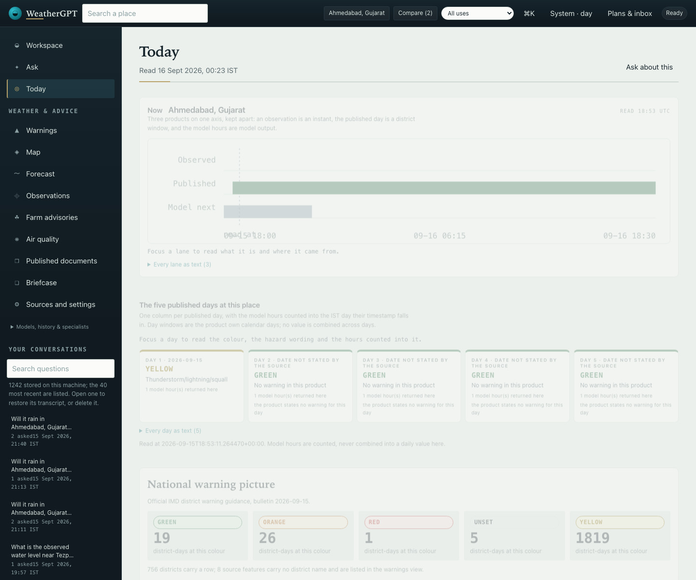

# WeatherGPT — SIH26068

A local, evidence-first conversational weather workspace for India. Ask about a place and a time in
your own words and the answer keeps its **entity, window, unit and source attached to every value**,
backed by governed adapters, published records and — when you configure one — a model.



**Operational acceptance is not achieved.** This is a working prototype whose limits are part of the
interface: it says what it did not read, which state is unknown, and when a value is model output,
published wording, an observation or an official warning. The requirement-by-requirement verdict is
[the integrated PS assessment](docs/72-integrated-status-and-ps-review.md); the newest batch is
[Forecast verification](docs/80-forecast-verification.md).

## Status at a glance

| | |
|---|---|
| **Delivered in scope** | Point forecasts and cross-source comparison, published historical and climate records, official district-warning applicability resolved against IMD's own geometry, plan monitoring with a local inbox, published-document retrieval with page/issue/currency attached, marine and river point products, airport reports, air quality, ensemble spread, archived-run forecast verification against reanalysis, farming advisories, a desktop workspace with sixteen guided tools, and a conversation that carries its artefacts. |
| **Partial** | Warning delivery (outbox, consented Web Push and acknowledgements exist; no live device journey has been demonstrated), language output and voice (measured per direction, not accepted by native speakers), retrieval breadth (whole-document and contradiction handling remain open), operations (foreground watcher, no sustained service). |
| **Not connected** | Radar/satellite **imagery**, official sea-area and coastal bulletins as live products, observed water level or gauge readings, danger levels, flood extent, tide, current, sea-surface temperature, ground air-quality monitors, SMS/IVR/WhatsApp delivery, road or route clearance, crop diagnosis or pesticide dosage, and any confidence, risk or skill score. |
| **Not accepted** | Nationwide corpus acceptance, mobile and rural journeys, noisy-input and native-speaker review, live changed-edition to device notification, fresh-machine and cross-platform installation, sustained load. Hosting is on hold. |

## Run it

```sh
python3 -m venv .venv
source .venv/bin/activate
python -m pip install -r requirements.txt      # runtime, including the optional PDF stack
python scripts/start_weather.py                # preflight first, then serve on 127.0.0.1:8765
```

Open <http://127.0.0.1:8765>. The server answers only on loopback, behind a per-process session
token, and it refuses to start on a check it cannot pass (a registry that does not parse, an unusable
store, a taken port) rather than serving a half-working workspace. **Restart a running server after
pulling**: changing files does not update a process that is already serving.

The push suites and the push panel need `pywebpush` and `cryptography` from the project
environment; a bare system `python3` runs everything else but reports the push checks as missing
dependencies, and the preflight names that state too.

Try *“Will it rain in Ahmedabad, Gujarat tomorrow morning?”*, then *“And what about the evening?”*.
Or *“Show the annual rainfall trend for Ahmedabad district, Gujarat from 1981 to 2010.”*, or
*“कल अहमदाबाद में बारिश होगी क्या?”*.

## Providers: rules first, then OpenRouter free, then the local model

The core question shapes are planned by deterministic rules with **no model at all** — that floor
never depends on a key, a network or a GPU. Above it:

- **OpenRouter free models are used first when a key is configured.** The key is entered with echo off
  and never reaches shell history, a printed line or a log; it is stored in the git-ignored
  `data/runtime/model-config.json` at mode 0600. Only ids ending in `:free` can ever be routed: a
  paid id is refused by name before a request is built, so configuration cannot bill an account.
- **The ranking is measured, not assumed.** `python3 scripts/models.py --probe-free` intersects the
  curated ranking with the live catalogue and records what it observed. Re-run it when a provider
  retires models: a catalogue read on 15 September 2026 found that none of the previously ranked free
  ids were still published.
- **The local model is the fallback.** `python3 scripts/models.py` prints the order, what is
  available and why anything is not. With no key, nothing changes except the order.

```sh
python3 scripts/models.py              # routing order, availability, key source
python3 scripts/models.py --set-key    # hidden prompt; writes the local config at mode 0600
python3 scripts/models.py --probe-free # measure the ranking against the live catalogue
python3 scripts/models.py --check      # plan two questions through the router and print the trace
```

Whichever provider plans a turn, it supplies **candidates only**: model output never executes code,
never supplies a measurement, and never decides an entity, window, unit or source. Every answer's trace
names the provider, the model and any failover. Routing a question to a hosted model is a stated trade
— the question text leaves this machine; the rules floor and the local model stay local.

## What it answers today

Each answer leads with the value, its unit and its window, then shows a **validity ruler** over the
covered source hours, a structured **evidence receipt** (entity, window, method, source, retrieval
time, page/row locator, evidence id) and disclosures for requested tasks, scope and provenance.

- **Right now, and what happens next.** The nearest station reports with distance and age, the
  published district day, and the next model hours — kept apart, with one line naming what is not
  connected. The Today surface opens with a **Now band** that places the observed instant, the published district
  window and the model hours on one time axis, with the read-at instant taken from the payload. Point forecasts cover rainfall totals on whole source hours, rain probability,
  temperature, feels-like temperature, wind and gusts, humidity and visibility, with a bounded refresh
  when stored evidence is stale. Two sources can be compared with their difference and the
  shared-lineage caveat, never a score; ensemble member statistics (mean, spread, range, nearest-rank
  p10/p50/p90) are drawn as an ensemble plume (p10-p90 band, median, mean, min-max whiskers) with an
  exact-value table, never as probability or skill; the hourly forecast is drawn as a meteogram, and every
  answer window carries a validity ruler whose covered spans and gaps can each be inspected.
- **Air quality.** CAMS modelled concentrations and the source’s own indices at a grid cell, with
  the provider’s current hour kept apart from the window; no health advice, no risk score, no
  protective action and no ground monitor connected.
- **Published records.** District rainfall and national climate series with charts, exact-value
  inspection and page/row locators; a bounded daily reanalysis window labelled as modelled; airport
  METAR and TAF reports each with their own station and validity.
- **Warnings and plans.** The official district warning day resolved to your place against IMD's own
  geometry, with the CAP relay reported separately and never merged into one verdict; an alert brief
  you can keep, a plan-monitoring inbox, and legacy watches that record a changed official state.
  A no-match is never an all-clear and origin authentication remains unverified. The national product is
  also drawn as a district x day matrix whose cells carry only the colour the source printed, with an unknown
  hazard code flagged on the cell rather than dropped.
- **The published corpus.** A named national, state, district or marine product answers from the
  indexed documents with its family, region, physical page, printed issue date, measured currency and
  retrieval instant attached; warning-classified text stays reference-only, earlier editions are
  retired from current retrieval, and a saved PDF opens from this origin on request. A **Published
  documents** surface lists every edition this machine holds with its printed issue date, measured
  currency and the state of its saved body — as cards and as a table — so the corpus can be browsed rather
  than only asked about.
- **Specialist products.** Modelled wave height, direction and period near a coastal place, and
  modelled river discharge near a point — each naming the answering cell and its distance, never
  standing in for an observed water level, gauge, danger level, flood extent, tide or current. The
  national sub-basin list is shown with its day fields verbatim and no derived flood class.
- **The published days are laid out beside the reading.** Each day carries the colour the source printed and its
  hazard wording; the model hours are counted into the IST day their timestamp falls in, the station is placed on
  the day it reported, and the surface states that it computes no daily value.
- **The map is an instrument.** Districts read out their published day and hazard wording on hover or focus; a
  vendored city can be selected to make it the working place at the geometry's own coordinates; and the legend
  states what is drawn and how many of each.
- **Station networks.** A search-radius reading of the METAR and AWS networks, a single-network
  inventory, and the radar **status** layer reporting on itself with status codes and remarks shown as
  published. Radar imagery is not retrieved.
- **Farming advisories.** Published district agromet passages for a district, crop and stage, with page
  locators and the source's own conditions quoted as conditions; no diagnosis, dosage or field
  clearance.
Places can be pinned from the command palette (⌘K) and switched from the topbar; the shortlist is local and a
  pin without coordinates is refused.
- **Conversation control and output.** Follow-ups and corrections in one thread, clarify-on-ambiguity
  with every candidate offered, a stop control, elapsed time, and a conversation ledger with search,
  restore and local delete. Any answer can be copied, printed, saved as Markdown, downloaded as a JSON
  receipt, or kept in a briefcase; briefings can be written into a dated local series.
- **Language and voice, measured.** A selector offers only languages that pass a measured write gate
  (19 of 23 registered). Rendering keeps a deterministic gate between evidence and reader: values are
  substituted, safety-critical clauses are held, and a rendering in the wrong script is refused in
  favour of the source language. Press-to-talk shows a transcript for correction before it becomes a
  question; Listen speaks answers already produced. No native speaker has reviewed any output.
Places can be read side by side in a local compare tray (⌘K → *Add this place to compare*, then the Compare
  surface): each column keeps its own timestamps and sources and the page computes no difference between them.
  Loading states reserve the shape of the answer without showing a number, and the evidence receipt can be
  copied or printed.
- **Reading positions.** Farmer, district officer and traveller change which surfaces and questions
  open first; every answer names the position it was read under and states that it changes no value,
  unit, window, warning level or source.

## What it deliberately does not do

The interface states these limits instead of filling them:

- **No invented warnings or all-clears.** CAP lifecycle diagnostics never authorise dissemination, and
  a resolved document hash or a quiet day is never an alert.
- **No invented numbers.** No confidence, risk, suitability or probability value is computed for
  display; no arithmetic is applied to source values; no skill claim is made from prototype checks.
- **No observation where none exists.** No observed water level, gauge reading, danger level, flood
  extent, tide, current or sea-surface temperature, and no station observation for an arbitrary place.
- **No field, marine, medical or travel clearance.** No crop diagnosis, no pesticide dosage, no
  flood-impact prediction, no road or route advice.
- **No delivery service.** Plans and watches are evaluated while the workspace runs; notifications are
  local or consented browser push. SMS, IVR and WhatsApp are not connected channels.
- **No universal language claim.** Coverage is per direction and measured; the four refused languages
  are named with their reasons.

## How it is checked

```sh
python3 -m pytest tests/ -q                          # 1160 Python tests
node tests/test_charts.js                            #  2 of 70 component checks
node tests/test_viz.js                               #  the chart engine: plume, meteogram, gaps and locators
node tests/test_views.js                             # 18
node tests/test_bulletin_ui.js                       #  6
node tests/test_conversation_ui.js                   # 13
node tests/test_suite_ui.js                          # 18
node tests/test_voice_ui.js                          #  3
node tests/test_briefcase_ui.js                      # 10
node tests/test_workspace_ui.js                      # workspace behaviour and recovery
node tests/test_notify_ui.js                         # watch delivery controls
python3 scripts/doctor.py                            # environment, providers and corpus presence
python3 scripts/models.py --check                    # the rules-first floor and the configured providers
python3 scripts/models.py --probe-free               # the curated free ranking measured against the live catalogue
python3 scripts/verify_all.py                        # environment, registries, drift guard, tests, component suites
python3 scripts/audit_workspace_frontend.py --baseline
```

The component checks run against a small DOM shim, so they are **not** browser, visual, load or
fluent-language acceptance. What they do hold is specific: every displayed number must come from the
returned packet with no arithmetic applied, no renderer may leak a stylesheet class name into visible
text, a clarification must offer every candidate, an unverified warning must stay held, and every
request must carry the workspace token. The suite counts measure regression coverage, not completion.

The saved bulletin layout fixtures resolve from tracked curated evidence under
`research/implementation/*` (see `tests/source_fixtures.py`), not from the git-ignored
`data/runtime` cache, so the layout tests run on a clean checkout. The test runner and the remaining
development dependencies are declared in `requirements-dev.txt`; the optional multilingual embedding
stack (`requirements-bulletins.txt`) is only needed to build the real indexed corpus. Recorded real
journeys, accessibility scans and viewport measurements live in
[the frontend batch evidence](research/reviews/frontend-v2-20260915/after/live-checks.json), and the
most recent live loopback and chat records in `research/reviews/frontend-delivery-20260915/`.

## What it feels like to use

Open the workspace and it shows the working place, the published district warning days, and a composer
asking *What is it like right now in Ahmedabad?*. That answer leads with the freshest station report
(name, distance, age), then the published district day with its issue instant, then the next six model
hours, then one line naming what is not connected. Ask *Is any warning in force for Patna, Bihar
today?* and the answer offers **Write the alert brief** and **Save to briefcase**; ask about a district
agromet advisory and it offers **Write the advisory brief**. Every answer can show *What was retrieved,
and what is missing*: pending questions, search counts, the editions read with their printed issue dates
and currency, and the source of every value. [docs/63](docs/63-product-walkthrough.md) walks the
recorded journeys, fast and slow.

## Repository map

| Path | What lives there |
|---|---|
| `weathergpt_data/` | The engine: adapters, governed tools, planner, conversation, retrieval, providers, the product read-model API and the workspace server. |
| `web/` | The desktop surface served by the workspace: shell, panels, views, charts, map, voice, service worker, stylesheet. |
| `scripts/` | Operator commands: start and preflight, intake and audits, measurement and rehearsal, model configuration, verification, backup and restore. |
| `tests/` | Python suites and the Node component suites with their DOM shim. |
| `data/registry/` | Machine-readable state: sources and their review status, product and hardening progress, language support, answer policy, benchmark, free-model ranking. |
| `research/` | Curated evidence: review batches, implementation records, recorded journeys and scans. |
| `docs/` | The written record: the problem statement, batch reports and the standing reviews. |
| `tmp/pdfs/` | Saved source PDFs referenced by evidence records (tracked; runtime stores are not). |

### Where to start reading

- [The recorded problem statement](docs/00-problem-statement.md) — the authoritative SIH26068 summary and what this team's interpretations are.
- [The integrated PS assessment](docs/72-integrated-status-and-ps-review.md) — the current requirement-by-requirement verdict and remaining gates.
- [The frontend overhaul plan](docs/78-frontend-overhaul-plan.md) and [DESIGN.md](DESIGN.md) — the phased overhaul, the stack decision and the design system it commits to.
- [The corpus front door and surface completion](docs/77-corpus-front-door-and-surface-completion.md) — the newest batch on the surface work.
- [OpenRouter routing and frontend delivery](docs/76-openrouter-routing-and-frontend-delivery.md) — the free-model ranking, failover and the radar coordinate repair.
- [The dissemination integration review](docs/73-dissemination-integration-review.md) — alert delivery machinery and its limits.
- [The chronological gap register](docs/31-full-solution-gap-register.md) — what is open, in order of value.
- [The critical full-solution review](docs/21-full-solution-critical-review.md) — findings A01–A08 and the staged trajectory.
- [The product plan](data/registry/product-progress.json) and [hardening checklist](data/registry/hardening-progress.json) — finding status as data.
- [Source registry](data/registry/README.md) and [RAG readiness decision](data/registry/rag-readiness.json).

### Batch records, newest first

Each links to the batch that recorded it. Older entries are **historical evidence, not completion
claims**, and the test counts in them are the counts of their own checkpoint.

- [Forecast verification](docs/80-forecast-verification.md) — archived model runs measured against ERA5 reanalysis, with the method, sample floor and no-skill-claim limit attached.
- [The frontend overhaul: plan and design system](docs/78-frontend-overhaul-plan.md) — the stack decision, the token layer, the chart engine and the signature visuals, phase by phase.
- [The corpus front door and surface completion](docs/77-corpus-front-door-and-surface-completion.md) — the README overhaul, the published-documents browser, air quality and ensemble surfaces, and two repairs found while building.
- [Provider routing and the surfaces that reached the frontend](docs/76-openrouter-routing-and-frontend-delivery.md) — the free-model ranking re-measured, body-level failover repaired, radar coordinate order fixed, five capability paths surfaced.
- [Concurrent alert delivery and its critical limits](docs/73-dissemination-integration-review.md) — outbox, consented push, acknowledgements; no live device-delivery claim.
- [The dissemination build reports](docs/74-dissemination-build.md) — the branch's historical record, preserved at renumbered paths.
- [Stakeholder audit and its repairs](docs/64-stakeholder-repairs.md) — six findings repaired at their cause.
- [Air quality](docs/70-air-quality.md) — CAMS modelled concentrations and the source's own indices; no health advice, risk score or ground monitor.
- [Plan Watch](docs/67-plan-watch.md) — saved plans checked against the district-warning product while the workspace runs.
- [Ensemble spread](docs/65-ensemble-spread.md) — one model's member distribution, never scored.
- [The district corpus becomes reachable](docs/64-district-corpus-reachability.md) — the district family, the printed valid-till crash, and the topic word that decides which passage is served.
- [Reading the question in every language we can write](docs/66-language-reading-coverage.md) and [a question in one language, documents in another](docs/68-crosslingual-retrieval.md).
- [A translated answer that does not stall](docs/69-render-latency-and-quotations.md) — quotations held back from translation and the measured render seconds.
- [The product, walked through](docs/63-product-walkthrough.md) and [the chat surface and the key you paste](docs/62-chat-surface-and-provider-ux.md).
- [State agromet coverage](docs/60-state-agromet-coverage.md), [paraphrase robustness](docs/59-paraphrase-robustness.md), [the right-now reading](docs/58-right-now-reading.md), [comparing two sources](docs/57-model-comparison.md).
- [The sealed holdouts](docs/54-holdout-generalisation.md), [the second one](docs/56-second-holdout.md) and [two gaps they exposed](docs/55-place-typos-and-coasts.md) — what the tuned sets do and do not show.
- [Operations](docs/53-operations.md) — the preflight, measured latency and the release checklist.
- [Language and voice, re-measured](docs/52-language-and-voice-measurement.md), [a scheduled briefing](docs/51-scheduled-briefing.md), [personas and the briefcase](docs/50-personas-and-the-briefcase.md).
- [The Instrument Desk](docs/46-frontend-instrument-desk.md) — the desktop surface, its measurements and what none of it establishes.
- [Source activation and national document intake](docs/29-source-activation-and-document-intake.md) — every registered source measured and the corpus it produced.
- [Multilingual and voice path](docs/30-multilingual-and-voice-path.md) — a plan with its governing invariant: no number, unit, date, place, source id or negation crosses a generative step unchecked.
- [The intake holds what it cannot verify](docs/48-intake-publication-identity.md), [answer transparency](docs/47-answer-transparency-and-edition-coverage.md), [verification and backup](docs/39-verification-backup-and-drift-guard.md), [watch requests](docs/38-watch-requests.md), [the acceptance benchmark](docs/35-acceptance-benchmark.md), [bounded queue and cancellation](docs/34-bounded-queue-and-cancellation.md), [the indexed corpus becomes conversational](docs/32-corpus-chat-and-planner-robustness.md).
- [The full-solution gap register](docs/31-full-solution-gap-register.md), [critical review](docs/21-full-solution-critical-review.md), [engine context repairs](docs/22-engine-context-repairs.md), [marine and river tools](docs/23-marine-and-river-tools.md), [frontend overhaul](docs/25-frontend-overhaul-batch.md).
- [Earlier batches](docs/14-product-review-and-progress-plan.md): [conversational recovery](docs/13-conversational-recovery.md), [product workspace](docs/12-product-workspace-and-repairs.md), [extensive validation and RAG gate](docs/11-extensive-validation-and-rag-gate.md), [grounded answer workflow](docs/10-grounded-answer-workflow.md), [bounded ingestion](docs/09-bounded-ingestion.md), [geography and coverage](docs/07-geography-and-coverage.md), [hardening](docs/06-hardening-batch-one.md), [data foundation](docs/04-data-foundation.md), [climate pipeline](docs/03-climate-pipeline.md), [data layer design](docs/02-data-layer-design.md), [idea analysis](docs/01-idea-analysis-and-critique.md).

## Ground rules

The user-supplied SIH26068 statement is authoritative, and final scope includes nationwide and
specialist coverage. Reuse the existing adapters, source registries, numerical contracts and provenance
rather than replacing them. Keep entity, time, parameter, unit and source attached to every factual
claim, and preserve unknown, missing, stale, cancelled and reference-only states. Credentials belong in
local backend configuration and must not reach browser code or chat. Do not publish runtime
conversations, logs or restricted source material. GeoNames place data is used under CC BY 4.0.
