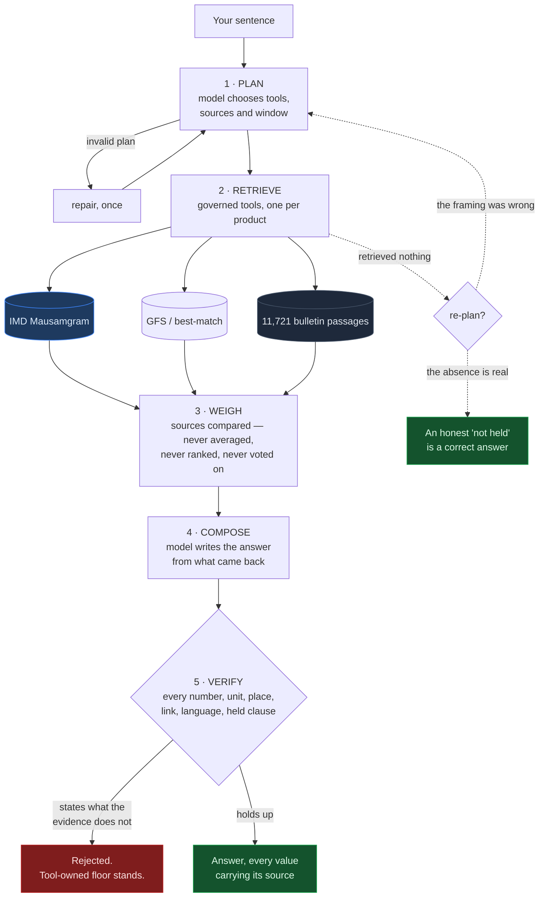
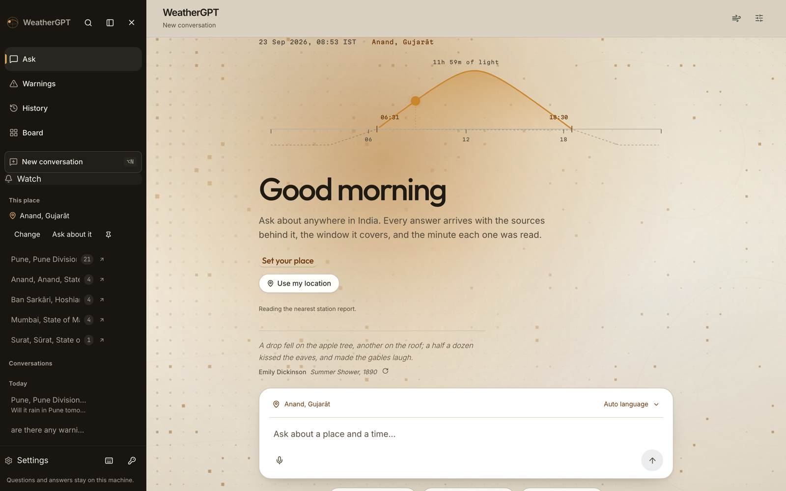
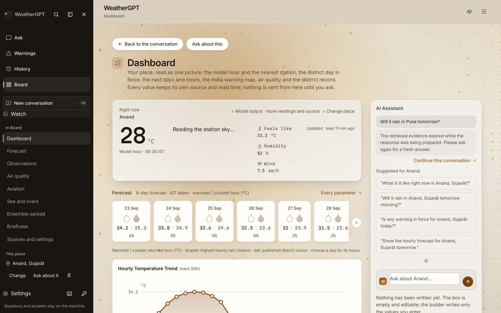
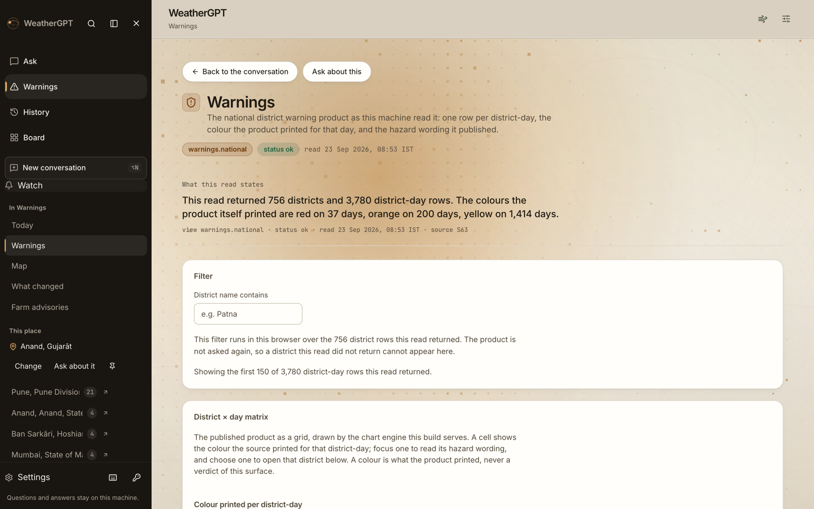
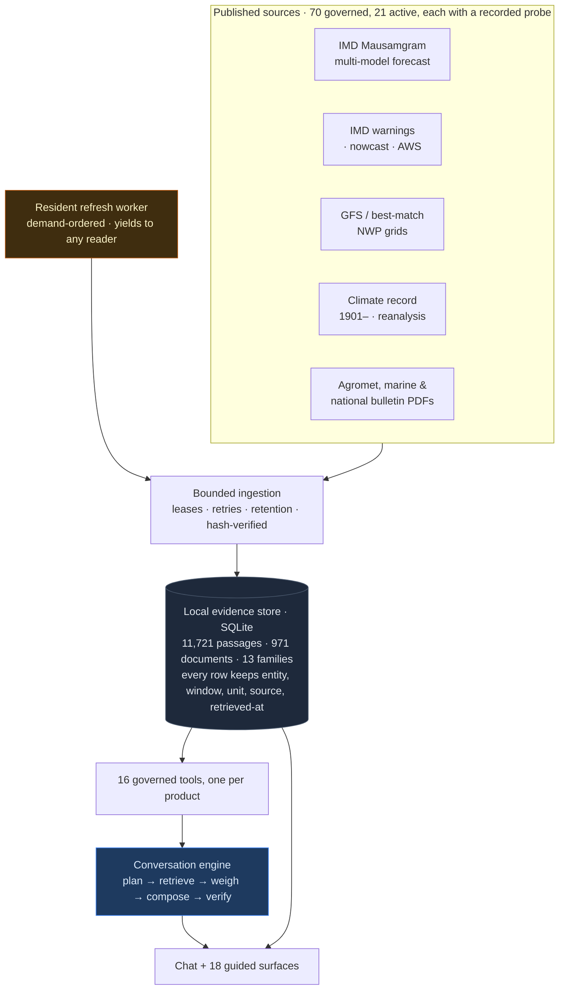

<div align="center">

# WeatherGPT

### India's weather, in your own words — with the receipt attached.

**Smart India Hackathon · SIH26068 · Ministry of Earth Sciences / IMD**
Team **Void Pointer** (18) · Disaster Management

`1,630` Python checks · `596` frontend checks · `21`-step gate, `0` failed · `276`-scenario atlas · `70` governed sources · `100%` local

</div>


---

## The thing everything else is built around

Ask a weather chatbot whether a flight is on time and it will usually tell you. It has no flight data. It is guessing, fluently.

<table>
<tr>
<th width="50%">A question it can answer</th>
<th width="50%">A question it cannot</th>
</tr>
<tr>
<td valign="top">

**Will it rain in Ahmedabad tomorrow?**

> No rain is forecast for Ahmedabad tomorrow: **0.0 mm** of precipitation is expected over 23 Sep 00:30 – 24 Sep 00:30 IST.
>
> *These are model forecasts for the selected points, not observed conditions or district averages.*

`source S21` · `geonames:1279233` · `read 21 Sep 2026, 23:53 IST`

</td>
<td valign="top">

**Is flight AI-101 on time?**

> I can't check flight status or whether a specific flight is on time — this workspace has no flight source.

**Is it safe to go out in Chennai right now?**

> There is an official district warning in force for CHENNAI … *(the conditions, in full)* … Whether that is safe for you depends on where you are going and how, which I can't judge.

</td>
</tr>
</table>

The model never supplies a number. It decides **what to retrieve**, **which sources to weigh**, and **how to say it**; every value comes from a retrieval and stays tool-owned all the way to the screen. An answer stating a figure the evidence does not support is **rejected, not softened**.

---

## ⭐ It answers from IMD's own data

Fifteen `api.imd.gov.in` products sit behind a credential this project does not have. The easy move is to serve global models and call it Indian weather. Instead, every blocked product was probed for a **public route to the same thing** — and the most important ones had one.

<table>
<tr>
<th align="left">Blocked product</th>
<th align="left">Public route found</th>
<th align="left">Status</th>
</tr>
<tr><td><code>S02</code> IMD City Forecast</td><td><b>Mausamgram</b> multi-model, no credential</td><td>🟢 <b>connected</b></td></tr>
<tr><td><code>S03</code> IMD District Nowcast</td><td><code>imd:NowcastWarningDistrict</code> — 764 districts</td><td>🟢 <b>connected</b></td></tr>
<tr><td><code>S39</code> IMD AWS/ARG stations</td><td><code>imd:aws_data_layer</code> — 2,071 stations</td><td>🟢 connected</td></tr>
<tr><td><code>S04</code> IMD District Warning</td><td><code>imd:district_warnings_india</code> WFS</td><td>🟢 connected</td></tr>
<tr><td><code>S52–54</code> marine warnings</td><td>RSMC sea-area + coastal bulletin PDFs</td><td>🟢 connected</td></tr>
<tr><td><code>S41</code> district rainfall</td><td><code>imd:subdiv_rainfall_now</code> — subdivision only</td><td>🟡 probed, not built</td></tr>
<tr><td><code>S43–45</code> cyclone track / cone</td><td>RSMC bulletins are <b>image-only PDFs</b></td><td>🔴 needs OCR — not claimed</td></tr>
</table>

**Ask what IMD itself forecasts, and it answers from IMD:**

> **What does IMD itself forecast for Pune tomorrow?**
>
> IMD's own multi-model output for Pune on 23 September 2026 gives a temperature range of **22.8–28.5 °C**, or **24.4–32.2 °C** on the bias-corrected series, with precipitation of 0.0–2.3 mm per step and **5.6 mm total** across the eight three-hourly steps…
>
> *Served from the IMD Mausamgram cell at 18.5, 73.875, **3.0 km** from the requested point: the publisher answers only on its own 0.125° grid. Initialisation 2026-09-22T00:00Z; each valid time is **derived** from that initialisation and the three-hour step, because the payload carries no time axis.*

Two things that source does not supply — a grid identity and a time axis — are **named as derived rather than filled in silently**. That is the whole discipline in one answer.

<sub>📄 **[docs/144](docs/144-the-model-answers-and-the-sources-open-up.md)** — every probe, every address, and the two cyclone families **deliberately not registered** because their PDFs carry no text layer. A family that can never produce a passage is not coverage.</sub>

---

## ⭐ How one answer is made

Not a retrieval wrapper. Five stages, three of which can send the turn back.



**Stage 3 runs whether or not you ask for it.** A reader does not know the architecture, so an ordinary *"will it rain in Pune tomorrow?"* retrieves IMD **and** the global model, and says which is which:

> IMD's multi-model forecast gives a precipitation total of **5.6 mm** for the window, while the global model (GFS) gives **7.4 mm**; the two broadly agree.

**Stage 5 is what makes the rest safe.** The draft is checked against the evidence it was handed — every number, every unit against its source, the place named, no invented link, the requested language, and safety clauses it is not allowed to drop. When it fails, the deterministic floor stands and the reason is recorded on the turn.

---

## 756 districts, in the publisher's own colours

<table>
<tr>
<td width="46%" align="center">


</td>
<td valign="middle">

This is not a basemap with dots on it. Every one of the **756 districts** is a feature from IMD's own geometry, filled with **the colour IMD published for that district-day** — nothing is interpolated, averaged or inferred.

**A district with no published row is drawn as an outline, never as green.** An absence of guidance is not an all-clear, and the figure refuses to say otherwise.

| | today |
|---|---|
| districts drawn | **756** |
| stated a hazard colour | **753** |
| no published row → outline | **3** |

Ask it *"which districts in Odisha have a warning today, and in what colour?"* and it sweeps the state and answers from the same rows.

</td>
</tr>
</table>

---

## Against the problem statement

The eight features SIH26068 names. **Delivered in scope** = it works and its boundary is stated. **Partial** = it works for real cases, with named cases it does not cover. **Not accepted** = the code exists and nobody has proved it against reality. No row is upgraded by a passing test or a screenshot.

| # | Requirement | State | |
|---|---|---|---|
| 1 | Real-time weather retrieval | 🟡 Partial | Forecasts, station reports, warning days, **IMD's own district nowcast**, a composed Now reading. Coverage and station quality vary by place. |
| 2 | Natural-language querying | 🟢 **In scope** | The model plans every turn, weighs the sources it retrieved, and re-plans once when a retrieval comes back empty. |
| 3 | NWP models (GFS / WRF) | 🟢 **In scope** | Governed GFS, best-match **and IMD's own Mausamgram multi-model**, compared with provenance. **WRF is not connected** — the PS names both; only one is true. |
| 4 | Alerts & early warning | 🟡 Partial | District applicability, nowcast, plans, outbox, consented Web Push, service worker. **No live delivery to a real device has been demonstrated.** |
| 5 | Location-based advisories | 🟡 Partial | Place resolution, district identity, crop/stage intake, cited bulletins across **575 districts**. Nationwide acceptance open. |
| 6 | Indian languages | 🟡 Partial | 22 languages measured per direction. 16 live Hindi/Gujarati answers render 15/16 in the requested script. **Awaiting a native speaker.** |
| 7 | Climate & historical analysis | 🟡 Partial | Published history, source-constrained trends, reanalysis to a year. Not a research workspace; no attribution claims. |
| 8 | Voice for rural access | 🟠 Path built | Transcription, spoken output, Hindi/Gujarati round trips. **No noisy-field or speaker validation.** |

<sub>Line-by-line evidence and the explicit gap behind every row: **[docs/84](docs/84-ps-progress-and-pictures.md)** · the complete account: **[docs/140](docs/140-the-full-account.md)**</sub>

---

## How honest is it, measured

306 turns across the eight features, multi-turn context and adversarial boundaries — run against the live engine, not fixtures.

```
ANSWERED  ███████████████████████████████████████████░░░░░  276 / 306   90%

refusals, 21 total — and which kind matters more than the count:
  the publisher has no such data   ██████████████░░░░░░░░░░░░░░░░░░░   7
  a stated product limit           ██░░░░░░░░░░░░░░░░░░░░░░░░░░░░░░░   1
  ours to fix                      ██████████████████████████░░░░░░░  13
```

**Most refusals are the publisher having nothing, not the product failing** — and the two are counted apart, because collapsing them would let a data gap quietly flatter the engineering.

**The atlas is 306 single questions, so it cannot tell you whether a conversation holds together.** That is measured separately: `node tools/conversation-probe.mjs` runs eight multi-turn threads where each turn is meaningless alone — *"and the day after?"*, *"sorry, I meant Pune"*, *"just guess"*. **7 of 8 threads held**, end to end.

---

## ⭐ The engine that corrects itself

Three defects found this week by **measuring**, not by reading code. Every one of them had been reporting success.

<table>
<tr><td width="33%" valign="top">

### 🔴 A refresh doing nothing

The scheduled sweep took its "already done" set from the **day's** manifest, so every run restarted at the alphabet.

```
20 Sep  40 swept · 290 passages
21 Sep  40 swept ·   0 passages
22 Sep  40 swept ·   0 passages
```

The same forty districts, twice a day, forever. **541 of 667** district heads unread since the 14th — while the job exited zero.

**Now:** a resident worker ordered by *what readers asked for* and *how long unread*, running for as long as the machine is on.

</td><td width="33%" valign="top">

### 🔴 The model locked out

The composer refused to write whenever a turn carried **more than six passages** — so the richer the retrieval, the likelier the reader got a table.

```
All India Summary  12 → TEMPLATE
Extended range      8 → TEMPLATE
Rajkot advisory     3 → model
```

The two "big picture" questions lost *because* they retrieved the most.

**Now:** leading passages in full, the rest **by name**, and the model writes them — 7 of 8.

</td><td width="33%" valign="top">

### 🔴 Two sources, one range

Given IMD *and* a global model, the answer read **"IMD gives 0.0–7.4 mm"** — IMD's floor, GFS's ceiling, the span credited to IMD.

```
S21  7.4 mm    (whole day)
S16  0.0–2.3   (eight steps)
```

A number attributed to a publisher that never printed it. Telling the model not to merge ranges **did not stop it.**

**Now:** accumulations are summed to the window total the other source reports — comparable *before* they are compared.

</td></tr>
</table>

The third is the instructive one: **the fault was in the evidence, not in the reading of it.** No amount of prompting fixes a comparison between two shapes that were never comparable.

<sub>📄 **[docs/142](docs/142-fetching-what-a-reader-asked-for.md)** · **[docs/143](docs/143-the-refresh-that-never-stops.md)** · **[docs/144](docs/144-the-model-answers-and-the-sources-open-up.md)** · **[docs/145](docs/145-asking-again-when-the-first-answer-was-nothing.md)**</sub>

---

## ⭐ When it finds nothing, it asks again — once

The engine planned **once**, before seeing a single result. A plan one notch too narrow ended the turn telling the reader something was not held, when it was the *asking* that was wrong.

Now the model is shown what each tool actually said and gets **one** more attempt. The hard part is not the retry — it is refusing to fish:

| Question | Decision | Why |
|---|---|---|
| Sea surface temperature off Chennai? | ⛔ **no retry** | *"the absence was judged real"* — not a connected quantity |
| Agromet advisory for **wheat** in Ludhiana? | ⛔ **no retry** | the edition genuinely has no wheat row — it names the eleven crops it **does** carry |
| Flash flood risk for **Assam**? | ✅ **retried** | first plan found nothing; the second reached the district warning product and answered |
| Flash flood risk for **Kerala**? | ✅ **retried** | same |

Four ways it cannot make a turn worse: **exactly one attempt**; an invalid second plan is dropped, not retried again; a second retrieval that also finds nothing **keeps the first answer** (two honest absences are still one absence); and one that raises keeps it too. **Fourteen tests pin this — nine on when it must *not* fire.**

> An honest *"the publisher has not issued this"* is a **correct answer**, not a failure to work around. A retry loop is the obvious way to destroy that, which is why most of the work went into the refusal.

---

## See it run

```bash
python3 -m weathergpt_data.workspace --port 8765     # then open http://127.0.0.1:8765
cd frontend && node tools/demo.mjs                   # 10 live turns, recorded, ~3m20s
```

`tools/demo.mjs` is not a slideshow. It drives the real engine and records whatever happens — every turn is planned, retrieved and written live. One beat per key feature, plus the two refusals.

<table>
<tr>
<td width="50%"></td>
<td width="50%"></td>
</tr>
</table>

---

## ⭐ The interface is an instrument, and the light in it is real

Four planes, ranked by darkness, so the eye has something to rank: a **near-black rail**, a **grey bar**, a **living ground**, and the conversation on **white sheets**. The chat is the brightest thing on screen, because it is the product.

**The glow behind the page is the sun.** Not a decoration placed by eye — its position comes from the real solar altitude and hour angle at the place you are holding, from the same solver that plots the arc on the front door. It rises at screen left, arcs over through the morning, sets at the right, and goes out below the horizon leaving only the cool ambient. At four in the afternoon the page is lit from the west, because it is.

The palette moves with it. Meridian has its own four hours — a cool slate room at midnight, warm at first light, neutral and bright at high sun, umber at dusk — drifting continuously on the sun rather than stepping between fixed values, and never once leaving the light family. A full day of it is swept every fifteen minutes at four latitudes in `meridianSpectrum.test.ts`: the ground has to stay pale, the rail near-black, every ink has to clear AA on every plane it is set on, and **the hours have to actually differ from each other**.

| | |
|---|---|
| The front door's hero | Today's solar altitude, plotted across the full width. Sunrise and sunset solved from the altitude zero-crossings, checked against published almanac times for five place/date pairs, to within ten minutes — the band the low-precision solar position is honestly good to |
| Every value | Set in Martian Mono, tabular, so a reading looks read off an instrument rather than typed |
| A retrieved value | Exact from its first painted frame. It used to count up from zero, which meant a second of display-size measurements no source ever published, with a real citation under each one |
| The background | A contoured pressure field and a firing cell array, both derived from one scalar field, over two blend-mode light layers. Measured at a **9.8 ms median frame** under headless software rasterisation — inside the 16.7 ms a 60 fps budget allows, before any of the compositing a real GPU does for free. The slow layer is rendered at half resolution six times a second and blitted; the array is the only thing redrawn every frame |
| Reduced motion | One still frame, no loop, no firing. A trail is motion by construction; there is no still version of one |

The atmosphere is decoration and says so: inside an `aria-hidden` ground, no legend, never derived from a retrieved value, and held far below the contrast at which a reader would try to read it.

<table>
<tr>
<td width="100%"></td>
</tr>
</table>

Every one of the nineteen surfaces leads with **what this read states** — the finding, in the evidence's own terms — before the controls and the tables that prove it. The way back to the conversation sits at the end, where an offer belongs.

---

## Architecture



Everything runs **on this machine**. No telemetry, no account, no cloud store. The only outbound calls are to the publishers themselves and to whichever model provider you configure.

**A reader always outranks the refresh.** A live question raises a lease while it fetches and the worker stands down — bounded, so a workspace busy enough to never refresh does not quietly rot while looking healthy.

---

## Verify it yourself

```bash
python3 scripts/verify_all.py                        # 21 steps, 0 failed
python3 -m pytest tests/ -q                          # 1630 Python tests
cd frontend && npx vitest run                        # 596 checks, 90 suites
```

21 steps: the Python suite, the frontend suites, a typecheck, a production build, and audits that read the built stylesheet and the served DOM rather than the source. **0 failed.**

<sub>That second comment is load-bearing. `scripts/check_status_drift.py` parses this README for the number and fails the gate if it disagrees with what pytest actually collects — so this document cannot quietly claim a count it no longer has.</sub>

<table>
<tr><td>

| | |
|---|---|
| Python | **1,630** checks, 113 files |
| Frontend | **596** checks, 90 suites |
| Gate | **21** steps, **0** failed |
| Scenario atlas | **276** scenarios / 306 turns |

</td><td>

| | |
|---|---|
| Engine | **27,778** lines, 87 modules |
| Interface | **38,058** lines, TS + React |
| Sources | **70** governed, **21** active |
| Decision records | **145** in `docs/` |

</td></tr>
</table>

`docs/` is not a folder of plans. It is what was measured, what broke, and what was done — written as the work happened. Three defects it caught, none exotic:

- A check had been **passing for a day while computing `NaN`**. `NaN < floor` is false, so it reported success on every input by failing to compute anything at all.
- A verifier printed the last lines of an error log without checking *when they were written*, and declared a freshly installed job broken on the strength of a failure from that morning.
- Every screenshot in the evidence directory — 18 surfaces × 2 schemes × 4 widths — had been **photographing a loading skeleton** for weeks. Two review passes drew conclusions from those files.

That is the ordinary way software lies to the people building it. The instrumentation exists because this repository has been caught doing all three.

---

## What it will not do

Not missing features — **refusals by design**, each one a place where being useful would mean being wrong.

| | |
|---|---|
| ❌ Invent a value the sources did not state | ❌ Draw a district green because nothing was published |
| ❌ Give a confidence, risk or skill score | ❌ Tell you whether something is *safe* |
| ❌ Convert between units a source did not state | ❌ Rank, average or vote between two models |
| ❌ Offer medical, health or evacuation advice | ❌ Treat a CAP reference as authority to disseminate |
| ❌ Name a hazard code no legend was published for | ❌ Widen a search until something comes back |

---

## Where to go deeper

| | |
|---|---|
| 🎯 **[The demo runbook](docs/138-demo-runbook.md)** | Running order, what to point at, measured timing per beat, what to say when asked "is it just an LLM wrapper?" |
| 📋 **[Requirement-by-requirement](docs/84-ps-progress-and-pictures.md)** | Every PS line, its evidence, its explicit gap |
| 📚 **[The full account](docs/140-the-full-account.md)** | The complete reference: every subsystem, every limit |
| ⭐ **[Opening the data layer](docs/144-the-model-answers-and-the-sources-open-up.md)** | How the blocked IMD products were routed around, and what was refused |
| ⭐ **[Asking again](docs/145-asking-again-when-the-first-answer-was-nothing.md)** | The one re-plan, and the nine tests on when it must not fire |
| 🔬 **[What the atlas measured](docs/119-what-the-atlas-measured.md)** | The 306-turn run, by group |
| 🚀 **[Deploying it](docs/118-deploying-this-workspace.md)** | Dockerfile, fly.toml, and what is not yet proved |
| 📐 **[Problem statement](docs/00-problem-statement.md)** | SIH26068 as captured |

---

<div align="center">

**Operational acceptance is not achieved. This is a working prototype whose limits are part of the interface.**

That sentence is the design, not a disclaimer bolted to it. A workspace that hedges everything is useless; one that hedges nothing is dangerous. This one states, per answer, what it did not read, which state is unknown, and whether a value is model output, published wording, an observation, or an official warning.

</div>
