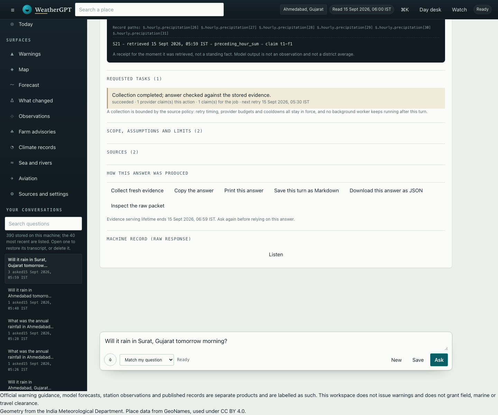

# WeatherGPT — SIH26068

A local conversational weather prototype for India. Ask about a place and a time in your own words and get an answer that keeps its **source, its window and its retrieval time attached to every value** — backed by governed numerical adapters, published records and a local model.

Nationwide and specialist **operational acceptance is not achieved**. This is an evidence-conscious prototype whose limits are part of the interface, not a finished service.



## Run it

```sh
python3 scripts/start_weather.py
```

Open <http://127.0.0.1:8765>. The launcher starts installed Ollama if needed and uses `qwen3.6:latest`; set `WEATHERGPT_MODEL` to another installed model. The engine plans the core question shapes with rules and no model at all, and the rest through whatever providers exist. No paid gateway is required, and the server answers only on loopback with a per-process session token.

OpenRouter free models are optional and take two steps. The key is entered with echo off, so it never reaches shell history, a printed line or a log, and no paid model is ever routed:

```sh
python3 scripts/models.py --set-key     # hidden prompt; writes data/runtime/model-config.json at mode 0600
python3 scripts/start_weather.py        # restart the server so the key is read
```

`python3 scripts/models.py --probe-free` then measures which ranked ids OpenRouter actually publishes and records that observation in `data/registry/openrouter-free-models.json`; with no key it reports **not configured** instead of guessing, and exits 0. The routing order is the curated free ranking, most capable first, followed by any `WEATHERGPT_MODELS` or `model-config.json` ids — an id that does not end in `:free` is skipped with a recorded reason rather than routed.

Try “Will it rain in Ahmedabad, Gujarat tomorrow morning?”, then “And what about the afternoon?”. Or ask “Show the annual rainfall trend for Ahmedabad district, Gujarat from 1981 to 2010.”, or “कल अहमदाबाद में बारिश होगी क्या?” and choose the intended place.

## What works today

Each answer is presented answer-first — an exact value with its unit and window — followed by a **validity ruler** of the covered source hours, a structured **evidence receipt** (entity, window, method, source, retrieval time, page/row locator, record paths, evidence id) and expandable disclosures for requested tasks, scope, sources and provenance.

- **Point forecasts** at a named place or pinned coordinate: rainfall totals on whole source hours, hourly rain probability, temperature, feels-like temperature, wind and gusts, humidity and visibility, with a bounded refresh when stored evidence is stale.
- **Historical and climate records**: published district rainfall and national climate lookups, comparisons, period totals, charts with exact-value and evidence-id inspection, and a short daily reanalysis window labelled as modeled.
- **Specialist tools**: airport reports for supported ICAO codes (METAR observations and TAF forecasts, each with its own station and validity), modeled wave height, direction and period near a coastal place, and modeled river discharge near a resolved place — each naming the answering model cell and its distance.
- **Published bulletins**: crop/stage passages with page locators and saved source PDFs you can open and download, kept separate from general and warning context. The wider indexed corpus is also conversational: a named national, state or marine product answers with its family, region, physical page, printed issue date, measured currency and retrieval instant attached, warning-classified text kept reference-only, and earlier editions retired from current retrieval.
- **Conversation control**: follow-ups and corrections in one thread, clarify-on-ambiguity with every candidate offered, a stop control, elapsed time, a conversation ledger with search, restore and local delete, and a read-only collection-health panel.
- **Portable output and spoken access**: copy, print a stylesheet-stripped answer, save a turn as Markdown, download the JSON receipt, or save a whole stored conversation; press-to-talk with a transcript shown for correction before it becomes a question, Listen over answers already produced, and a language selector that offers only measured languages.
- **The wider published corpus**: a named national, state or marine product answers from the indexed documents with its printed issue date, measured currency, retrieval instant, physical page and document identity attached; warning-classified text stays reference-only and earlier editions are retired from current retrieval.

## What is not connected

The interface states these limits rather than filling the gaps:

- **Official warning delivery is absent.** District warning applicability *is* resolved to a place against IMD's own geometry, but origin authentication is unverified and CAP lifecycle diagnostics never authorise dissemination. There is no subscription, outbox, delivery or update/cancel service, and no all-clear. Rain, model output, published bulletin wording and a resolved document hash are never presented as an alert.
- **No live station observation for an arbitrary place**, no observed water level, gauge reading, danger level, flood extent, tide or current, and no road, route or travel clearance.
- **No field or marine clearance**, no crop diagnosis, no pesticide dosage, and no flood-impact prediction.
- **No invented scores.** No confidence, risk, suitability or probability value is computed for display.
- **Language output is measured per direction, not fluent.** Nineteen of twenty-three registered languages pass a measured `write` gate (including Hindi and Gujarati); ten of those also pass measured speech and hearing, the rest are readable but speech for them is beta-gated by the provider. Four fail the write gate and are refused rather than offered with a warning, each with its recorded reason. Rendering puts a deterministic gate between the evidence and the reader: values are withheld and substituted, safety-critical clauses are held, and the gate now also refuses a rendering that mixes Indian scripts or that is not written in the requested script at all - a Tamil rendering carrying Telugu characters was shipped before that check existed. A failed gate keeps the source-language answer and says which failure it was. Quoted published passages are evidence and are never rewritten: of 6,739 indexed passages only 107 contain Devanagari, all of them bilingual letterheads, so document coverage in the language sense is not established. No native speaker has reviewed any output.
- **Voice exists but is not accepted.** Speech input with a confirmable transcript, spoken answers over gated text, and spoken/recognition states are implemented. A presence-only round-trip measurement now records place, unit and negation presence for Hindi and Gujarati, with numerals again observed as word forms; speech accuracy, noisy input and browser/audio acceptance remain unmeasured, and no native speaker has reviewed any output.
- **An advisory brief for a crop.** One district, one crop and one stage become an artefact: published advice quoted with its page and printed issue date, the source conditions quoted as conditions, the forecast kept apart as context, what a decision still needs when asked, and no prescription, diagnosis or dose decision. Another crop is never served for the one asked about. Written with scripts/advisory_brief.py.
- **An alert brief you can keep.** One place and one published warning day become an artefact: the day status in the product own terms, the bulletin identity and retrieval instant, the CAP relay reported separately, what would change it, what is not established, and a content hash. Written with scripts/alert_brief.py. Nothing is delivered anywhere.
- **Two products, one answer.** When a turn retrieves an official district warning and a model forecast for the same window, the answer compares them in words - consistent, differing or not comparable - names both, and never ranks them.
- **A reading position, and a briefcase for what you keep.** Farmer, district officer and traveller each open the page on their own surfaces and questions, and every answer names the position it was read under and states that it changes no value, unit, window, warning level or source. Briefs the workspace composed can be kept, reopened, exported as Markdown and deleted on this machine; nothing is delivered, pushed or scheduled. See [docs/50](docs/50-personas-and-the-briefcase.md).
- **A briefing you can have waiting.** A runner reads the connected products for named places and writes a dated briefing: the official district warning day per place, the CAP relay reported separately, the forecast window as retrieved, what could not be read, and what changed since the previous run — measured against that run record. The interval is a foreground loop inside the command, not a service: nothing is delivered or pushed. See [docs/51](docs/51-scheduled-briefing.md).
- **One command, and a preflight that tells the truth.** `python3 scripts/start_weather.py` reports the Python version, the registries, the indexed corpus, the gazetteer, the port, the runtime store and the model providers before it serves - and it starts without a model at all, because the rules floor answers. A blocked check (a registry that does not parse, an unusable store, a taken port) refuses to start and names what to fix. No key material is printed. Measured latency over eight representative turns: p50 4.844 s, p90 6.327 s, with the rules floor planning seven of eight. See [docs/53](docs/53-operations.md).
- **A sealed holdout, run once.** The declared benchmark's numbers describe the cases they were tuned on: its earlier holdout had been read during development. A fresh set of ten unseen cases was authored, sealed in the registry with a rule against tuning on it, and run once — 8 of 13 declared tasks, 0 prohibited claims, 0 crashes. The difference between that and 17/17 is the honest estimate of shape coverage. See [docs/54](docs/54-holdout-generalisation.md).
- **The conversation carries the artefacts.** Every answer offers what its own evidence supports: the right-now reading (stations with distance and age, the published day, the next model hours, and what is not connected), an alert brief or an advisory brief composed in place with save-to-briefcase, and a briefing written into the local series. Pending slots, retrieval coverage, the edition comparison and each edition printed issue date and currency render from the tools own records, and the trace names the provider, the model and any failover. The OpenRouter key goes in with one command: python3 scripts/models.py --set-key (hidden prompt, owner-only file, never printed), and only free model ids are ever routed, ranked most capable first, with the local model as the fallback. See [docs/61](docs/62-chat-surface-and-provider-ux.md).
- **Desktop web only.** The desktop surface carries a day/night/system appearance, a command palette (⌘K) over surfaces, actions, places and stored conversations, a twelfth surface comparing stored forecast retrievals, and a raw-packet inspector on every answer. Small screens are usable, but this is not mobile platform compliance or mobile acceptance.
- **Hosting and sharing remain on hold** at the user's request.

## How it is checked

```sh
python3 -m pytest tests/ -q                          # 988 Python tests
node tests/test_charts.js                            #  2 of 70 component checks
node tests/test_views.js                             # 18
node tests/test_bulletin_ui.js                       #  6
node tests/test_conversation_ui.js                   # 13
node tests/test_suite_ui.js                          # 18
node tests/test_voice_ui.js                          #  3
node tests/test_briefcase_ui.js                     # 10
python3 scripts/doctor.py                            # environment, providers and corpus presence
python3 scripts/models.py --check                    # the rules-first floor and the configured providers
python3 scripts/models.py --probe-free               # the curated free ranking measured against the live catalogue
python3 scripts/verify_all.py                       # environment, registries, drift guard, tests
python3 scripts/run_daily_cycle.py --families national_bulletin  # one bounded foreground cycle
python3 scripts/audit_workspace_frontend.py --baseline
```

The component checks run against a small DOM shim, so they are **not** browser, visual, load or fluent-language acceptance. What they do hold is specific: every displayed number must come from the returned packet with no arithmetic applied, no renderer may leak a stylesheet class name into visible text, a clarification must offer every candidate, an unverified warning must stay held, and stopping a turn must not claim the server stopped working.

Real journeys are recorded with screenshots in [the frontend batch evidence](research/reviews/frontend-v2-20260915/after/live-checks.json), which also carries ten automated accessibility scans and the viewport measurements quoted in [docs/46](docs/46-frontend-instrument-desk.md). The suite counts are not a completion measure.

## What it feels like to use

Open the workspace, and it shows the working place, the published district warning days, and a composer asking
*What is it like right now in Ahmedabad?*. Answering that leads with the freshest station report (name,
distance, age), then the published district day with its issue instant and source, then the next six model
hours, then one line naming what is not connected. Follow up in the same conversation with *and what about the
afternoon?* and only the window changes. Ask *Is any warning in force for Patna, Bihar today?* and the answer's
actions offer **Write the alert brief** and **Save to briefcase**; ask about a district agromet advisory and
they offer **Write the advisory brief**; any answer with a point offers **Right now here** and **Write a
briefing**, which writes a dated briefing into the local series. Every answer also shows *What was retrieved,
and what is missing*: the pending questions, the search counts, the editions read with their printed issue dates
and currency, and the source of every value. [docs/63](docs/63-product-walkthrough.md) walks the thirteen
recorded journeys, with what is fast and what is still slow.

## Status and open work

- [Plan Watch](docs/67-plan-watch.md) - saved plans checked against the IMD district-warning product while the local workspace runs, with in-app and browser notifications only.
- [Ensemble spread](docs/65-ensemble-spread.md) - the member distribution of one governed model (mean, population spread, range and nearest-rank p10/p50/p90) reachable from chat and never scored; the endpoint requires a model id, the per-model support set is measured, and a day-level spread question is planned by the deterministic rules.
- [Reading the question in every language we can write](docs/66-language-reading-coverage.md)
- [A question in one language, documents in another](docs/68-crosslingual-retrieval.md)
- [A translated answer that does not stall](docs/69-render-latency-and-quotations.md) - source quotations held back from translation, sentences rendered concurrently through the same gate, a bounded local render cache, and the measured cold/repeat seconds. - six questions in five scripts that now reach the English sources through a translation used for retrieval only, with the product words, the folded comparison, the unit-word places and the named limits. - day, part-of-day, measure and place words per language, one definition per part of day, and the five languages declared unread rather than guessed.
- [The district corpus becomes reachable, and the topic word decides](docs/64-district-corpus-reachability.md) - four defects and two answer-quality problems on the published-corpus route: the district family was unrequestable, a printed valid-till time crashed the turn, an absent state and an absent district now name what is held, the reader’s own name is tried against the publisher’s directory, the indexed edition answers when the live reader cannot verify one, and the words that name the topic decide which passage is served.
- [The product, walked through](docs/63-product-walkthrough.md) - thirteen recorded journeys with what a user gets in five minutes, the rebuilt first-run screen, and the honest list of what is still slow or unconnected.
- [The chat surface and the key you paste](docs/62-chat-surface-and-provider-ux.md) - the audit that found a whole-turn renderer crash, the artefact actions now wired into the conversation, three place and freshness defects fixed, and the one-command OpenRouter key flow with a ranked free-model list.
- [State agromet coverage](docs/60-state-agromet-coverage.md) - a 22-centre sweep that took state coverage from one edition to five, the sixteen centres that answer 404, and the marker defect that would have accepted any PDF as a bulletin.
- [Paraphrase robustness](docs/59-paraphrase-robustness.md) - 38 deterministic variants over eleven declared shapes, the eight repairs that took the held rate from 25/34 to 38/38, and the honest note that this is a development set, not generalisation.
- [The right-now reading](docs/58-right-now-reading.md) - live station observations in the conversation, and one reading composing the observed, the published day and the model hours next, with radar, sub-hourly refresh and push named as not connected.
- [Comparing two forecast sources](docs/57-model-comparison.md) - the crosscheck operation now runs on the rules-first floor, with both sources, their difference, the shared-lineage caveat, and no skill, average or confidence score.
- [A second sealed holdout](docs/56-second-holdout.md) - 6 of 11 declared tasks after the repairs, but every miss now an absence the product states rather than a wrong product or a mis-read place, plus the case-authoring lesson recorded from two vocabulary mistakes.
- [Two gaps the sealed holdout exposed](docs/55-place-typos-and-coasts.md) - a misspelt state that emptied a candidate list, and a coast searched for as a settlement: both repaired, pinned by tests over the real index, and recorded as having turned the sealed set into development data.
- [A sealed holdout, run once](docs/54-holdout-generalisation.md) - ten unseen cases, 8 of 13 declared tasks, 0 prohibited claims, the five misses with their causes, and why the tuned sets overstate coverage.
- [Operations: one command, a preflight and measured latency](docs/53-operations.md) - a preflight that reports each state rather than refusing to start, a clean-runtime start recorded against an empty store, eight measured turns with p50 4.844 s and p90 6.327 s, the three defects that measurement found, and a release checklist with what it does not establish.
- [Language and voice, re-measured](docs/52-language-and-voice-measurement.md) - a stricter gate that refuses mixed scripts, the ledger re-measured at 19 of 23 write and 10 of 23 speak and hear, six journeys including a Hindi clarification rendered through the gate, real audio for Hindi and Gujarati, and the measured document-language gap.
- [A briefing you write on a schedule](docs/51-scheduled-briefing.md) - a dated briefing over named places with the change since the previous run measured against that run own record, a foreground interval that says what it is not, and the WS7 exit check now met with its limits recorded.
- [Personas and the briefcase](docs/50-personas-and-the-briefcase.md) - three registered reading positions that change emphasis and never evidence, disclosed in every answer, and a local briefcase that keeps, reopens, exports and deletes composed briefs. WS7's scheduled-briefing half is explicitly still open.
- [Critical full-solution review](docs/21-full-solution-critical-review.md) — the current verdict, findings A01–A08 and the recommended trajectory.
- [Source activation and national document intake](docs/29-source-activation-and-document-intake.md) — every registered source measured, the national bulletin corpus, and what it still cannot answer.
- [Multilingual output and voice access](docs/30-multilingual-and-voice-path.md) — the plan for PS features 6 and 8. A plan, not a batch: nothing built and nothing measured yet.
- [Engine and architecture: gap analysis, rounds 1-2](docs/49-engine-architecture-and-gap-analysis.md) — the declared benchmark moved from 66.7% to 100% on the development set and 4/4 holdout after the plan-quality repairs, with the holdout no longer sealed; the provider layer with OpenRouter-free routing and a rules-first floor that answers with no model at all, plus the WS1-WS9 plan to full problem-statement coverage.
- [The intake holds what it cannot verify](docs/48-intake-publication-identity.md) — publication identity is content and address, a held target no longer aborts the sweep, and the live corpus still holds one edition per product.
- [Answer transparency and cross-edition coverage](docs/47-answer-transparency-and-edition-coverage.md) — engine stages and queue position reported as facts, whole-edition readings, cross-edition differences named and never ranked, and a keyboard journey with its repairs.
- [The Instrument Desk](docs/46-frontend-instrument-desk.md) — the current desktop surface: design direction, the capabilities added, the live measurements, the accessibility repairs and what none of it establishes.
- [Frontend overhaul batch](docs/25-frontend-overhaul-batch.md) — the earlier surface, its findings FE01–FE06 and what it does not establish.
- [Frontend overhaul plan](docs/24-frontend-overhaul-plan.md) — scope, design direction and batch gates.
- [Machine-readable product plan](data/registry/product-progress.json) and [living hardening checklist](data/registry/hardening-progress.json) — stage and finding status.
- [RAG readiness decision](data/registry/rag-readiness.json) and [source registry](data/registry/README.md).

Known-open highlights: **P11** (a bounded queue and stage-boundary cancellation now exist; there is still no stage streaming or queue position, and cancellation cannot interrupt a model call already in flight), **P10** (collection is request-driven and narrow), **P12** (a declared benchmark now runs: 17 development cases at 100% declared-task completion and 4 holdout cases at 4/4 in one current-clock pass after the plan-quality repairs; the holdout has been read twice, so it is no longer sealed and the set is still far below the docs/14 scale), **P13** (mobile acceptance), **P14** (packaging), plus engine findings A01 for paraphrase/repeat coverage, A04 for dated place/district aliases, and A07 for progress accounting. The indexed national corpus is now reachable from chat (A06, scoped) and the district family with it; reading coverage now spans 18 of 23 languages for day, part-of-day and measure words, with Bodo, Kashmiri, Maithili, Manipuri and Santali recorded as unread and Marathi/Tamil inflected place names confirmed by asking; full-document recall, held layouts, cross-edition contradiction handling and forecast-skill evaluation remain open. The living gap list is [docs/31](docs/31-full-solution-gap-register.md).

## Milestones, newest first

Each links to the batch that recorded it. Older entries are **historical evidence, not current completion claims**.

- [The intake holds what it cannot verify](docs/48-intake-publication-identity.md) — a re-fetch is not a new edition, the sweep no longer aborts on one held target, and no product holds two editions yet.
- [Answer transparency and cross-edition coverage](docs/47-answer-transparency-and-edition-coverage.md) — 654 tests, 60 component checks, live stage readings, and the honest note that no live two-edition comparison was possible.
- [The Instrument Desk frontend overhaul](docs/46-frontend-instrument-desk.md) — 57 component checks, ten accessibility scans at zero violations, the composer measured on the viewport bottom at three widths, and the repairs recorded as FE07.
- [The acceptance benchmark grows to seventeen development cases](docs/45-benchmark-expansion.md) — 66.7% declared-task completion on the expanded set, every incomplete published.
- [Remaining blocked and held items](docs/44-remaining-blocked-and-held-items.md) — the closing register state and the exact input each item waits on.
- [Forecast vintages: what can be measured, and what still cannot](docs/43-forecast-vintage-variance.md) — 635 tests, vintage variance measured, skill recorded as blocked.
- [Specialist sea-area identity: the recorded decision](docs/42-specialist-sea-area-decision.md) — what is reachable and what is deliberately not invented.
- [Spoken round trips, voice checks and the opt-in daily cycle](docs/41-speech-roundtrip-voice-checks-and-daily-cycle.md) — 633 tests, presence-only speech measurement, foreground cycle.
- [Embedded PDF viewing and its accessible controls](docs/40-embedded-pdf-and-aria.md) — 631 tests, 19 verify steps, same-origin viewer.
- [Verification, backup and the drift guard](docs/39-verification-backup-and-drift-guard.md) — 631 tests, one verify command, rehearsed restore.
- [Watch requests](docs/38-watch-requests.md) — 627 tests, local watches registered, checked on request and never delivered silently.
- [Historical alias candidates](docs/37-historical-alias-candidates.md) — 627 tests, candidate-based history resolution with live journeys.
- [Context edit matrix](docs/36-context-edit-matrix.md) — 611 tests, three recorded live multi-turn sequences.
- [Declared acceptance benchmark](docs/35-acceptance-benchmark.md) — 604 tests, first live run over development and holdout sets, failures published.
- [Bounded queue and stage-boundary cancellation](docs/34-bounded-queue-and-cancellation.md) — 598 tests, three recorded queue/cancel checks.
- [Language write reach](docs/33-language-write-reach.md) — 591 tests, write coverage measured at 20 of 23 languages, speech beta-gated by the provider.
- [The indexed document corpus becomes conversational](docs/32-corpus-chat-and-planner-robustness.md) — 588 tests, five recorded corpus journeys, 26 sources reachable.
- [Full-solution gap register](docs/31-full-solution-gap-register.md) — the current gap list, G01–G18, kept separate from batch records.
- [Source activation and national document intake](docs/29-source-activation-and-document-intake.md) — 543 tests, 67 sources measured, national district sweep recorded.
- [Frontend overhaul batch](docs/25-frontend-overhaul-batch.md) — 374 Python tests, 34 component checks, five recorded journeys.
- [Marine wave and river discharge tools](docs/23-marine-and-river-tools.md) — 374 tests, nine local-model turns.
- [Engine context, language disclosure and task dependency](docs/22-engine-context-repairs.md) — 362 tests, eight component checks.
- [Bulletin parent context and qualified guidance](docs/20-bulletin-parent-context.md) — 356 tests, 16 HTTP turns, four saved PDFs matched by hash.
- [Context and retrieval coverage](docs/19-context-and-retrieval-coverage.md) — 340-test checkpoint.
- [Bulletin retrieval and warning lifecycle](docs/18-bulletin-retrieval-and-warning-lifecycle.md) — 319 tests, 15 HTTP turns.
- [Conversation engine refinement](docs/17-conversation-engine-refinement.md) — 280 tests.
- [Hourly and daily point tools](docs/16-hourly-and-daily-point-tools.md).
- [Answer fidelity and historical analysis](docs/15-answer-fidelity-and-historical-analysis.md).
- [Product review and progress plan](docs/14-product-review-and-progress-plan.md) — the standing stage plan.
- [Conversational recovery](docs/13-conversational-recovery.md), [product workspace and repairs](docs/12-product-workspace-and-repairs.md), [extensive validation and RAG gate](docs/11-extensive-validation-and-rag-gate.md), [grounded answer workflow](docs/10-grounded-answer-workflow.md).
- [Bounded ingestion](docs/09-bounded-ingestion.md), [geography and coverage](docs/07-geography-and-coverage.md), [hardening batch one](docs/06-hardening-batch-one.md), [foundation hardening plan](docs/05-foundation-hardening-plan.md), [data foundation](docs/04-data-foundation.md), [climate pipeline](docs/03-climate-pipeline.md), [data layer design](docs/02-data-layer-design.md), [idea analysis](docs/01-idea-analysis-and-critique.md).
- [The recorded problem statement](docs/00-problem-statement.md) distinguishes the authoritative SIH26068 summary from team interpretation.

## Ground rules

The user-supplied SIH26068 statement is authoritative, and final scope includes nationwide and specialist coverage. Reuse the existing adapters, source registries, numerical contracts and provenance rather than replacing them. Keep entity, time, parameter, unit and source attached to every factual claim, and preserve unknown, missing, stale, cancelled and reference-only states. Credentials belong in local backend configuration and must not reach browser code or chat. Do not publish runtime conversations, logs or restricted source material. GeoNames place data is used under CC BY 4.0.
