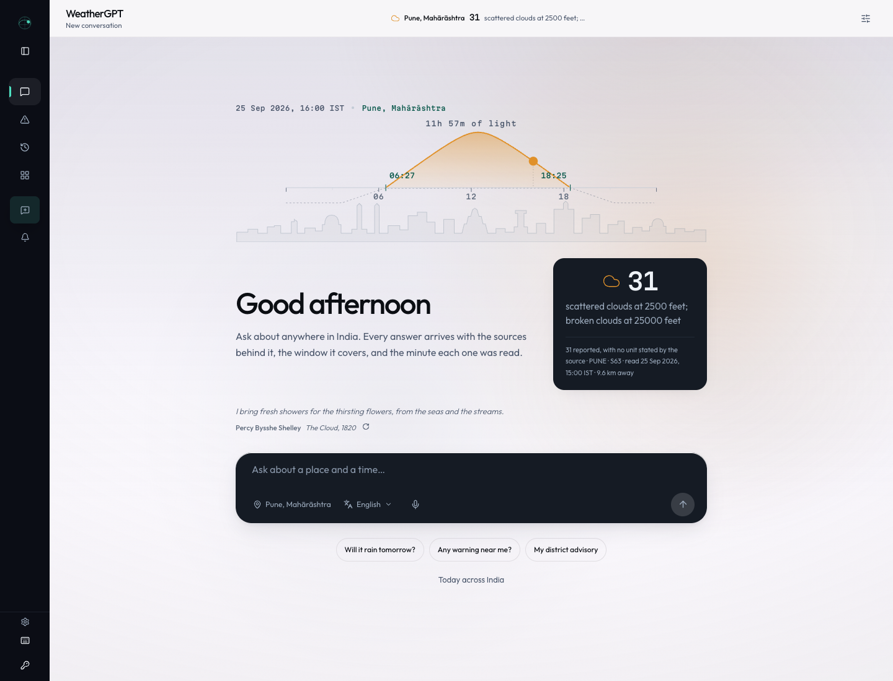
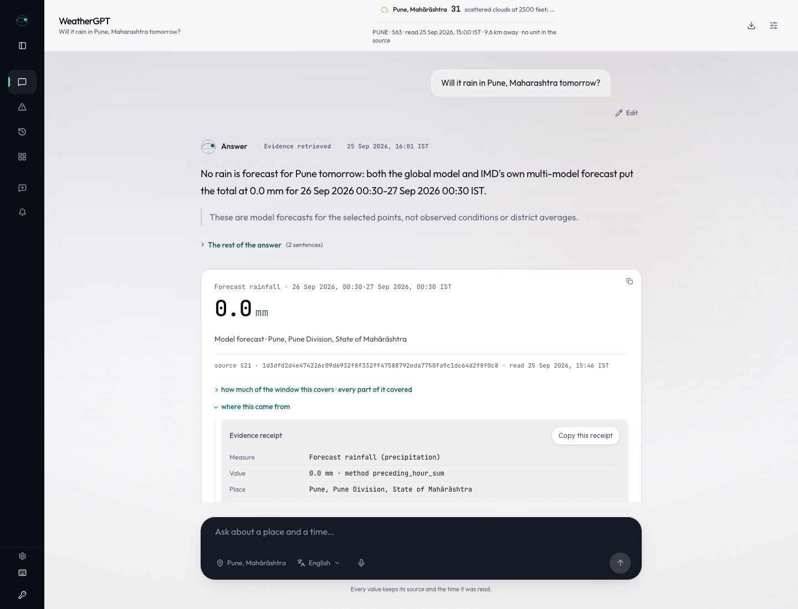
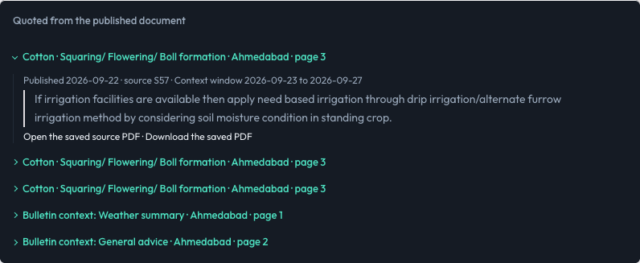
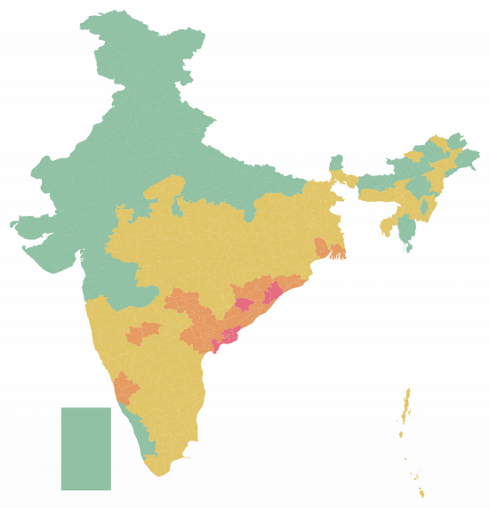
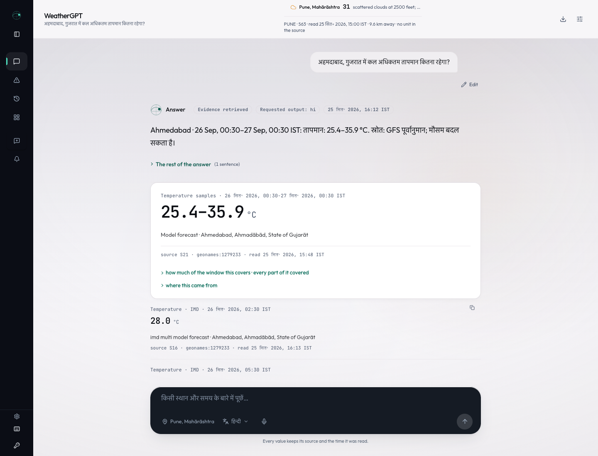
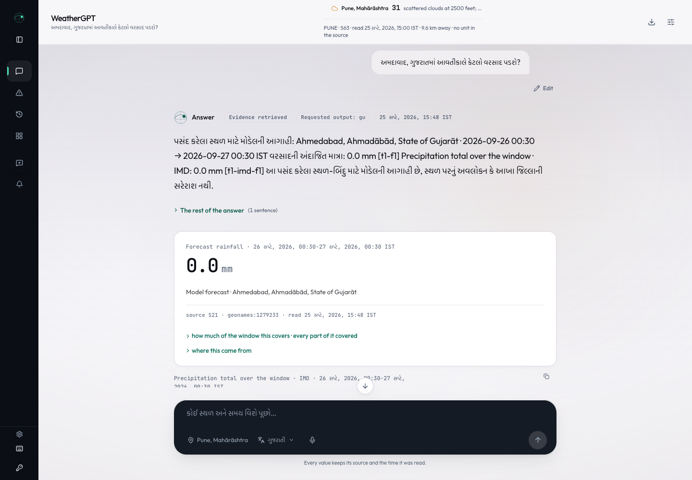
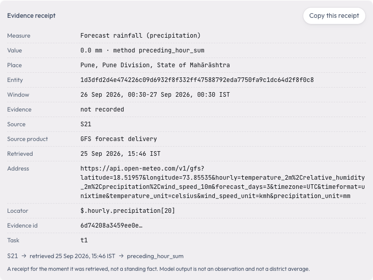
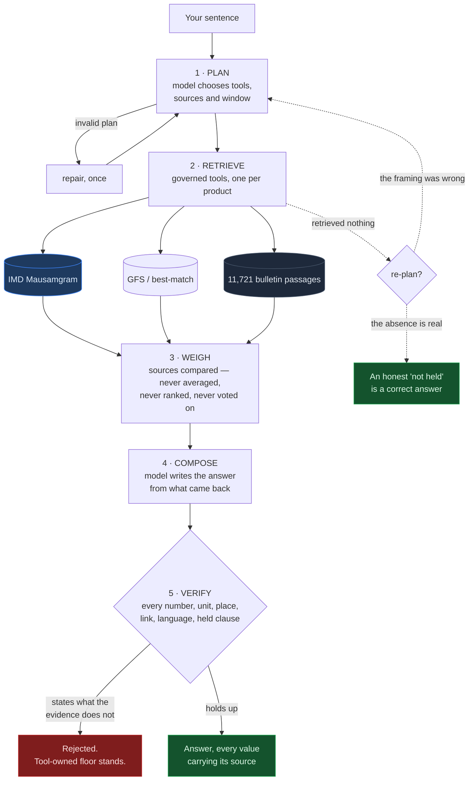
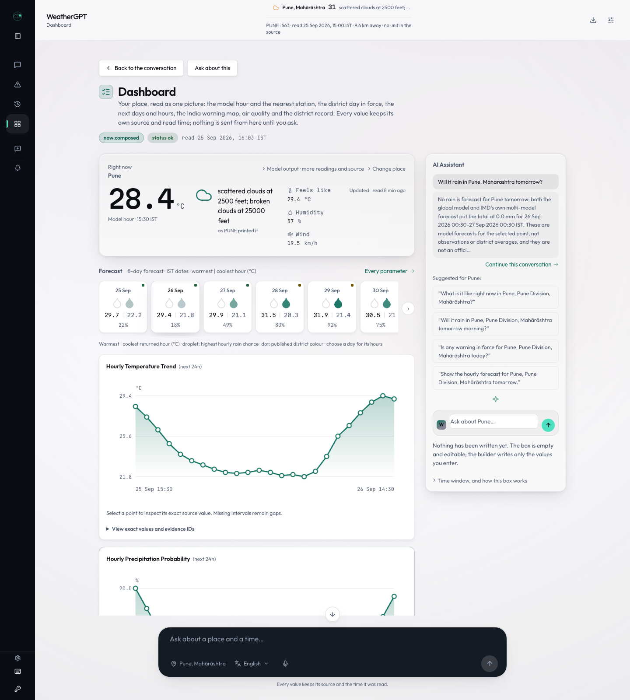
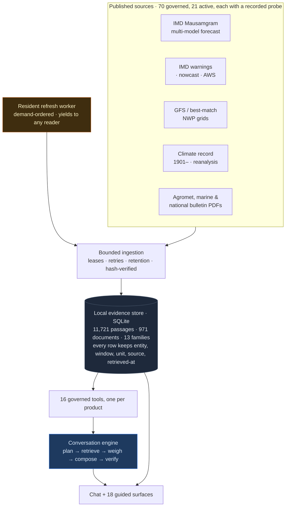

<div align="center">

# WeatherGPT

### India's weather, in your own words — with the receipt attached.

**Smart India Hackathon 2026 · SIH26068 · Ministry of Earth Sciences / IMD**<br>
**Team Void Pointers · 118709** · Disaster Management

[Product tour](#from-a-place-to-a-conversation) · [Farmer advisories](#for-the-farmer-the-crop-the-stage-the-source) · [Architecture](#architecture-and-the-evidence-store) · [PS coverage](#against-the-problem-statement) · [Run locally](#run-locally)

[View the presentation](WeatherGPT_SIH26068_VoidPointers_FINAL.pdf) · Submission video in preparation

</div>



Weather information lives across forecast charts, station reports, warning maps and agricultural bulletins. **WeatherGPT brings it into one conversation—with the source still attached.** A farmer can find crop guidance, a citizen can read a district warning, and a researcher can explore a historical record.

<table>
<tr><th width="33%">Ask naturally</th><th width="33%">Understand locally</th><th width="33%">Inspect the evidence</th></tr>
<tr><td>Follow-ups, corrections and comparisons in the same conversation.</td><td>Indian-language answers, voice input and district-specific published guidance.</td><td>Source, place, window, units and retrieval time beneath the claim.</td></tr>
</table>

<sub>Desktop web prototype. Product captures: 25 September 2026, unless labelled otherwise. All displayed weather is dated example content. Verification checks support traceability; they do not establish forecast accuracy or operational acceptance.</sub>

## From a place to a conversation

Choose a place and an answer language, then ask. The home shows the available nearby station reading; the dashboard opens the forecast, hourly chart and warning map. **Chat remains the main way to explore them.**



**A conversation should remember what the reader already said.** This three-turn sequence was recorded in one chat:

| Reader | Context carried forward | Retrieved rainfall totals |
|---|---|---|
| “Will it rain in **Pune, Maharashtra tomorrow**?” | Pune · 26–27 Sep, 00:30 IST | GFS **0.0 mm** · IMD **0.0 mm** |
| “And **the day after**?” | Same place and measure · 27–28 Sep, 00:30 IST | GFS **0.0 mm** · IMD **0.0 mm** |
| “Actually, I meant **Mumbai, Maharashtra**.” | Changed place · kept the second window | GFS **0.0 mm** · IMD **1.0 mm** |

<sub>S21 / Open-Meteo GFS and S16 / IMD Mausamgram; retrieved 25 Sep 2026, 15:46 IST. Point-model forecasts, not observations. On the correction turn, the model draft failed a check: the tool-rendered answer remained, with the fallback disclosed. [Recorded conversation](research/reviews/readme-20260925/README.md).</sub>

Saved conversations are searchable. Claims can be copied with their source, conversations exported as Markdown, and evidence opened beneath the answer that owns it.

## For the farmer: the crop, the stage, the source

> **“What does the latest district agromet bulletin say for cotton in Ahmedabad, Gujarat? Include the crop stage, issue date and advice.”**

**Krishi Salah** retrieves the relevant published passages, retaining the crop stage and the bulletin's wider context. This answer found **cotton · squaring / flowering / boll formation · Ahmedabad edition of 22 September 2026 · page 3**.



The irrigation passage keeps its conditions: **available irrigation facilities and soil moisture**. Weather context, general guidance and crop advice remain distinguishable; the reader can open the saved PDF. A missing crop row or old edition is stated. District guidance does not establish what an individual field needs.

## Warnings: the publisher's colour, for the right district and day

<table>
<tr>
<td width="46%" align="center">

<sub>Original repository map capture: 756 district features, 753 with a published colour and 3 without a row. Historical illustration, not today's warning status.</sub>
</td>
<td valign="middle">

**“What warning colour has IMD published for Patna district today?”**

The 25 September rehearsal returned **orange for Patna**, naming heavy rain, thunderstorm/lightning/squall and strong surface winds.

**S15 · IMD district 364**<br>
Bulletin: **25 Sep 2026, 05:30 IST**<br>
Retrieved: **08:00 IST**<br>
Derived day: **25 Sep 00:00 → 26 Sep 00:00 IST**

The map uses **IMD's own district geometry and published colours**. A missing row stays an outline. Green means “No warning in this product”; it is not a guarantee of safety.

[Open the actual Patna answer](docs/images/submission/warning-answer.png)

</td>
</tr>
</table>

**Chetavani Relay** connects warning reading with local Watch, plans and inbox controls. An outbox and consent-based Web Push path are implemented; **live changed-edition delivery to a real device remains unvalidated**. SMS/IVR are proposed extensions. Warning text in an agricultural bulletin remains separate from current official alerts.

## Vaani: your language, the same evidence

<table>
<tr><th width="50%">Hindi · Temperature</th><th width="50%">Gujarati · Rainfall</th></tr>
<tr>
<td valign="top">

**“अहमदाबाद, गुजरात में कल अधिकतम तापमान कितना रहेगा?”**

<a href="docs/images/submission/hindi-temperature.png"></a>

</td>
<td valign="top">

**“અમદાવાદ, ગુજરાતમાં આવતીકાલે કેટલો વરસાદ પડશે?”**

<a href="docs/images/submission/gujarati.png"></a>

</td>
</tr>
</table>

Translation checks protect numbers, units, dates, places and source identifiers. Source quotations keep their original wording. A failed rendering is disclosed; some labels and caveats remain English. **These captures demonstrate selected language paths, not native-speaker fluency.**

**Voice input:** microphone → speech recognition → editable transcript → **Use text** → send. The reader can correct a misheard place before asking; recorded audio is sent to the configured Sarvam service.

<details>
<summary><strong>Language and voice: measured support and remaining gaps</strong></summary>

The [15 September language ledger](data/registry/language-support.json) covers 22 Indian languages plus English: **19/23 passed the writing gate; 10/23 passed each recognition and synthesis probe**. Recognition probes used synthesised audio. Tamil, Sindhi, Manipuri and Santali retain failed writing results.

The current React chat exposes microphone input. Speech synthesis exists in the backend, but a **Listen control is not wired into this answer surface**. Native-speaker review, human microphone/noisy-field checks and the complete rural voice journey remain open. The README rehearsal also retained an unsuccessful Gujarati wind rendering and a poorly worded Gujarati farmer answer. [Language measurements](docs/52-language-and-voice-measurement.md) · [Rehearsal successes and failures](research/reviews/readme-20260925/README.md).

</details>

## Pramaan: open the receipt behind the answer

Open **“where this came from”** beneath a claim to trace the measure, calculation, place, time window, source and retrieval time back to a record.



**A checked answer is still a forecast, observation, warning or published advisory—and says which.** The receipt makes that distinction inspectable. This captured receipt also exposes a remaining metadata gap: its **Evidence** field says “not recorded”, although the owning claim identifies a model forecast.

## How one answer is made

The model chooses what to retrieve and explains what came back. Numerical claims come from governed tools; the draft is checked against their evidence before display.



**Compare sources without blending them.** IMD and GFS keep separate values and identities; overlapping model lineage is not independent confirmation. The checks cover values, units, places, links, language and required qualifications. A rejected draft falls back to tool-owned wording.

**One retry, with a boundary.** An empty retrieval can trigger one revised plan. It must preserve the reader's place and question; an invalid, failing or still-empty retry keeps the first answer. A genuine “not issued” remains a useful answer. [Recorded retry cases and limits](docs/145-asking-again-when-the-first-answer-was-nothing.md).

<sub>Diagram inventory counts are the retained 22 September architecture snapshot, not a live coverage counter.</sub>

## IMD at the centre, specialist sources alongside it

Public IMD routes supply forecasts, station observations, district warnings, nowcasts and bulletins. Credential-gated products remain visible as blocked; a different public product is identified by its own name.

| Product reached | Route / evidence | Boundary |
|---|---|---|
| **IMD multi-model forecast** | Mausamgram, S16/S17 | Own product, not a replacement claim for credential-gated City Forecast. Grid point and derived time axis disclosed. |
| **District warnings & nowcast** | Public IMD GeoServer layers | Separate products and validity windows; unknown codes are not assigned invented hazard names. |
| **Station observations** | Public IMD AWS layer | Station identity, reporting time and distance retained; station coverage varies. |
| **Agricultural, national & marine bulletins** | Publisher PDFs with indexed passages | Edition, district, crop/stage and physical page retained; unrecognised layouts held. |
| **GFS, history & specialist models** | Governed forecast, climate, marine and river tools | Model output remains distinct from observations and official guidance. |

[Source registry and probe ledger](data/registry/source-review.json) · [Public-route investigation](docs/144-the-model-answers-and-the-sources-open-up.md). Registration, connection and reachability from chat are separate states. WRF is not connected; image-only cyclone track/cone PDFs still need OCR.

## Beyond the first answer

<a href="docs/images/submission/dashboard.png"></a>

| Journey | What the prototype adds |
|---|---|
| **Explore a place** | Station and forecast readings, hourly charts, day selection and a national warning map. |
| **Look back — Jalvayu Lens** | Published climate records and reanalysis, source-constrained comparisons and trends; no climate-attribution claims. |
| **Explore specialist conditions** | Air quality, aviation-weather reports, marine forecasts/bulletins and modelled river discharge within connected coverage. Discharge is not observed water level; aviation weather is not flight status. |
| **Keep the work** | Searchable conversations, pinned places, source-linked claim copying, Markdown export and local Watch/inbox. |

## Architecture and the evidence store



**The evidence survives the answer.** SQLite-backed records retain source identity and retrieval context; indexed document passages keep edition, district, page and hash links. Saved PDFs can be reopened while retained. After document-body retention expires, the route names what metadata survives.

**A waiting reader gets priority.** A query refreshes the requested stale district within a bounded wait; the resident worker handles demand and age-ordered background refresh, yielding to active readers. A failed refresh leaves the held edition's age visible.

<sub>Original architecture retained; numerical inventory is a 22 September snapshot. Storage runs locally. Configured hosted model and language services receive the context needed for their requests; this is not a “100% local” processing claim.</sub>

### Engineering decisions that changed real answers

<table>
<tr><th width="33%">A refresh doing nothing</th><th width="33%">Rich evidence, poor answers</th><th width="33%">Two sources, one false range</th></tr>
<tr>
<td valign="top">The sweep repeatedly fetched the same forty districts while older records aged.<br><br><strong>Repair:</strong> demand- and age-ordered refresh, with every attempted outcome recorded. <a href="docs/142-fetching-what-a-reader-asked-for.md">Measured failure and repair</a>.</td>
<td valign="top">A six-passage ceiling blocked model prose precisely when retrieval found more evidence.<br><br><strong>Repair:</strong> leading passages in full, additional headings by name; unseen text cannot be quoted. <a href="docs/144-the-model-answers-and-the-sources-open-up.md">Composer evidence</a>.</td>
<td valign="top">A comparison credited one source with another source's endpoint.<br><br><strong>Repair:</strong> align accumulation windows before comparing; preserve each source's total. <a href="docs/140-the-full-account.md">Source-comparison account</a>.</td>
</tr>
</table>

## Against the problem statement

| SIH26068 requirement | What an evaluator can inspect | Remaining scope |
|---|---|---|
| **1 · Real-time retrieval** | Forecasts, station reports, district warnings and nowcasts | Coverage, freshness and station quality vary. |
| **2 · Natural-language queries** | Follow-ups, place corrections, comparisons and one governed re-plan | Broad paraphrase and mixed-task acceptance remain open. |
| **3 · NWP integration** | GFS, best-match and IMD Mausamgram with separate provenance | **WRF not connected**; no validated forecast-skill claim. |
| **4 · Alerts & early warning** | Warning map, applicability, Watch, outbox and Web Push machinery | **Live real-device delivery not accepted.** |
| **5 · Location-based advisories** | District/crop/stage retrieval with dated PDF passages | Nationwide corpus and individual-field acceptance open. |
| **6 · Indian languages** | Selected written-language paths with protected evidence | Partial localisation; native-speaker acceptance open. |
| **7 · Climate & historical analysis** | Published history and reanalysis with bounded comparisons | Research-grade analysis and attribution not established. |
| **8 · Voice for rural access** | Microphone → reviewed transcript → question; speech backend | Complete spoken-output UI and field/mobile acceptance open. |

[Authoritative PS record](docs/00-problem-statement.md) · [Detailed product account](docs/140-the-full-account.md) · [Acceptance scorecard](data/registry/ps-scorecard.json)

## Evidence an evaluator can check

| Recorded verification | What it establishes |
|---|---|
| **1,637 Python tests · 596 frontend checks · 21-step gate, 0 failed** | Scoped regression evidence from **23 September**, not forecast skill. [Verification record](docs/163-chat-reading-and-selected-controls.md). |
| **25 September README rehearsal** | Actual conversations, opened source/receipt panels and language captures; failed candidates retained. [Evidence record](research/reviews/readme-20260925/README.md). |
| **276-scenario atlas** | Outcome and refusal analysis across 306 turns; useful for finding gaps, not scoring linguistic or scientific quality. [Method and dated results](docs/119-what-the-atlas-measured.md). |

<details>
<summary><strong>Reproduce the checks and interpret the measurements</strong></summary>

```bash
.venv/bin/python scripts/verify_all.py             # canonical gate
.venv/bin/python -m pytest tests/ -q               # 1637 Python tests
cd frontend
npx vitest run                                    # recorded: 596 checks, 90 suites
```

The README test count is checked against collection by `scripts/check_status_drift.py`. The full gate includes typechecking, a production build and frontend audits. The 23 September record also covers sampled 1440, 768 and 360 px layouts and accessibility checks; this is not comprehensive mobile or assistive-technology acceptance.

The [20 September atlas record](docs/119-what-the-atlas-measured.md) reports **256/306 passed outcomes**, including honest refusals—not 256 independently correct forecasts. Its 26 refusals split into 14 upstream absences, one product limit and 11 avoidable failures. Advisories and climate were its weakest groups. This README refresh did not rerun that benchmark.

</details>

## Run locally

Requires **Python 3.9+**, **Node.js 20+** and network access to the selected sources. Configure one model provider; optional Sarvam credentials enable the language/speech service paths.

<details>
<summary><strong>Install, configure and start the desktop workspace</strong></summary>

```bash
git clone https://github.com/Abhichandani-Yash-Manish/WeatherGPT_.git
cd WeatherGPT_
python3 -m venv .venv
source .venv/bin/activate
python -m pip install -r requirements-dev.txt
cd frontend
npm ci
npm run build
cd ..
```

Configure credentials in your local backend environment. Choose the matching provider route:

| Provider | Configuration |
|---|---|
| DeepSeek | `WEATHERGPT_PROVIDERS=deepseek` and `DEEPSEEK_API_KEY` |
| OpenRouter free route | `WEATHERGPT_PROVIDERS=cloud_free` and `OPENROUTER_API_KEY` |
| Local Ollama | `WEATHERGPT_PROVIDERS=local` and `WEATHERGPT_MODEL` naming an installed model |
| Optional Sarvam | `WEATHERGPT_SARVAM_API_KEY` |

Keep keys out of Git and frontend bundles. Hosted services can rate-limit; a configured local model provides an alternative. A fresh clone does not contain private runtime databases or a fully populated corpus; source reads need network access and document indexing may take time.

```bash
python -m weathergpt_data.workspace --port 8765
```

Open **http://127.0.0.1:8765**. For deployment configuration and its acceptance limits, see the [deployment guide](docs/118-deploying-this-workspace.md).

</details>

---

<div align="center">

**A useful answer. A visible source. An honest boundary.**

WeatherGPT is a working prototype for SIH26068. Nationwide, field, language, mobile and live-delivery acceptance remain open; the evidence above shows what has actually been demonstrated.

</div>
