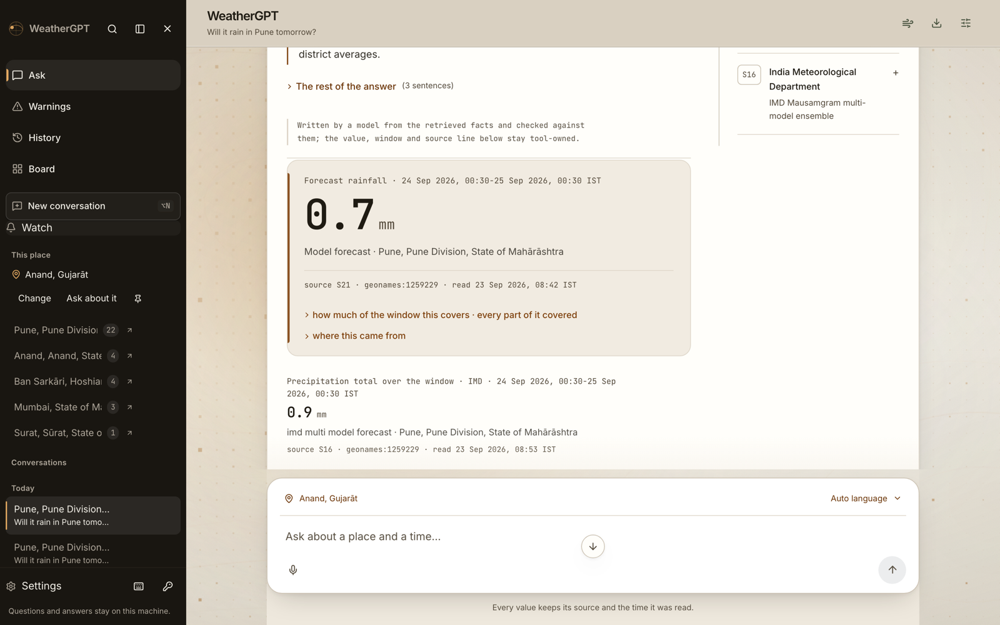
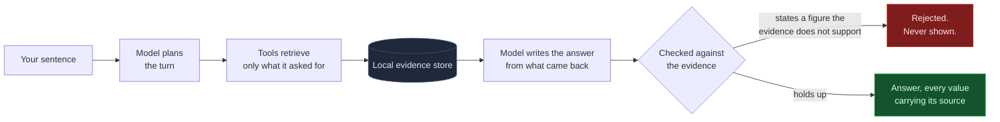
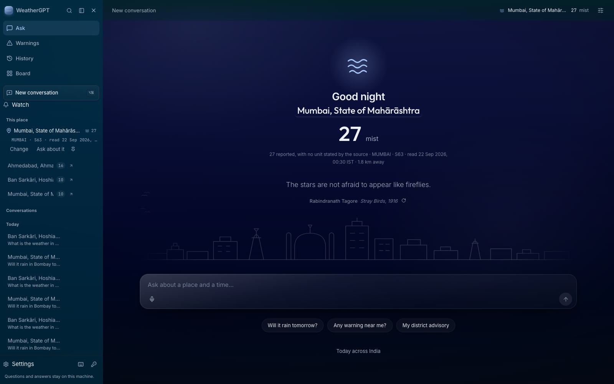
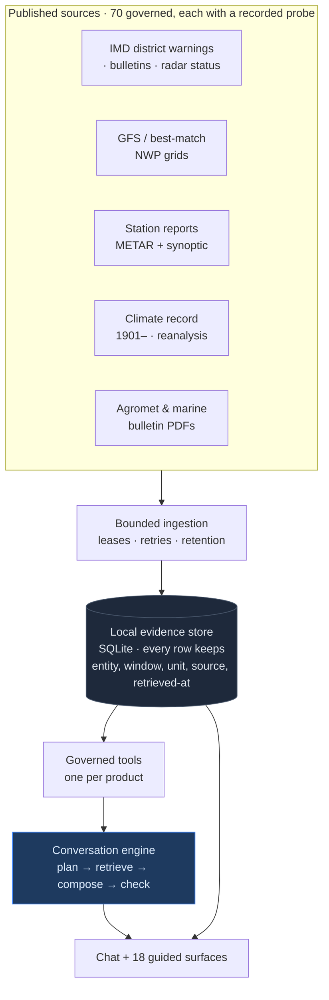

<div align="center">

# WeatherGPT

### India's weather, in your own words — with the receipt attached.

**Smart India Hackathon · SIH26068 · Ministry of Earth Sciences / IMD**
Team **Void Pointer** (18) · Disaster Management

`1,557` Python checks · `547` frontend checks · `21`-step gate, `0` failed · `276`-scenario atlas · `70` governed sources · `100%` local

</div>



---

## The thing everything else is built around

Ask a weather chatbot whether a flight is on time and it will usually tell you. It has no flight data. It is guessing, fluently.

<table>
<tr>
<th width="50%">A question it can answer</th>
<th width="50%">A question it cannot</th>
</tr>
<tr>
<td valign="top">

**Will it rain in Ahmedabad tomorrow?**

> No rain is forecast for Ahmedabad tomorrow: **0.0 mm** of precipitation is expected over 23 Sep 00:30 – 24 Sep 00:30 IST.
>
> *These are model forecasts for the selected points, not observed conditions or district averages.*

`source S21` · `geonames:1279233` · `read 21 Sep 2026, 23:53 IST`

</td>
<td valign="top">

**Is flight AI-101 on time?**

> I can't check flight status or whether a specific flight is on time — this workspace has no flight source.

**Is it safe to go out in Chennai right now?**

> There is an official district warning in force for CHENNAI … *(the conditions, in full)* … Whether that is safe for you depends on where you are going and how, which I can't judge.

</td>
</tr>
</table>

The model never supplies a number. It decides **what to retrieve** and **how to say it**; every value comes from a retrieval and stays tool-owned all the way to the screen. An answer stating a figure the evidence does not support is **rejected, not softened**.



---

## 756 districts, in the publisher's own colours

<table>
<tr>
<td width="46%" align="center">


</td>
<td valign="middle">

This is not a basemap with dots on it. Every one of the **756 districts** is a feature from IMD's own geometry, filled with **the colour IMD published for that district-day** — nothing is interpolated, averaged or inferred.

**A district with no published row is drawn as an outline, never as green.** An absence of guidance is not an all-clear, and the figure refuses to say otherwise.

| | today |
|---|---|
| districts drawn | **756** |
| stated a hazard colour | **753** |
| no published row → outline | **3** |

Ask it *"which districts in Odisha have a warning today, and in what colour?"* and it sweeps the state and answers from the same rows.

</td>
</tr>
</table>

---

## Against the problem statement

The eight features SIH26068 names. **Delivered in scope** = it works and its boundary is stated. **Partial** = it works for real cases, with named cases it does not cover. **Not accepted** = the code exists and nobody has proved it against reality. No row is upgraded by a passing test or a screenshot.

| # | Requirement | State | |
|---|---|---|---|
| 1 | Real-time weather retrieval | 🟡 Partial | Forecasts, station reports, warning days, a composed Now reading. Coverage and station quality vary by place. |
| 2 | Natural-language querying | 🟢 **In scope** | The model plans every turn; a greeting is answered without retrieval; a fact turn is written behind checks. |
| 3 | NWP models (GFS / WRF) | 🟢 **In scope** | Governed GFS and best-match, with comparison and provenance. **WRF is not connected** — the PS names both; only one is true. |
| 4 | Alerts & early warning | 🟡 Partial | District applicability, plans, outbox, consented Web Push, service worker. **No live delivery to a real device has been demonstrated.** |
| 5 | Location-based advisories | 🟡 Partial | Place resolution, district identity, crop/stage intake, cited bulletins. Nationwide acceptance open. |
| 6 | Indian languages | 🟡 Partial | 22 languages measured per direction. 16 live Hindi/Gujarati answers render 15/16 in the requested script. **Awaiting a native speaker.** |
| 7 | Climate & historical analysis | 🟡 Partial | Published history, source-constrained trends, reanalysis to a year. Not a research workspace; no attribution claims. |
| 8 | Voice for rural access | 🟠 Path built | Transcription, spoken output, Hindi/Gujarati round trips. **No noisy-field or speaker validation.** |

<sub>Line-by-line evidence and the explicit gap behind every row: **[docs/84](docs/84-ps-progress-and-pictures.md)** · the complete account: **[docs/140](docs/140-the-full-account.md)**</sub>

---

## How honest is it, measured

306 turns across the eight features, multi-turn context and adversarial boundaries — run against the live engine, not fixtures.

```
ANSWERED  ███████████████████████████████████████████░░░░░  272 / 306   89%

refusals, 27 total — and which kind matters more than the count:
  the publisher has no such data   █████████████████████░░░░░░░░░░░░  10
  a stated product limit           ██░░░░░░░░░░░░░░░░░░░░░░░░░░░░░░░   1
  ours to fix                      ████████████████████████████████░  16
```

**Most refusals are the publisher having nothing, not the product failing** — and the two are counted apart, because collapsing them would let a data gap quietly flatter the engineering.

Weakest group, stated plainly: **agromet at 60%, advisories at 79%** against 89% overall. The cause is
measured and it is not reasoning — the daily sweep covered 40 of India's 756 districts, so the corpus
simply did not hold most districts' bulletins ([docs/141](docs/141-fetching-documents-when-they-are-asked-for.md)).

**The atlas is 306 single questions, so it cannot tell you whether a conversation holds together.**
That is measured separately: `node tools/conversation-probe.mjs` runs eight multi-turn threads where
each turn is meaningless alone — *"and the day after?"*, *"sorry, I meant Pune"*, *"just guess"*.
**7 of 8 threads held**, end to end.

---

## See it run

```bash
python3 -m weathergpt_data.workspace --port 8765     # then open http://127.0.0.1:8765
cd frontend && node tools/demo.mjs                   # 10 live turns, recorded, ~3m20s
```

`tools/demo.mjs` is not a slideshow. It drives the real engine and records whatever happens — every turn is planned, retrieved and written live. One beat per key feature, plus the two refusals.

<table>
<tr>
<td width="50%"></td>
<td width="50%"></td>
</tr>
</table>

**The page is lit by the real sun.** The palette is computed from solar altitude and hour angle *at the reader's own latitude*, once a minute — dawn in Kochi and dawn in Leh are different colours because they are different dawns. The skyline between the reading and the composer is the horizon: what the sky is doing above it, what you ask about it below.

---

## Architecture



Everything runs **on this machine**. No telemetry, no account, no cloud store. The only outbound calls are to the publishers themselves and to whichever model provider you configure.

---

## Verify it yourself

```bash
python3 scripts/verify_all.py                        # 21 steps, 0 failed
python3 -m pytest tests/ -q                          # 1557 Python tests
cd frontend && npx vitest run                        # 547 checks, 83 suites
```

21 steps: the Python suite, the frontend suites, a typecheck, a production build, and audits that read the built stylesheet and the served DOM rather than the source. **0 failed.**

<sub>That first comment is load-bearing. `scripts/check_status_drift.py` parses this README for the number and fails the gate if it disagrees with what pytest actually collects — so this document cannot quietly claim a count it no longer has.</sub>

<table>
<tr><td>

| | |
|---|---|
| Python | **1,539** checks, 109 files |
| Frontend | **547** checks, 83 suites |
| Gate | **21** steps, **0** failed |
| Scenario atlas | **276** scenarios / 306 turns |

</td><td>

| | |
|---|---|
| Engine | **25,495** lines, 83 modules |
| Interface | **37,801** lines, TS + React |
| Sources | **70**, each with a probe |
| Decision records | **145** in `docs/` |

</td></tr>
</table>

`docs/` is not a folder of plans. It is what was measured, what broke, and what was done — written as the work happened. Three defects it caught this week, none exotic:

- A check had been **passing for a day while computing `NaN`**. `NaN < floor` is false, so it reported success on every input by failing to compute anything at all.
- A verifier printed the last lines of an error log without checking *when they were written*, and declared a freshly installed job broken on the strength of a failure from that morning.
- Every screenshot in the evidence directory — 18 surfaces × 2 schemes × 4 widths — had been **photographing a loading skeleton** for weeks. Two review passes drew conclusions from those files.

That is the ordinary way software lies to the people building it. The instrumentation exists because this repository has been caught doing all three.

---

## What it will not do

Not missing features — **refusals by design**, each one a place where being useful would mean being wrong.

| | |
|---|---|
| ❌ Invent a value the sources did not state | ❌ Draw a district green because nothing was published |
| ❌ Give a confidence, risk or skill score | ❌ Tell you whether something is *safe* |
| ❌ Convert between units a source did not state | ❌ Rank or recommend a model |
| ❌ Offer medical, health or evacuation advice | ❌ Treat a CAP reference as authority to disseminate |

---

## Where to go deeper

| | |
|---|---|
| 🎯 **[The demo runbook](docs/138-demo-runbook.md)** | Running order, what to point at, measured timing per beat, what to say when asked "is it just an LLM wrapper?" |
| 📋 **[Requirement-by-requirement](docs/84-ps-progress-and-pictures.md)** | Every PS line, its evidence, its explicit gap |
| 📚 **[The full account](docs/140-the-full-account.md)** | The complete reference: every subsystem, every limit, how the chat and palette were reworked |
| 🔬 **[What the atlas measured](docs/119-what-the-atlas-measured.md)** | The 306-turn run, by group |
| 🚀 **[Deploying it](docs/118-deploying-this-workspace.md)** | Dockerfile, fly.toml, and what is not yet proved |
| 📐 **[Problem statement](docs/00-problem-statement.md)** | SIH26068 as captured |

---

<div align="center">

**Operational acceptance is not achieved. This is a working prototype whose limits are part of the interface.**

That sentence is the design, not a disclaimer bolted to it. A workspace that hedges everything is useless; one that hedges nothing is dangerous. This one states, per answer, what it did not read, which state is unknown, and whether a value is model output, published wording, an observation, or an official warning.

</div>
