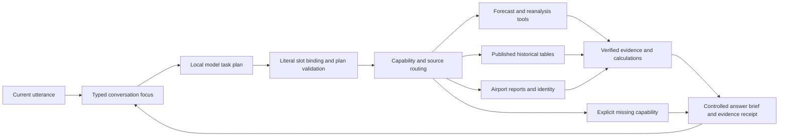

# Conversation engine refinement — 13 September 2026 IST

The user's critical feedback was reproduced against the previous preview. The foundation contained more useful evidence than the conversation engine could reliably reach. This batch repairs interpretation, conversational focus, source routing and answer delivery. It is an implementation checkpoint, not full SIH26068 acceptance.

The standing [critical review](14-product-review-and-progress-plan.md) remains authoritative. P03, P04, P05, P08, P10, P12 and P13 are still **partial**, with narrower demonstrated repairs recorded here. P06 official-warning lifecycle and P07 reviewed document retrieval remain major open requirements. Hosting stays on hold; the local desktop engine is the current priority.

## What failed and what changed

| Reproduced failure | Implemented repair | Effect on the answer |
|---|---|---|
| A Hinglish question returned English clarification, or a city became a district | Preserve Romanized Hindi; validate literal geographic scope; retain genuine same-name choices | The provided Ahmedabad question gets a Hinglish answer after one legitimate state choice |
| “Will it rain tomorrow?” lost its date when the location was missing | Compile unambiguous literal relative dates independently of missing fields | Supplying the city completes the original question instead of starting a generic forecast |
| Short corrections could overwrite time, quantity or location | Persist typed conversational focus and apply declared changes to individual fields | Evening → millimetres → Surat retains the intended date and other unchanged details |
| Probability → amount silently switched from best-match to GFS | Retain the established supported forecast product across follow-ups | Successive answers use a consistent basis; explicit cross-checks are separate |
| “Check another model” returned only GFS | Retrieve GFS and best-match, align requested place/window, calculate differences | Both products and their disagreement are visible; no invented confidence score |
| An explicit airport or country appeared in the question but was absent from task arguments | Bind literal ICAO identifiers, country aliases and repeated named places to typed tasks | Airport and national/district historical evidence is actually reached |
| “What does that mean?” explained the phrase or lost the topic | Re-explain the previous verified packet within its original expiry | Facts, reports, citations and limitations remain attached; no hidden new observation is claimed |
| Surat produced a Jalalpore alias as an equally plausible answer | Prefer canonical source-name matches over unrelated aliases; retain multiple canonical matches | A normal Surat correction works while genuine Ahmedabad ambiguity remains explicit |
| A flight-cancellation question could become an ordinary TAF request | Preserve the requested flight-status outcome and report its unavailable contract | Weather data cannot masquerade as airline status |

These are bounded compilers and validation gates around the local model, not a claim that a vocabulary list can understand arbitrary language. Complex implicit references, many-place requests and fluent coverage across Indian languages still need a larger independent evaluation set.

## Engine architecture and research

Three external references informed the design; they are architectural inspiration, not dependencies newly installed here:

- **Conversational query resolution:** CONQRR studies rewriting context-dependent questions into standalone retrieval queries. WeatherGPT uses explicit place/time/measure state to serve the same purpose, without adopting the paper's training method. [CONQRR, EMNLP 2022](https://aclanthology.org/2022.emnlp-main.679/).
- **Routing and bounded workflows:** Anthropic describes separating tasks into appropriate paths and adding programmatic checks. WeatherGPT therefore retains an inspectable task dispatcher and bounded planning repair rather than delegating factual authority to free-form synthesis. [Building effective agents](https://www.anthropic.com/engineering/building-effective-agents).
- **Existing stores as retrieval tools:** LangChain describes exposing existing databases through tools, and hybrid retrieval with query and evidence validation. WeatherGPT keeps numerical tables in their existing contracts. A document index is still a separate upcoming capability; adding embeddings would not fix lost dates or entity bindings. [Retrieval architectures](https://docs.langchain.com/oss/python/deepagents/retrieval).

The response now contains a `retrieval_plan`: candidate tools, selected products, registry status, actual returned source IDs and task outcome. This is an executable capability catalogue, **not full semantic search across all 62 registry entries**. The model does not choose arbitrary network URLs or SQL.

## Newly connected evidence and limits

S18/S19/S20 now participate in actual conversation: Indian ICAO airport identity, latest METAR temperature and wind, and original TAF reports with validity. The tool reuses the existing AWC adapters and validated raw cache, adds fixed request contracts, a cross-process provider lock, shared request reservations and cooldowns. METAR serving expires after the shorter of its observation-age allowance and five-minute retrieval lifetime. Stale or wrong-station reports cannot feed numeric answers. TAF retains its original change groups; this batch does not implement full segment decoding. [AWC API documentation](https://aviationweather.gov/data/api/).

AWC retrieval uses the common budget database but is not yet part of the numerical ingestion job/lease scheduler. Broader airport coverage, source revision behavior and complete aviation briefing remain open. An airport measurement is not a city-wide observation.

S21/S62 comparison is between products for the same requested location and interval, potentially sampled on different model grids. Best-match can include GFS upstream. The two results are not independent confirmations, and agreement does not establish forecast accuracy. No averaging or confidence percentage is produced. Probability-only comparisons correctly retain the unavailable comparable GFS field.

Whole-day and exact-clock requests retain their actual bounds. Source hours end at :30 IST. A midnight-to-midnight probability question can show the contained 23 hourly intervals and remains partial for the two boundary half-hours. It never invents a daily probability by summing hourly percentages. Hourly and daily precipitation totals are shown prominently only when their requested support is complete.

## Actual acceptance evidence

[Saved acceptance](../research/implementation/conversation-engine-20260912/acceptance.json) covers **23 real HTTP conversation turns using local Ollama**:

- **15 completed answers**, including cross-source comparison, a combined forecast/history request, Hindi national rainfall plus temperature and its year follow-up, daily reanalysis, METAR and TAF.
- **Five partial answers:** two whole-day boundary cases, an exact-clock probability request and its language follow-up, and a forecast-plus-unavailable-warning request.
- **Two necessary clarifications:** genuinely ambiguous Ahmedabad and a missing location.
- **One unavailable outcome:** airline cancellation status. This is not counted as an answered information request.

The verifier matched **81 numeric facts** to saved raw response values and locators, **seven historical cells**, **four original airport report instances**, and **six calculations**. Eight unique API responses were preserved. Source values, units, timestamps, entity associations, citation IDs and chart references were checked. National cells were rechecked through the verified publication read path; district cells were checked against their hashed source CSV rows. The earlier full transcription audit remains separate evidence.

The recorded turns had a **5.185-second median**, **6.869-second maximum**, including a no-model-call textual selection. These are one local run's timings, not load-test or production latency guarantees. **280 Python tests pass**, adding 28 regression tests to the previous 252. Existing JavaScript chart component tests also pass. Browser/visual QA remains unverified due to the previously recorded browser policy restriction; no alternative browser mechanism was used to bypass it.

The [implementation directory](../research/implementation/conversation-engine-20260912/) preserves the failed baseline and intermediate runs as well as the final checks. All **227 previous registered assets** retained their hashes before three AWC evidence blobs were registered: **62 registry entries, 230 assets**. The inventory is not a utilization percentage. User data, historical checkpoints and prior reviews were retained.

## What should happen next

1. **Current warnings and applicability — P06/P08.** Complete update/cancel chains, validity, affected-area mapping and feed-completeness checks. Then make combined forecast/warning questions useful for the PS's disaster-management focus. Supported IMD access would help; it does not replace these checks.
2. **Reviewed bulletin retrieval — P07.** Extract a document family with verified issuer, printed geography, dates, page locators and supersession. Add lexical plus semantic retrieval with hard place/time/crop filters, then test wrong-area, stale and unsupported-advice cases. This is the next route to useful document RAG.
3. **Broader conversational acceptance — P03/P12/P13.** Use independent user questions, negation, transliteration, competing topics and interrupted clarifications. Current limits include two named locations per plan, six tasks, seven daily reanalysis days and bounded forecast detail. Model inference remains probabilistic even though factual rendering and arithmetic are controlled.
4. **Marine/river workflows and resilience — P04/P10/P11.** Resolve sea/river identities before activating their adapters in chat; unify refresh scheduling, cancellation, queueing and retention. Evaluate scientific forecast skill against appropriate independent observations, separately from source integrity.

No new API keys are required for the implemented repairs. Sarvam/other speech providers and hosted LLMs can be evaluated when their specific language/latency or voice requirement is being addressed. Voice, mobile accessibility, dissemination and nationwide operational coverage remain incomplete SIH requirements. The desktop should not be called a finished product on the strength of this batch.

## Local delivery

The repaired engine is running at [http://127.0.0.1:8765](http://127.0.0.1:8765). The older 8766 preview and 8767 development server were stopped. Reload the standard URL before testing. A fresh two-turn Hinglish question/selection was verified after restart; see `standard-url-check.json`. The code/registry checkpoint is `data/processed/checkpoints/conversation-engine-20260913/`. This was a local restart, not hosting or deployment.
