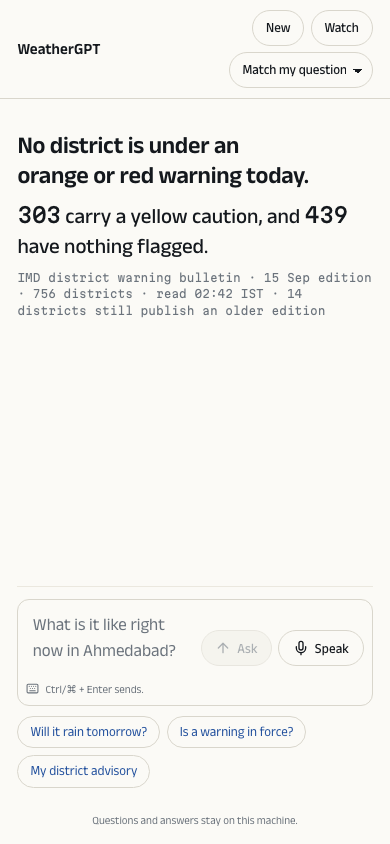
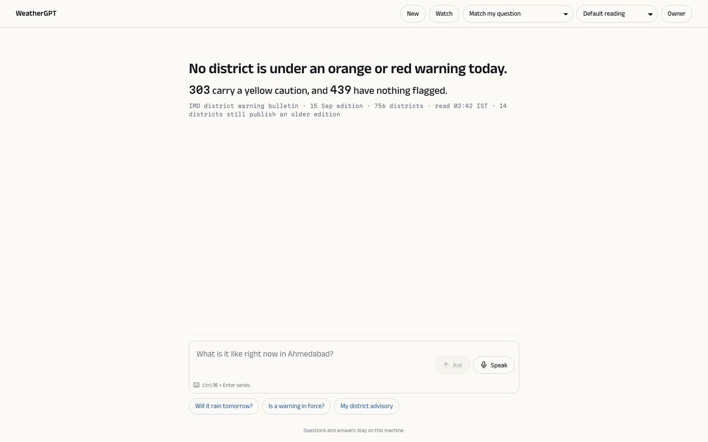
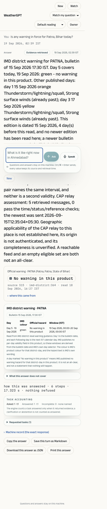

# 109 — Bulletin: the design language, built from scratch

19 September 2026. The user's direction: plan and work the entire design philosophy from scratch, on the
React stack, and do the frontend overhaul first and fast. This is the record of what was built in that batch.
It carries out docs/108 §3; it does not change the engine, a route contract or an evidence rule.

## 1. The idea

Everything this product shows is read from a published bulletin or a governed model product, by a person
who is often on a phone, outdoors, on a poor network. So the language is a bulletin's:

- **Paper in daylight.** A near-white paper, a blue-black ink, one rule colour. No glass, no shadow, no
  gradient, no photograph, no motion that answers nobody's action. Contrast is the design.
- **One accent**, a deep blue (`#1f4e9c`), chosen because it sits far from all four IMD hazard hues in both
  themes, so an accent can never read as a warning level.
- **The four published colours are the only other colour**, and they are reached only through a value a
  source printed — a chip that carries the source's own words. Interface state never borrows them.
- **Two voices, typographic.** What a model wrote is set in **Anek** (a pan-Indic family drawn per script);
  what a tool measured — every value, unit, source id, locator and timestamp — is set in **Martian Mono**.
  A number in the human face is a defect. Both faces are self-hosted, because the workspace serves under
  `default-src 'self'`; the Indic script faces load on demand.
- **Nothing decorative that needs a disclaimer.** If an element would have to be captioned "this is not a
  reading", it is not drawn.

Tokens, atoms and rules live in `frontend/src/bulletin/` (`bulletin.css`, `Claim.tsx`, `Work.tsx`).

## 2. The three shapes a reader learns

| Shape | What it is |
| --- | --- |
| **The sentence** (`.b-sentence`) | What the model wrote. The first thing in every answer; a long one is set as a paragraph rather than a headline. |
| **The claim** (`Claim`) | One value, one window, one unit, one source, one state. A published colour appears only here, with the source's words; an absent value prints "not stated in this read"; depth unfolds under the claim that owns it — the receipt, the series, the district grid. |
| **The work** (`Work`) | The engine's own steps as it ran them — planning, each tool, each task, the writing — with real durations and refused steps kept in place, collapsed to one line: *"how this was answered · 6 steps · 17.3 s · nothing refused"*. |

## 3. What was removed

| Removed | Why |
| --- | --- |
| The light language (`frontend/src/light/`, the five sky photographs, the dithered sky canvas, pointer parallax, drifting cloud, birds, noise grain, the place plate, the unsourced "line for the hour", the board) | 784 KB of atmosphere before the first answer, paid by the reader least able to pay it, every piece needing a caption saying it was not a condition report |
| The reading register (Brief / Conversational / Full evidence) | An answer is one shape; depth is opened, never switched on |
| The conversation rail with "Delete from this machine" in hazard red | A destructive action at content weight, in a colour reserved for published hazards |
| The rail of eighteen peer surfaces and the topbar | A survey of the architecture, not a product; every module survives as a sheet the conversation opens in the same frame, and deep links still work |
| The `.v3` two-voice layer (docs/106) and the aurora-glass tokens as the served look | Superseded; the old token files remain imported only for the module surfaces not yet rebuilt |
| The silent route fallback | `#/nothing-here` now says "There is no page called nothing-here" on the conversation instead of rendering it as if it were the conversation |

## 4. What a reader sees

The answer capture is a real turn through the engine on this machine ("Is any warning in force for Patna,
Bihar today?", 19 September 02:39 IST): the warning claim carries the source's own words, "No warning in
this product", with the published green, `source S15 · imd-district:364 · read 18 Sep 2026, 16:27 IST`;
the district-day table is the older component held to the paper; the work line reads 6 steps, 17.3 s,
nothing refused.

## 5. Evidence

| Check | Result |
| --- | --- |
| `npx tsc --noEmit` | clean |
| `npx vitest run` | **56 files, 312 checks, all passing** (61 / 347 before; the difference is the deleted light-language and board suites and the register tests, which were rewritten to the one-shape card) |
| `npm run build` | 951 ms; served on loopback and captured at 390 and 1440 |
| The port ledger's hooks | kept on the new card (`h2` title, status tags, `.lead-value`, `.fact-row`, the accessible validity ruler, the receipt, `.warning-panel`, the tasks list, the machine record) so the 110 vanilla checks still hold against it |

## 6. What this does not claim, and what is next

- The eighteen module surfaces, the warning table, the receipt, the disclosures, the chart block and the
  plans panel are **older components held to the paper by CSS**, not rebuilt on the Claim. That is B1.3 in
  docs/108 — depth unfolding — and it is where the paused session resumes.
- The composer keeps the kit's controls under bulletin styling; push-to-talk with confirm-before-send already
  exists and is the next thing to finish (B1.4).
- `audit_claims` (no number outside a Claim) and `audit_surface_reach` (no orphan route) are not yet in the
  gate; the seven orphan routes are still orphans.
- No reader other than this machine's owner has used it. A capture is one render on one machine.
