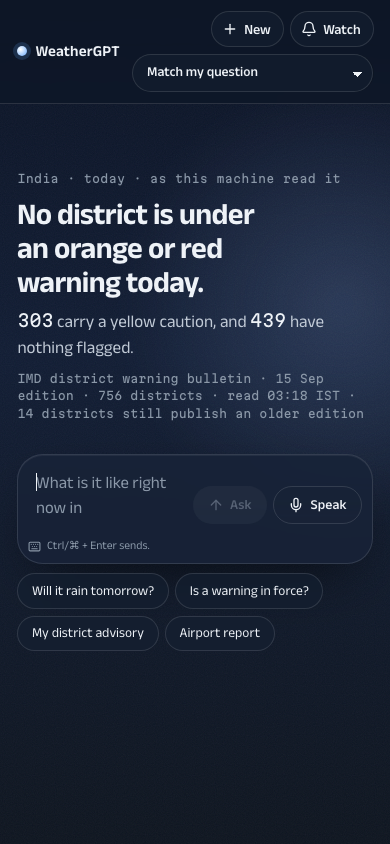
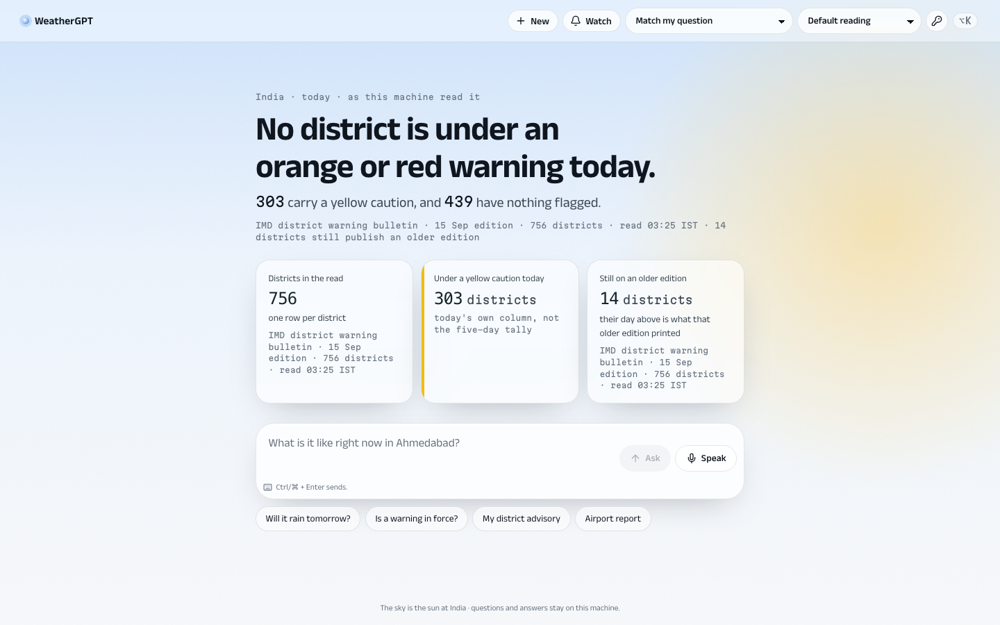
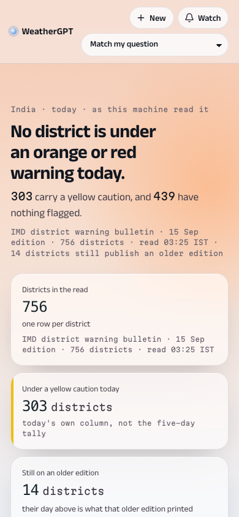
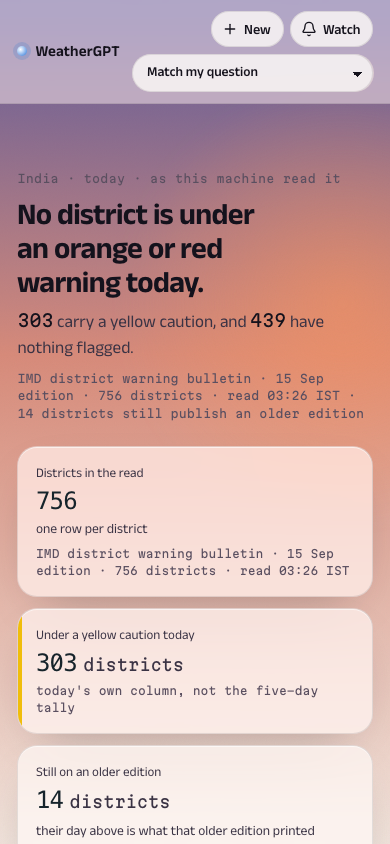
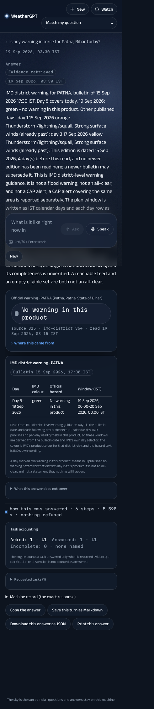

# 110 — Flagship: the atmosphere, the component library, and the motion

19 September 2026. The user's direction: cook the UI to the maximum, redesign if needed, search for
inspiration and real component libraries, and make it shine — flagship level. This is the record of that
batch. It is a frontend batch: no engine, adapter, route contract or evidence rule changed, and no PS
feature state moves.

It sits **on** [docs/109](109-bulletin-design-language.md) rather than replacing it. Bulletin's rules are the
truth layer and every one of them survives: the sentence the model wrote, the Claim as the only atom, the
Work panel, published colour reached only through a published value, an absent value printing its absence,
a gap staying hatched. What this batch adds is everything a person feels in the first three seconds.

## 1. What was researched, and what was taken

| Source | Taken | Refused |
| --- | --- | --- |
| **[HeroUI v3](https://heroui.com/)** (`@heroui/react`, `@heroui/styles`, 3.2.6) | Adopted as the chrome: Button, Kbd and the rest of 75+ React-Aria-backed components, themed entirely through its own OKLCH custom properties (`--accent`, `--radius`, `--font-sans`). No provider is needed in v3, it ships no CSS-in-JS runtime, and it imports Tailwind v4 itself — so it replaced the bare `@import "tailwindcss"` rather than sitting beside it. | Its default palette. Every token is overridden so the controls belong to the atmosphere, not to HeroUI's brand. |
| **[Aceternity](https://ui.aceternity.com/) / Magic UI / Motion Primitives** | The *idea* that product motion should be subtler than marketing motion — one orchestrated arrival, nothing that loops. | Their runtimes and their effect catalogues. Beams, particles, 3D cards and spotlight hovers are marketing motion; on a disaster-management product they would be noise, and `motion` (already a dependency) does everything this batch needs. |
| **Weather-app inspiration** (Dribbble/Mobbin surveys of 2026 weather UI, glassmorphism sets) | The two things those designs get right: the sky *is* the interface, and the data floats on it as glass. | Their invented conditions — animated rain, illustrated suns, mascots. Every one would be a fabricated weather statement on a product that refuses them. |
| **Citation-first AI answers** (the pattern Perplexity built and ChatGPT, Gemini and Claude converged on in 2026) | Confirmation that the Claim — a value with its source attached and its depth one gesture away — is the right shape, and that it should lead rather than hide behind a "sources" link. | Nothing. This product had the pattern first; the batch only made it look like it meant it. |

## 2. The three ideas

### The sky is the interface

The page sits on an atmosphere computed from the **sun at the reader's place and hour** —
`flagship/solar.ts`, the NOAA/Meeus solar-position approximation — resolved to four phases: night, dawn,
day, dusk. Each phase is a complete palette (`[data-phase]`), the sun's own glow is positioned by its real
azimuth and altitude, and the whole thing is CSS: gradients, one 90-second drift, an SVG-noise grain.
**Zero bytes of imagery and no invented condition** — this is the lesson of the deleted light language
(784 KB of sky photographs) applied properly.

One thing the atmosphere may say about the weather: when today's own column carries a **red or orange
published day**, the horizon takes that published colour at the very bottom edge (`[data-mood]`). It comes
from the read, never from inference, and never from the five-day tally whose severity is usually in the past.

### Depth is earned

Two elevations only. The sentence sits directly on the sky; Claims float above it as glass
(`backdrop-filter`, a hairline, one long soft shadow). A claim carrying a published hazard lights its left
edge with that colour. Depth — the receipt, the series, the district grid — still unfolds inside the claim
that owns it.

### Motion answers the reader

Three pieces in `flagship/motion.tsx`, each used once per answer, none looping, none on hover:

- **`AnimatedNumber`** — a value counts from zero to exactly the number the tool returned in 0.9 s, then
  settles on the string itself. The DOM holds the tool's value, never an interpolation, so a reader, a test
  and a screen reader all see the real number.
- **`Rise`** — a block arrives once, with a 80 ms stagger.
- **`Reveal`** — the opening sentence reveals word by word; every word is in the DOM from the first frame,
  so selection, search and assistive technology see the whole sentence immediately.

All three collapse to a plain render under `prefers-reduced-motion` **and** in jsdom, which is why the suite
sees static values.

## 3. What a reader sees

| | |
| --- | --- |
|  |  |
| **Night.** The reading leads; the composer follows it rather than docking, because there is nothing to scroll yet. | **Day.** The sun sits where the sun is. The yellow edge on the middle claim is the colour IMD printed. |
|  |  |
| **Dawn.** | **Dusk.** The same page, the same components, four hours later. |

The answer capture is a real turn through the engine on this machine ("Is any warning in force for Patna,
Bihar today?", 19 September 03:30 IST): the claim carries the source's own words — *No warning in this
product* — with the published green, `source S15 · imd-district:364 · read 19 Sep 2026, 03:15 IST`, and the
work line reads **6 steps · 5.598 s · nothing refused**.

## 4. Evidence

| Check | Result |
| --- | --- |
| Contrast, measured in the browser at all four phases | every text/background pair **passes WCAG AA**; the lowest is 4.65 (day, 11.5 px mono), dusk's small type measures 6.21. Probe: computed colour against the first painted ancestor, per phase |
| `npx vitest run` | **56 files, 312 checks, all passing** |
| `npx tsc --noEmit` | clean |
| `npx vitest run src/a11y` | axe-core clean on the front door, the conversation, two surfaces and the owner gate |
| `scripts/verify_all.py` | **20 steps, 0 failed** |
| `scripts/audit_react_frontend.py` | 13 checks, 0 failed — FE01 re-pointed at the served layer (`flagship.css`, `.f-dock`) after the rename |
| Bundle | JS 707 KB → **220 KB gzip** (was 184 KB); CSS 498 KB → **55 KB gzip** (was 12 KB). HeroUI's stylesheet is the whole increase, and it is the cost of 75 accessible components; no image asset was added |

## 5. Housekeeping done in the same batch

- `src/bulletin/` is gone. Its stylesheet was dead the moment the flagship layer replaced it, and its two
  atoms now style as flagship, so `Claim.tsx` and `Work.tsx` moved to `src/flagship/`. docs/109's rules
  stand; only its implementation pointer is superseded by this document.
- The register, the rail, the topbar and the conversation rail stay deleted.
- HeroUI's `@import` replaced the bare Tailwind import in `styles/app.css`, since v3 brings Tailwind v4 with it.

## 6. What this does not claim

- The eighteen module surfaces, the warning table, the receipt and the chart block are **still older
  components held to the atmosphere by CSS**. Rebuilding each on the Claim is B1.3 in
  [docs/108](108-master-plan-to-a-real-product.md), and it is where the paused session resumes.
- HeroUI is adopted for the chrome only. The Claim, the Work and the sentence are this product's own and are
  not delegated to any library.
- No reader other than this machine's owner has used it. A capture is one render on one machine, and the
  contrast probe is a measurement of the palette, not an accessibility acceptance.
- The atmosphere is astronomy. It states the hour, never the weather.
