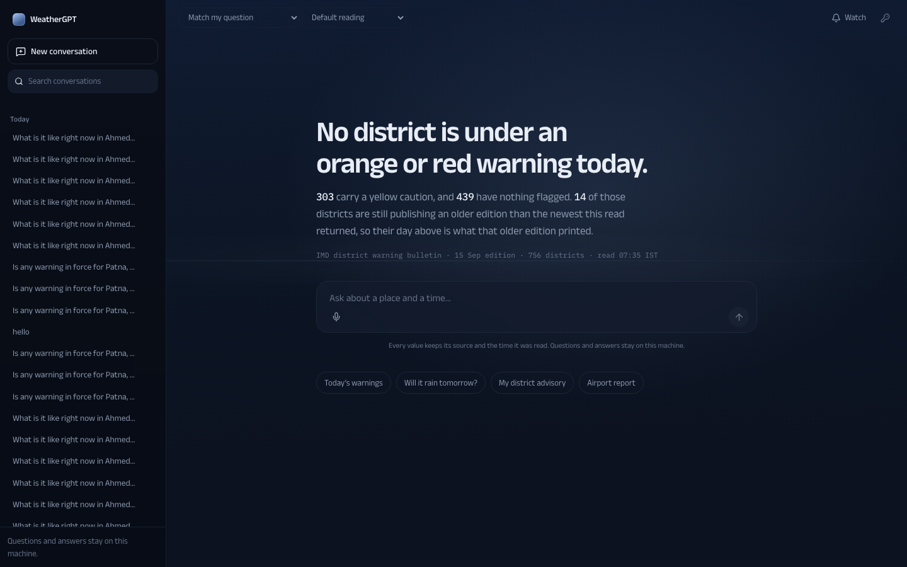
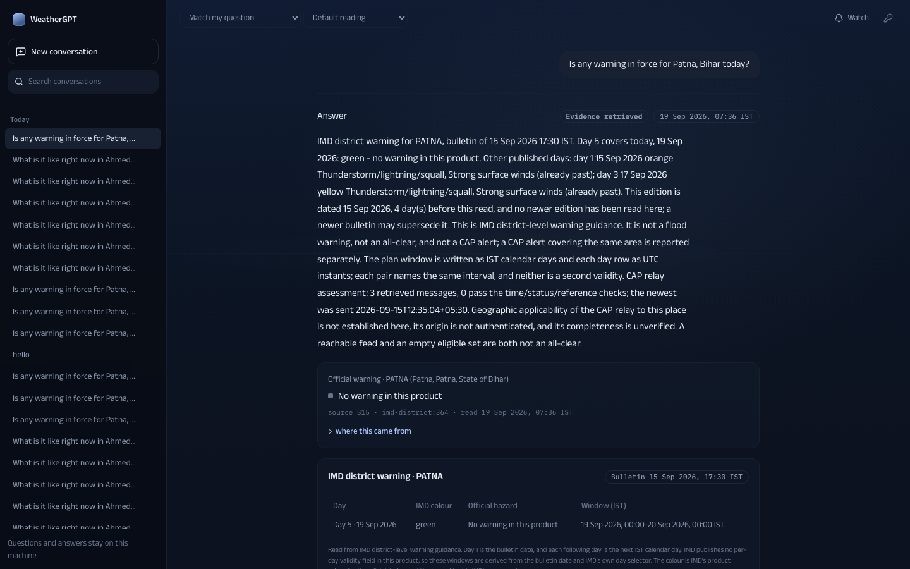
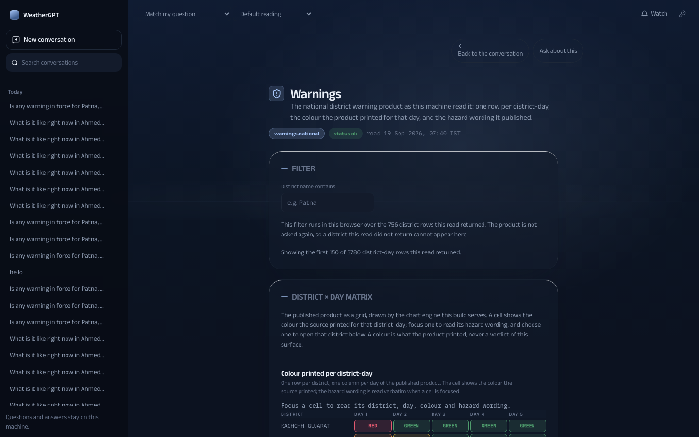

# 111 — The mature design system

19 September 2026. The instruction: the build read as a child's science project; add maturity, remove
animation if it helps, choose a mature palette, target ChatGPT for the architecture, and overhaul every
component and the dashboard. This is that system. It supersedes the look of docs/109 and docs/110; their
product rules — the claim, the source line, the published colour, the work panel — are unchanged.

## 1. The diagnosis, from this repository's own record

Seven background directions have now been tried here: aurora glass, cool paper with indigo, the light
language with sky photographs, a CSS gradient with a sun glow, illustrated vector landmarks, a dithered
aurora, and this one. **Six were rejected, and every one failed the same way**: the background tried to be
the subject, and a background that tries to be the subject reads as amateur. The two rejections that name
it most precisely are "looks like a 8 bit game" and "looks like a 5 year old child's science project" —
different pictures, identical mistake.

The category this product wants to sit in — Linear, Raycast, Vercel, Things — does the opposite. Those
interfaces have almost no background. Their entire impression of quality comes from **type, spacing,
component detailing and micro-interaction**. So this system inverts the effort: the ground whispers, and
all the craft moves to the foreground.

## 2. The system

**The ground.** Three CSS layers at roughly a twelve percent total contrast range: a gradient keyed to the
hour, one halo placed where the light is, and a **single horizon hairline**. That hairline is the whole of
the depth — Firewatch's six parallax planes reduced to the one edge that actually creates the illusion,
because at this contrast anything more becomes an illustration, and an illustration has already failed six
times. No canvas, no dither, no image. The hour comes from the sun's real altitude at the reader's place
(NOAA/Meeus with the equation of time), so dusk arrives when the sun sets rather than when a clock says so.

**Palette.** A night-flight palette rather than a tinted grey, which is one of the generated-design tells:

| | |
| --- | --- |
| `#070b14` | void — the rail, the deepest wells |
| `#0c1220` | ground |
| `#131b2b` / `#182131` | raised surfaces |
| `#1e2838` / `#16202f` | lines |
| `#8b98ad` / `#67738a` | mist — secondary and tertiary text |
| `#e8edf5` | paper — primary text, never pure white |
| `#a8c7fa` | the one accent: a pale instrument blue, on under five percent of the surface |

The accent was chosen to sit far from all four IMD hazard hues, so an interface state can never be read as
a warning level. The four published colours keep their own values and are still reached only through a
source.

**Type.** Anek stays — variable, pan-Indic, correct for a product that answers in 22 languages, and not the
default anyone reaches for. **Martian Mono was removed**: it is mannered, and it was a real part of why this
read as a toy. IBM Plex Mono replaces it, and mono is restricted to one job — a value a tool owns, or the
provenance line under it. Spacing is a 4px rhythm used throughout.

One deliberate exception: **the leading value of a claim is set in the sans**. A monospace face gives every
glyph the same advance, so at display size a decimal point floats in a gap of its own and `0.3` reads as
`0 . 3`. The claim's structure and the source line beneath it already establish that the value is
tool-owned, so nothing is lost by setting the hero numeral properly. Every supporting value stays in mono.

**Motion.** Only what answers an action: the composer lifts on focus, the send scales on press, a turn
arrives once with a 6px rise, one dot pulses while the engine works. Nothing loops for decoration, and
`prefers-reduced-motion` collapses all of it.

**Architecture.** ChatGPT's, as in docs/110: a 264px rail of stored conversations grouped by recency, a
740px centred column, the composer under the hero when the page is empty and docked once a turn exists,
transient hover actions, a stop while streaming, and a drawer rail with 44px targets on a phone.

## 3. Four generated-design tells removed

The frontend-design brief lists the traits that mark a page as machine-made. This build carried four:

1. **All-caps eyebrow labels above headings** — removed; the reading now opens the page with nothing above it.
2. **Meta strings joined with middle dots** — reduced to provenance, where the separator is doing real work.
3. **A monospace face used decoratively** — mono is now semantic only.
4. **A caption explaining the background** — removed entirely. The ground states the hour by being that
   hour, and it draws no condition to disclaim, so there is nothing to caption.

## 4. The eighteen surfaces and the dashboard

Restyling twenty-six module files would have been a rewrite. Instead the token layer they read is
repointed — one mapping in `gpt.css`. Two sets were needed: the raw names (`--ink`, `--glass-1`, `--serif`
…) that `modules.css`, `plans.css` and the chart CSS read directly, and the `--color-*` names that
Tailwind's utilities resolve. The second set has to be redeclared inside `.g` rather than at the root,
because a custom property declared at `:root` computes there and descendants inherit the computed value —
redefining `--ink` alone would never have reached `--color-ink`.

Four surface-level repairs went with it: the display serif masthead became a title at a sane size, the
published-colour washes were remixed for a dark ground (the cell keeps the source's colour as ink and edge
rather than a pale fill that read as a sticker), a four-figure KPI no longer overflows into its neighbour — it scales with its card;
and the validity ruler's first and last tick labels are anchored to their own edges instead of their
middles, which was clipping `09:30` against the track.

A later self-review pass found the all-caps label had survived inside the module surfaces after the
conversation dropped it — section headings, every dashboard card head, every table column header, and the
chart engine's axis and matrix labels. All are sentence case now. The table rule needed raised specificity
rather than a new declaration: `.module-table thead th` and a bare `.g th` have equal specificity, so source
order decided it and the module stylesheet won.

## 5. What a reader sees

## 6. Evidence

| Check | Result |
| --- | --- |
| `npx tsc --noEmit` | clean |
| `npx vitest run` | **57 files, 317 checks** |
| `scripts/verify_all.py` | **20 steps, 0 failed** |
| `scripts/audit_react_frontend.py` | 13 checks, 0 failed — FE01 now tests the intent (a narrow-width rule, a docking composer, one column) rather than a literal breakpoint, which made it fail every time the breakpoint moved |

## 7. What this does not claim

The module surfaces are **repointed, not rebuilt**: they carry the new palette and type, but their layout
is still the one written for the instrument design. Rebuilding each on the Claim is B1.3 in docs/108. No
reader other than this machine's owner has used this, and a capture is one render on one machine. The
scene lab of docs/109 stays in `research/` as the record of a rejected direction.
