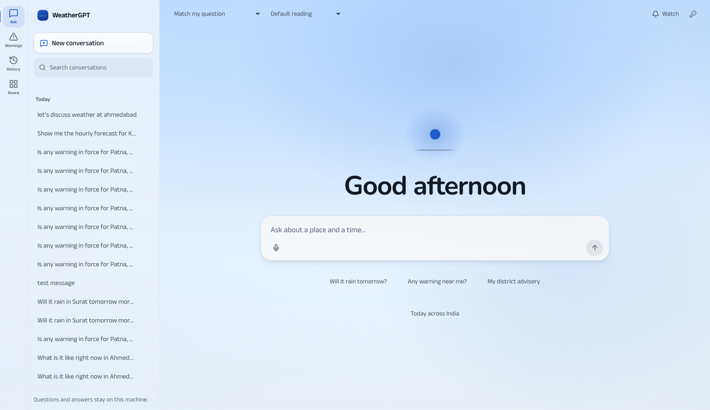
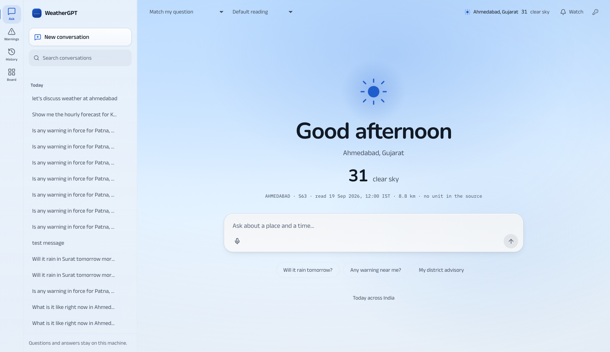
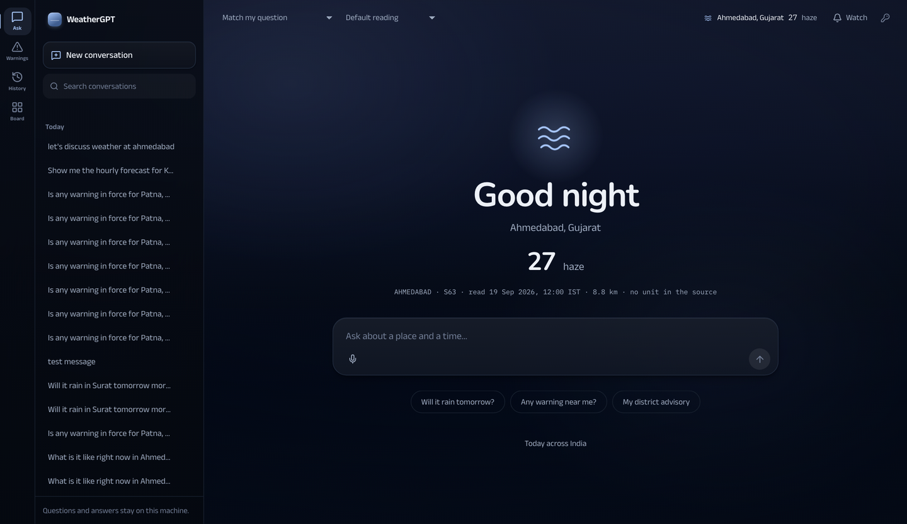
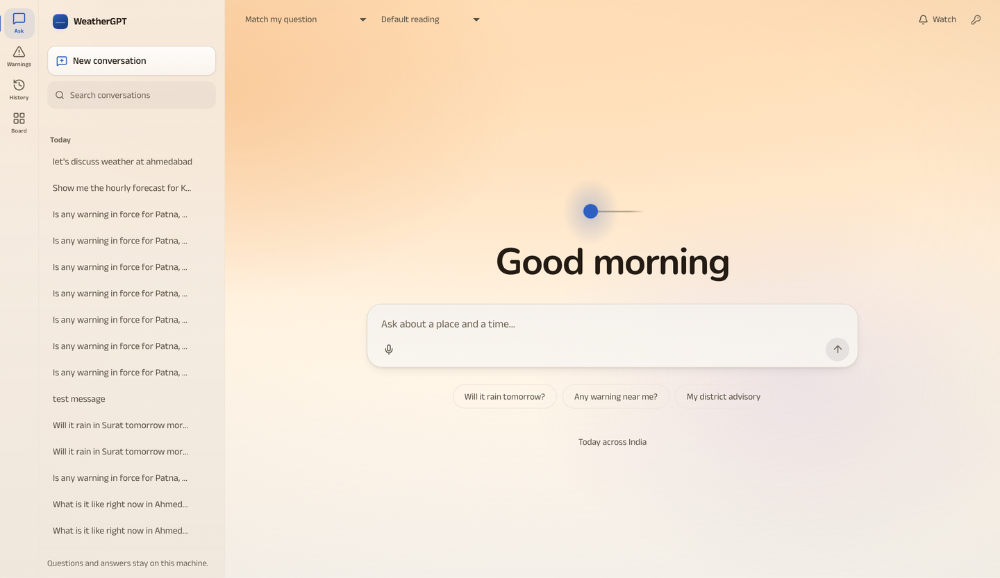
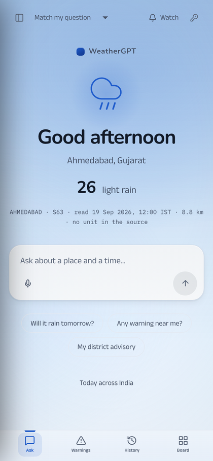
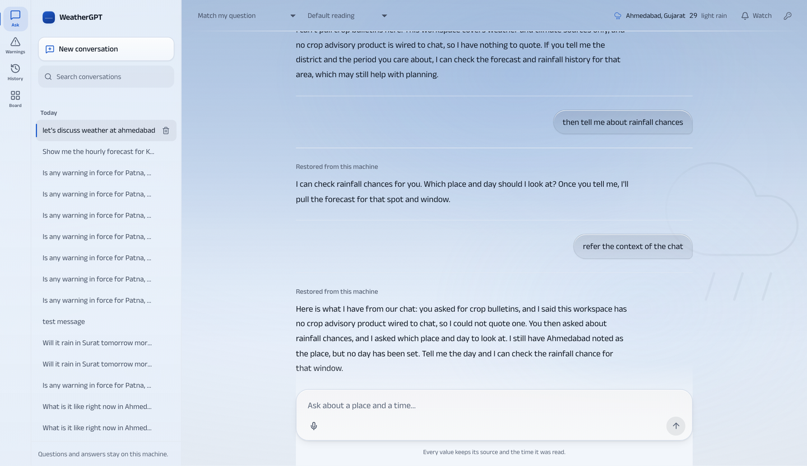

# 112 — The welcome screen, the sky mark, and a ground a reading can move

19 September 2026. The user's direction, in their words: *"subtle colours changing according to the time of
the day or weather conditions, and in the chat background we can show subtle details of the weather or
creatively just show the weather condition logo … make the UI clean aesthetic simple and punchy … we do not
need to give a brief to the user on the begin chat page so remove that element … it can be some quotes, a
subtle reactive and creative background, our logo, clean weather condition or time show greetings."*

It arrives on top of **docs/111**. That document's rules are the truth layer and every one survives: the
ground whispers and the craft is in the foreground, no element draws a condition a source did not print, the
four published hazard colours are reached only through a published value, no all-caps labels, mono only for
values and provenance. What this batch does is finish the screen that was started on that direction and had
been left mid-change.

## 1. The state this batch inherited, measured

The working tree held an unfinished welcome screen. Four things about it were false, and each was found by
reading or running something rather than by looking at it:

| What was claimed by the code | What was measured |
| --- | --- |
| `sky.ts` read the nearest station for the reader's place | It sent `latitude`/`longitude`; `GET /api/now` takes `lat`/`lon` and answered **400** every time. `retry: false`, so the welcome had never once shown a reading. |
| The welcome drew the station's condition | With no station data it always fell through to the hour mark, so the condition path had never run either. |
| The mark was "the sun over a horizon" | The horizon line drew nothing: it was stroked with an object-bounding-box gradient, and a horizontal line has a bounding box with **no height**, so the gradient is never painted. Silent, no error. |
| `npm test` | **6 failures**, in `App.test.tsx` and `home.test.tsx`, because the national warning brief had been removed from the front door and the tests still asked for it. |

The tests were repaired rather than deleted: the national picture's rules (an absent `today` block is not a
quiet day, a count no read produced is never printed, every count carries the read time) moved with the
picture to `home/national.test.ts`, and the front door kept the rules that are now its own.

## 2. The welcome screen

Four things, and nothing else: a mark, a greeting, the place, and the reading a station actually reported.

Three lines were **removed**, and each was a line that repeated something already said:

1. the brand mark on a desktop, where the 264px rail carries it four centimetres away — it survives on a
   phone, where the rail is a drawer;
2. the hour word ("Daylight", "Night") under a greeting that already states the hour;
3. *"Name a place and it becomes yours"*, under a composer whose placeholder asks for exactly that.

What is deliberately absent is the national warning brief, which was the headline here. A reader who opens a
chat has not asked to be briefed. It is not deleted from the product: it is the whole subject of the Warnings
home, and it is one quiet link away under the openings.

**The reading is subordinate to the greeting.** This is a conversation, so `Good afternoon` is set at 3.35rem
and the station's number at 2.5rem — the reference's scale contrast, with the hierarchy the product's job
implies rather than a weather dashboard's. The numeral keeps tabular figures so a reading that changes
between two looks does not shuffle its line.

**A condition is drawn only when a source printed one.** No place held means no condition word, no number and
no source line — the glass stays empty rather than being filled with a zero. What is drawn instead is the
hour, and the hour is drawn as astronomy rather than as a picture: the sun's own position at the reader's
place and minute, altitude for the height and hour angle for the east–west place, so the disc sits on the
line at first light and stands high at solar noon.

That mark had a **semicircular arc** for the sun's path, and it was removed for a reason worth keeping: a
half-circle says the sun rises due east, sets due west and passes through the zenith, and at 23°N in December
none of that is true. A mark drawn from astronomy does not get to be approximate astronomy, so what is left
are the two things that are exact — where the sun is, and how high above the line.

## 3. The ground

The ground is still CSS layers, no canvas and no image, and the hour still comes from the sun's altitude at
the reader's own place. Three changes.

**The day is a sky, not a tint of one.** The two light hours were close to white at the top of the page,
which is most of why a daylit page read as a form; the sky's colour now holds past the middle of the page
instead of returning to paper by 44 percent.

**One layer belongs to a reading.** When the nearest station PRINTED a condition, the ground takes that
condition's colour — a wash at a fifth of full strength over the hour's own sky, and the condition as a
watermark at four and a half percent once a conversation is running. Nothing here invents a condition: a
station that printed none leaves the ground as astronomy alone, and the layer is scoped to the conversation,
so a warnings surface never takes an ambient tint from a station's weather beside the four published hazard
colours.

| Condition | Hue | Strength | Why it reads as that |
| --- | --- | --- | --- |
| clear | — | 0 | A clear sky is what the hour's own palette already draws; adding light would make the one condition that needs no help the loudest thing on the page |
| cloud | 219° | 18% | Cool and desaturated |
| rain | 213° | 24% | Deeper slate-blue |
| storm | 262° | 24% | Violet-slate, darker still |
| haze | 34° | 17% | A grey warmth, 24% saturation — dust, not a hazard |

Every hue sits at least 40° from all four published hazard colours, and the dark hours hold the same wash at
62 percent of its strength, because a dark ground has less light in it to shift.

**A watermark, not an illustration.** In a running conversation the condition is also drawn at 4.5 percent,
emerging from the right edge under a mask that fades it to nothing before the reading column. Five percent is
the point where it is a change in the light rather than a picture of the weather, and the six rejected
background directions of docs/111 are the reason the number is that low.

## 4. The mark set, redrawn

The five condition marks were the generic outline set. Two were wrong on this screen:

- **haze** was three straight rules, which at any size reads as a text-alignment control from a toolbar. It
  is three *waves* now — a station that printed haze printed a softness.
- **clear** was an outlined disc with eight sticks, which is the glyph every icon set ships. The disc is
  FILLED now, because it is the sun.

The rain and storm marks share the one cloud shape, scaled and raised to make room beneath it, and each mark
is drawn at whatever stroke weight its size needs — a 320px watermark does not want the 1.6px line a 15px
top-bar glyph wants.

## 5. What was measured, not asserted

| Check | Result |
| --- | --- |
| `npx tsc --noEmit` | clean |
| `npx vitest run` | **61 files, 339 checks** (6 were failing when this batch started) |
| `scripts/audit_react_frontend.py` | **18 checks, 0 failed** (FE14 strengthened, FE16 added — below) |
| `npx playwright test tests/ui/a11y.spec.ts` | **80 passed**, every route at every width, axe including colour-contrast |
| Contrast probe, browser, 64 elements across the four hours | lowest pair **4.50:1**, nothing below the floor |
| `scripts/verify_all.py` | **20 steps, 0 failed** (in the project environment; a bare system python reports the push suites as missing dependencies, which is the documented behaviour rather than a regression) |

Two checks were repaired at the cause rather than around it:

- **FE14** read one ground per hour, `--g-bg` — which is the *lightest* part of a light hour and the darkest
  part of a dark one, so the one ground it never looked at was the one the top bar sits on. A browser probe
  measured the tertiary ink at **2.87:1** on noon over the sky. It now reads the whole gradient, and treats
  the tertiary step as the surface ink it is.
- **FE16**, new: a published hazard colour printed as ink on **its own wash** clears AA at the size the product
  prints it. Measured in a browser: red **4.21:1** and orange **3.90:1** at 9.5px on the light hours. Both were
  under the floor; yellow and green already cleared it. Red and orange moved, keeping their hues — which is how
  a published colour is allowed to move here — and the four are held to the floor from now on.

Two real defects were found by that axe run and repaired: the accent badge (`.pill-accent`) measured 4.43:1 on
the light hours, and an app-level override of it was **silently lost** because HeroUI's own rule is emitted
later in the same stylesheet at equal specificity — measured, then scoped to `.g`.

## 6. The chrome around it

- **The bar carries the place.** One quiet line: the mark, the place the answers are about, the station's
  number and its word, with the station, source and read time in the title. A statement, not a control — the
  place is changed by asking — and it exists because a reader three turns in otherwise has to infer it.
- **The bar's two selects are text.** They were filled, bordered fields with shadows; that was most of why the
  top of the page read as a control panel.
- **An opening is not a button.** The suggestion chips lost their fills and shadows: four elevated pills under
  a composer that already carries the page's highest elevation read as a second row of buttons.
- **"Today across India" is a way in, not a question.** It opens a surface and nobody would type it, so it sits
  under the openings as a quiet link.

## 7. What a reader sees

| | |
| --- | --- |
|  |  |
| **Night.** The haze mark, the station's own word, and the read time on one line. | **First light.** 05:55 IST at the national default longitude: the sun is east and just above the line. |
|  |  |
| **A phone.** The brand mark is kept here, where the rail is a drawer. | **A conversation.** The ground steps back, the watermark stays under the reading column's edge, and the bar keeps the place. |

The captures are real turns through the built frontend on this machine, driven with Playwright against
`127.0.0.1:8790`, with `GET /api/now` answered by a recorded station payload so each condition could be
looked at rather than argued about.

## 8. What this does not claim

- **No quotes.** The user floated them and this batch did not add any: a quotation is content with a licence,
  an attribution and a translation into 22 languages, and docs/30's rule is that a translation sits behind a
  deterministic check. It is a small project of its own, and it should be chosen deliberately. The screen has
  a natural slot for one line under the greeting and nothing is in it.
- **The reading is one station's.** It is the nearest station's own weather field and temperature, with its
  distance and its read time, and it says nothing about the district around it — the same limit the today
  surface states in words.
- **No reader other than this machine's owner has used any of this.** A capture is one render on one machine.
- **The condition wash was looked at on recorded payloads, not on live conditions for every state.** Five
  conditions across four hours were rendered; the combinations in between are arithmetic.
- The contrast probe is a measurement of the palette as rendered on this machine, not an accessibility
  acceptance. The axe run is the acceptance check, and it passes.

## 9. Open, and next

1. **Quotes** — the one element the user asked about that this batch left out, deliberately (§8).
2. **The rail on the front door.** It is still 264px of stored conversations beside a greeting. ChatGPT does
   the same, and it is defensible; on a first visit it is also the loudest object on the cleanest screen. A
   collapsed-by-default rail for a browser that holds no place is a small change with a real effect.
3. **The place is still set by asking.** The welcome shows where the place came from ("Name a place" is gone),
   but nothing on it sets one; a reader who wants their own sky has to type a question first.
4. **The skyline is hidden below 900px**, so the place the conversation is about is not stated on a phone.
