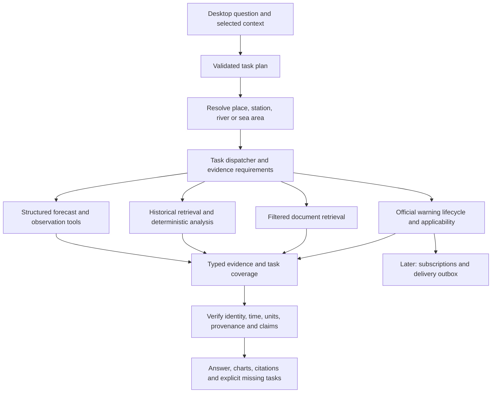

# WeatherGPT: product review and proposed progress plan

Current implementation follow-up: [the Instrument Desk frontend overhaul](46-frontend-instrument-desk.md) is the latest recorded batch; [the critical full-solution review](21-full-solution-critical-review.md) is the current status document and [the full-solution gap register](31-full-solution-gap-register.md) is the living gap list. Earlier checkpoints in the chain: [bulletin parent context](20-bulletin-parent-context.md), [context and retrieval coverage](19-context-and-retrieval-coverage.md), [conversation engine](17-conversation-engine-refinement.md) and [bulletin retrieval](18-bulletin-retrieval-and-warning-lifecycle.md). The findings below describe the original review snapshot; current scoped status is tracked in `data/registry/product-progress.json`.

12 September 2026. Scope: the supplied SIH26068 statement, current implementation, original R01–R12 review, supplied F01–F11 report and conversational recovery. **Desktop web stays the working surface; sharing and hosting are on hold at the user's request.** Nationwide and specialist final acceptance remains in scope. This review does not narrow that commitment to Ahmedabad.

**Assessment:** the foundation contains considerable reusable work, but WeatherGPT still exposes a small portion of it. The main bottlenecks are an overly narrow question/task representation, disconnected product tools, missing document semantics and incomplete user-level evaluation. More model capacity or embeddings alone would leave those problems intact. There are also two newly reproduced integrity/grounding gaps that should be repaired before expanding generated answers.

This is an audit and proposed implementation plan. It adds review evidence and updates current tracking; it does not claim that the proposed features or repairs have been implemented.

## Evidence and what was actually checked

- Read current source, registry, policies, prior reviews and the user-supplied PS. The repository now has its own Git root; existing working changes were preserved.
- Reran the complete test suite: **213 tests pass**. Registry checks pass for **61 entries and 223 evidence assets**. These facts do not establish user-task completion.
- Classified **every registry entry** by its actual conversational path: [source utilization ledger](../research/reviews/product-potential-20260912/source-utilization.csv).
- Ran **eight actual local Ollama planning probes**, invoking the real historical lookup when selected. These are planner/tool probes, not eight complete browser journeys: [results](../research/reviews/product-potential-20260912/planner-probes.json).
- Ran two isolated negative probes: a deliberately misattributed generated answer and mutation of a temporary copy of the national climate database. The serving database was not changed: [results](../research/reviews/product-potential-20260912/isolated-probes.json).
- Made seven bounded public GET checks, preserving response bytes/hash/time: [source checks](../research/reviews/product-potential-20260912/live-source-checks/summary.json). Checked official provider/model documentation for proposed dependencies. No paid credentials were used or purchased.
- No new browser, mobile, speech, load or scientific accuracy validation was performed. Previous browser verification limitations remain. This is not a rerun of the unavailable full 111-case user suite.

All new findings have stable IDs P01–P15 and map back to the earlier reviews in [findings.json](../research/reviews/product-potential-20260912/findings.json). Code/input hashes are recorded in the review baseline.

## Compliance with the original problem statement

Statuses describe current demonstrated behavior, not ambition or an official score.

| PS requirement | Present implementation | Gap to close |
|---|---|---|
| Real-time weather retrieval | Request-driven fresh model forecasts; airport observation adapter exists | Observation queries in chat currently terminate with a capability gap. IMD access and observation/station matching remain open. |
| Natural-language forecast querying | Ollama plan → place resolution → deterministic forecast → response; follow-ups | Multi-task questions, corrections, comparisons, time series and completion tracking remain narrow. |
| NWP integration such as GFS/WRF | GFS delivered through Open-Meteo | This is consumption of NWP output, not a model trained/run by WeatherGPT. Run identity, forecast skill and disagreement handling need work. Running WRF is not required merely because the PS gives it as an example. |
| Extreme-weather alerts and early-warning dissemination | CAP/WFS collection and reference parsing | No complete current applicability/lifecycle engine, subscriptions, notification outbox or delivery acknowledgement. **Major core PS gap.** |
| Location-based forecasting and advisories | Named settlement points; source catalogs and geometry checks | Dated area mapping, field/crop context, reviewed advisory extraction and weather/advice composition absent. |
| Indian-language support | Tested question interpretation and controlled Hindi/Gujarati forecast text | Historical/clarification paths are largely English; transliteration, corrections and end-to-end language fidelity unvalidated. |
| Historical information and climate trends | National and district published-value lookups; separate daily reanalysis adapter | No accessible comparison/anomaly/trend workflow or charts. Source period/boundary/missingness must constrain analysis. |
| Voice for rural access | Not implemented | STT → confirmed transcript/place/time → tools → spoken response; noisy/code-mixed evaluation. |
| Mobile-based platform | Local desktop web workspace | Deferred by current user preference, still incomplete for final PS acceptance. Desktop web alone must not be reported as full mobile compliance. |
| Meteorological backend integration | Multiple adapters, source registry, manifests, provenance and numeric store | Many adapters are absent from the question-to-answer path. |
| Scalable real-time ingestion | Local jobs, budgets, retries, leases, immutable published versions, backup tooling | No sustained scheduled footprint, unified budgets across every direct adapter, lifecycle retention or measured multi-user throughput. |
| Agriculture, aviation, marine, disaster and research use cases | Uneven prototype inputs | Add complete, scoped workflows for each; adapters or persona switches alone do not constitute delivered use cases. |

The PS's technology suggestions are options. Kubernetes, multiple autonomous agents, model training and a native app rewrite are not prerequisites for the next useful result. Accuracy/relevance, latency, accessibility and source integration must be measured in actual user journeys.

## Where the unused value is

| Registry relationship to chat | Entries | Meaning |
|---|---:|---|
| Connected in a limited scope | **5** | S21 forecasts; S25/S26 national historical tables; S27 historical district rainfall; S61 source place points |
| Numeric/identity adapter exists, disconnected | **7** | S18–S20 aviation, S22 daily reanalysis, S24 alternative geocoding, S37 river discharge, S56 marine |
| Reference adapter exists, disconnected | **5** | S06 CAP, S15 district warnings, S57 advisories, S58/S59 marine bulletins |
| Sample/reference only | **6** | Inspected material or reference evidence, not a complete serving contract |
| Catalogue/lead/gap/blocked | **36** | Includes missing entities, access gaps and documentation; not 36 ready datasets |
| Deliberately deferred | **2** | S28 astronomical ephemeris and S60 CityWx hold |

These counts sum to 61. Do not treat 5/61 as a scientific utilization percentage: entries differ greatly in size, function and readiness, and some are not datasets at all. Likewise, different delivery services can expose the same upstream GFS/ERA5 model; they are not independent votes.

The first unused sources worth activating are:

1. **S22 daily reanalysis:** period totals, wet/dry spells under an explicit threshold, historical charts and comparisons. Call it modeled reanalysis, not a rain-gauge observation or archived forecast. Recent-day availability requires a separate check; the successful July 2025 sample does not establish yesterday's availability.
2. **S18/S19/S20 airport reports:** “Latest VAAH METAR” should show the airport's observed conditions, observation time, raw report and explanation. This recovers useful observation and aviation behavior without claiming airport weather describes a whole city or predicts flight disruption.
3. **S56 marine and S37 river:** wave/discharge lookups with explicit sea-cell or river identity and units. Neither wave height nor discharge alone establishes fishing clearance, local inundation or safe travel.
4. **S57 and selected official bulletins:** reviewed, dated, page-cited advisory retrieval. This is the first valuable document-RAG target. S07's misleading PDF title demonstrates why printed geography and issuer must outrank file metadata.
5. **S06/S15 official warnings:** highest thematic importance, but activation requires lifecycle/time/area work. Returning available historical/reference notices is possible with explicit labels; current alert dissemination requires stronger acceptance.

NASA POWER, direct GFS/ERA5, satellite/radar/lightning and additional catalogs remain candidates for specific gaps. We should not integrate each simply to increase source count. The astronomical ephemeris is a valid deliberate deferral for core weather answering.

## Newly demonstrated failures

**P01 — source numbers can be attached to the wrong place.** The isolated synthesis probe supplied Ahmedabad=3.5 mm and Delhi=11.0 mm. The response swapped the cities, retained the allowed numbers/units/IDs, and passed the current validation. This does not prove that Ollama always swaps cities; it proves the validator cannot enforce attribution. The same class of gap can affect time, parameter and source associations.

Repair: each factual claim should refer to a typed evidence record containing entity, parameter, interval, value, unit, source and transformation. Render factual clauses from those records. Allow generated connective explanation, but do not let prose change which fact belongs to which entity/window. Check cited claims individually; a list of valid IDs is insufficient.

**P02 — a historical citation does not authenticate the serving value.** In a copied national database, changing 2024 annual rainfall from 1206.6 to 9999.9 still returned status `ok` with the unchanged citation. Existing build hashes are not verified in this read path. District code checks the source asset but not the transformed serving database, so the same architectural gap needs review there too; only the national-copy mutation was executed here.

Repair: publish and verify immutable serving artifacts against their build manifests, including derived database integrity. Verify once per immutable version and detect replacement before further reads; do not silently trust a copied citation or repeatedly reparse every PDF per question.

**P03 — the task schema discards parts of questions.** Live local probes showed:

| Question | Actual result of planner/tool probe | Required behavior |
|---|---|---|
| Compare Ahmedabad rainfall in 2010 and 2011 | `year=0`; lookup asks which year | Preserve both years; retrieve available rows and identify any unsupported year explicitly |
| Trend from 1981 to 2010 | Routed to generic `research` | Retrieve the range and compute a descriptive trend with sample/missingness/comparability context |
| Ahmedabad rainfall yesterday | Routed to annual 2026 district lookup | Preserve daily resolution/date and choose an available daily product or state the gap |
| India's rainfall and mean temperature in 2024 | Returns rainfall only, status `answered` | Execute both requested measures; completion cannot ignore temperature |
| Latest VAAH METAR | `observation` intent, generic observation gap route | Airport report tool with ICAO identity |
| Wave height off Veraval | Ordinary forecast with `wave_height` marked unsupported | Marine location resolution and existing marine adapter |

The combined forecast/warning probe did preserve the warning need as unsupported; that is better than silent loss, but is not a completed combined answer. A rain-start-time probe produced a precipitation plan, while the serving tool exposes a window total rather than an onset operation. The latter is a structural capability gap, not a claimed live false onset answer.

Repair: replace the single intent/year/parameter bottleneck with a **bounded list of typed tasks**. Each task records its operation, entities, times, parameters, granularity and evidence requirements. Overall status derives from task outcomes. No arbitrary model-written SQL, executable code or web URLs are needed.

Other important findings are the document extraction/retrieval gap, warning lifecycle, missing specialist identities, current runtime concurrency/retention limits and incomplete evaluation. They are individually listed in P04–P15 rather than being hidden behind “add RAG.”

## Fresh source checks and what they unlock

| Public check in this review | Observed result | Interpretation |
|---|---|---|
| IMD `/api/v1/current_wx` | **401** | Supported official access remains a useful external dependency |
| Open-Meteo `/v1/forecast` extended fields | **200**; 24 non-null hourly values each for probability, precipitation, apparent temperature, gusts, visibility and weather code | Valuable new contract is feasible; not yet integrated or scientifically validated |
| VAAH METAR | **200**, six reports; newest observation 17:00 UTC, checked shortly afterward | Actual recent airport evidence is available for an observation tool |
| Offshore Veraval marine sample | **200**, 24 wave-height and wave-period values | Candidate point marine retrieval works at this sample |
| July 1–7, 2025 ERA5 daily sample | **200**, seven non-null values per requested field | Existing daily-history adapter has immediately useful source evidence |
| Official advisory catalog | **200**, HTML | Catalog reachability does not establish validity of every bulletin |
| CAP RSS | **200**, nine items; newest listed publication September 9 | A successful HTTP request does not establish a current applicable warning or an all-clear |

The extended forecast probe uses `/v1/forecast`, not the existing GFS-only S21 contract. Its model/variable lineage must be registered separately before serving; do not relabel default provider selection as pure GFS. Open-Meteo defines hourly precipitation probability as exceeding 0.1 mm in the preceding hour. Do not sum hourly percentages, infer a whole-day probability by taking their maximum, or assume independent hours. [Variable documentation](https://open-meteo.com/en/docs).

For IMD, request supported access to documented observations/nowcasts, warnings, mappings and relevant specialist products, along with timestamp/coverage semantics. Access to an endpoint is only the beginning of validation. [Official IMD reference](https://api.imd.gov.in/public/api_reference.html).

## Proposed architecture: make the existing foundation reachable

Keep the adapters, contracts, manifests, numerical calculations and controlled publication. Refactor the orchestration boundary rather than rebuilding every pipeline. Expose a capability registry to the planner: what operations exist, what inputs they need, what evidence they can produce and which current restrictions apply.

The planner should distinguish location type, source type and user task. An airport code is not a settlement name; a district question is not permission to use its city center. Context should retain accepted entity IDs, requested operations and time windows—not merely rely on reinterpreting the last few prose messages. A correction such as “I meant the other Mandvi” must invalidate the previous selection explicitly.

Structured history and forecast data belong in typed tables and calculation tools. Documents need semantic retrieval. Warning updates/cancellations need an event/state model. Putting all three into vectors would erase important time and identity constraints.

### Document retrieval and embeddings

Start with a reviewed corpus drawn from S57 and selected official explanatory/advisory material, with a documented permitted use for each family. Preserve raw hashes and originals locally. Extract issuer, printed geography, language, issue time, validity, crop/stage, section headings and page/table coordinates. Quarantine uncertain extraction. OCR only when extraction requires it.

Chunk by advisory section or coherent table row group, repeating inherited headings and qualifiers. Preserve links to the parent page and full bulletin; measure a bounded chunk size rather than adopting one token count for every format. Stable chunk IDs should depend on document version, structural locator and transformation version. On a new issue, retire the earlier version from current retrieval while retaining explicit historical search.

Filter by product, date, place, crop/stage and review status **before** ranking. Combine lexical retrieval with dense embeddings, fuse rankings and optionally rerank a bounded candidate set. Retrieve enough parent context to preserve exceptions. Separate an official recommendation from WeatherGPT's explanation and from any additional weather calculation.

Benchmark **BGE-M3** and **Qwen3-Embedding-0.6B** as local candidates against the same multilingual corpus and questions. Both publishers document multilingual support; that is not proof of Gujarati agricultural retrieval quality. Keep a lexical baseline. Choose from measured recall, memory, latency and wrong-place/time retrieval—not reputation. No paid embedding key is required to start. [BGE-M3 model card](https://huggingface.co/BAAI/bge-m3), [Qwen embedding model card](https://huggingface.co/Qwen/Qwen3-Embedding-0.6B).

For a small local reviewed corpus, SQLite lexical search plus a versioned local vector index is sufficient to benchmark. Move shared mutable app state to PostgreSQL when the worker/application integration needs it; PostGIS and pgvector can then keep geography and retrieval filters together. Do not add TimescaleDB, Redis or Kubernetes until a measured requirement justifies each. pgvector supports exact and approximate search; approximate indexes with filters require recall testing. [pgvector documentation](https://github.com/pgvector/pgvector).

### Acquisition, storage and freshness

Keep raw immutable responses, normalized records, derived analysis, document chunks and conversation state separate. Store source issue/observation time, ingestion time and valid interval independently. Record the model run when actually available; never replace it with collection time.

Use a mixed acquisition strategy: prefetch broad official bulletins/warning feeds once per source cycle, refresh a bounded active/subscribed location footprint, and fetch uncached points on demand under shared budgets. Reuse compatible validated grid products where their identity and representativeness are explicit. Do not prequery every settlement independently.

Illustration, not a workload measurement: 549,021 place records refreshed hourly would mean **13,176,504 single-point calls/day**. The current local policy is only 200 attempts/day and 1,000 per rolling 31-day window. It is intentionally small and cannot support national prefetch. Open-Meteo currently documents 10,000 free calls/day for non-commercial use without an uptime guarantee; expanded requests can count as multiple calls. [Provider limits](https://open-meteo.com/en/pricing).

All adapters must eventually share provider accounting, backoff and publication policy. Missing/late feeds need explicit freshness states and diagnostic paths. Add tested retention and backup/restore for conversations and document indexes as well as numeric data. Failed refreshes may leave an older version available for explicitly historical inspection, but must not silently authorize current claims.

## Proposed implementation sequence and exit checks

Stages are ordered by dependencies and user value, not promises about calendar time. Geography/access work continues alongside the affected stages. No hosting, purchases or recurring jobs are created by this plan.

| Stage | What and how | Why it improves the product | Evidence required before calling it complete |
|---|---|---|---|
| **1. Answer fidelity and task coverage** | Repair P01/P02; typed multi-task plans; explicit completion statuses; persisted accepted IDs; separate source facts from generated explanation | Prevents plausible wrong answers and silently ignored subquestions | Wrong-place/time/parameter/unit swaps rejected; tampered copied historical artifacts rejected; comparisons and multi-measure asks either complete all tasks or label each missing task |
| **2. Useful everyday and research answers** | Add extended forecast fields and hourly timeline operations; connect daily reanalysis; implement range retrieval, comparisons, period totals and basic charts | Turns existing records into answers to normal planning/research questions | Probability correctly scoped; time boundaries and missing intervals tested; source-independent calculations reproduce totals/trends; yesterday never becomes an annual lookup |
| **3. Activate specialist tools** | Connect METAR/TAF/station lookup, marine waves and river discharge through the same dispatcher and governed acquisition | Delivers real aviation/marine/hydrology information already supported by foundation code | Airport/station and sea/river identities verified; observation/model types and times visible; no inference of flight delay, inundation or clearance from insufficient inputs |
| **4. Official warnings and document RAG** | Complete warning lifecycle/area matching; reviewed bulletin ingestion and hybrid retrieval; compose source recommendations with weather evidence | Restores the disaster-management and agriculture core of the PS | Expired/cancelled/test/wrong-area notices excluded; superseding updates behave correctly; right crop/place/time pages retrieved; claims cite exact sections; reference-only material never becomes a current alert |
| **5. Language, resilience and desktop usability** | Improve complete Hindi/Gujarati paths, short answers/charts/source inspection; stage progress, cancel/retry, bounded model queue; offline last-view labels; sustained ingestion rehearsal | Makes the system understandable and dependable beyond a single successful prompt | Repeatable scenarios under outages/cold starts; no lost conversational context; measured latency and memory; fluent reviewers validate numbers, negation, severity and place/time |
| **6. Later PS completion and distribution** | Sarvam voice trial, mobile acceptance, subscriptions/outbox/push, private shared access and deployment packaging | Completes currently postponed access/dissemination requirements | Confirmed voice transcripts; expiry-aware speech; notification update/dedup/delivery/revoke journeys; mobile/browser tests and user-approved sharing readiness |

Stage 4 deserves early access/schema work because warning semantics can take longer to resolve. It should not become an optional cosmetic addition after a polished forecast chatbot. Specialist tools remain required in this plan; stages are a delivery sequence, not a reduction of the agreed nationwide scope.

For the **next implementation batch**, take Stage 1 plus the existing-data portion of Stage 2: fix claim binding and historical publication verification, add multi-year/multi-measure/date-granularity plans, and make historical comparison/chart queries work. Then activate the live extended forecast contract and the specialist dispatcher. This produces observable new answers while repairing their trustworthiness.

## Acceptance should measure outcomes

Create a versioned benchmark with approximately 150 authored scenarios as a starting target, explicitly separating development and held-out sets. Include different state/settlement types, same-name places, NE/hill/coastal/island cases, source gaps, three languages and multi-turn corrections. This is a proposed test set, not 150 tests already passed.

Each case declares every requested task, allowed source types, entity/time/parameter expectations, expected calculations, acceptable clarification, prohibited claims and required citations. Score:

- Complete user tasks for the declared supported scope; initial target **at least 90%**, with the denominator and per-domain breakdown published.
- Correct clarification/abstention separately; these are not completed information tasks.
- Claim-to-evidence attribution and missing-subtask detection; **zero critical wrong-place/time/unit or invented-warning failures in the release suite** is a release gate, not a claim of universal correctness.
- Document retrieval recall@5, citation support and wrong-region/time/crop retrieval. An initial recall target of 95% on reviewed answerable cases is proposed, not measured.
- Warm/cold end-to-end latency, queue wait, source errors, generation fallback, memory and cost. Choose latency budgets after representative baselines; the previous four 3–9 second checks are not a p95/SLA.
- Language place/date/unit/negation preservation, speech entity errors and human usability. Without reachable end users, scripted tests remain provisional validation rather than evidence of farmer/disaster-manager adoption.
- Scientific forecast verification separately: archived forecast vintages against matched observations, stratified by horizon/variable/place/season. Numerical correctness and citations do not establish forecast skill. Probability needs calibration evaluation; model disagreement alone is not a confidence score.

## Useful external resources, in priority order

| Resource | What it would unlock | Need now? |
|---|---|---|
| **Supported IMD/MoES access and product documentation** | Current observations/nowcasts, official warnings, station/admin mappings and specialist feeds | Highest-value external dependency; current public observation request returned 401. Ask about approved access, permitted uses, rate limits and issue/validity semantics. |
| **Dated administrative data and authoritative mappings** | Village/district/state coverage and official warning/advisory matching | Important for area claims; a cloud LLM cannot replace it. Source points remain useful meanwhile. |
| **Sarvam developer access** | Speech recognition/synthesis and controlled multilingual trials | Useful when language/voice stage begins; not needed to repair numeric retrieval. |
| **One reliable hosted LLM endpoint with a spending cap** | Benchmark structured planning, linguistic quality and concurrent/cold-start latency against Ollama | Optional while local desktop is the target. Choose by the held-out task benchmark; a key alone does not fix the task schema. |
| **Local embedding weights** | Multilingual document retrieval experiments | Start free/local after reviewed chunks exist. No paid embedding subscription or separate vector SaaS needed initially. |
| **Larger weather quota / suitable permitted-use arrangement** | Sustained broader footprint and later distribution | Measure calls/storage first; no purchase justified solely by registry size. |
| **Domain and fluent-language review** | Advisory applicability, warning wording, translation and usability checks | Valuable even before hosting. Current lack of stakeholder access remains a validation limitation. |

Sarvam currently documents **Saaras v3** for speech recognition and **Bulbul v3** for synthesis, including Hindi/Gujarati in their respective support sets. The support sets differ; do not promise every recognized language also has speech output. Their documented APIs are candidates, not integrated/benchmarked services in this project. [Model documentation](https://docs.sarvam.ai/api/getting-started/models), [speech recognition API](https://docs.sarvam.ai/api-reference/speech-to-text/transcribe), [speech synthesis API](https://docs.sarvam.ai/api-reference/text-to-speech/convert).

Prefer short recorded queries, visible/editable transcripts and explicit entity/time confirmation when uncertain. Preserve source numbers and alert severity through translation and speech. Keep text fallback, cancel/retry and minimal audio retention. With hosted services, send only necessary permitted context. Configure credentials locally on the backend; do not paste keys into chat or put them in browser code. Current prices/credits and regional processing/retention terms should be checked at setup. [Sarvam pricing](https://docs.sarvam.ai/api/getting-started/pricing).

## Documentation and release hygiene

The early design critique contains optimistic compliance ticks, judging predictions and a suggested crop-water-stress percentage without a validated agronomic definition. Those are hypotheses, not evidence or present product requirements. They must not direct implementation toward invented risk scores. The user-supplied PS and current acceptance records are authoritative. Climate trend computation belongs to deterministic analysis even if narrative documents also use RAG.

Repository inspection found **305 tracked runtime paths**, including local databases/logs. This is not evidence of public exposure, and no secret values were printed or removed. Before sharing, separate curated fixtures from personal/runtime state, define retention/deletion, review source redistribution rights and add reproducible dependency/setup/CI packaging. Do not delete prior evidence or rewrite Git history as part of this review.

Keep all original R01–R12 and F01–F11 findings visible. A new capability should close its specific acceptance case with evidence; it should never cause a blanket “everything is ready” promotion.
