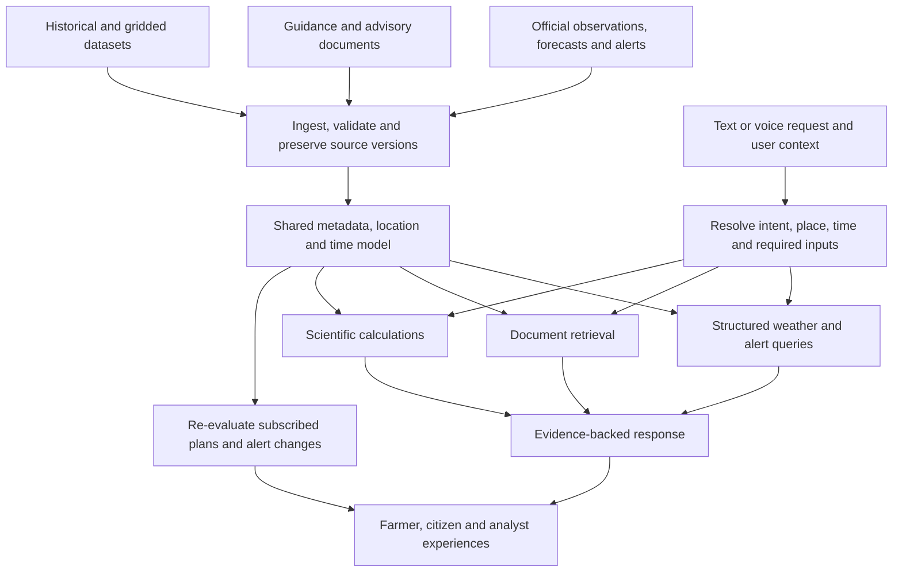

# WeatherGPT product and architecture assessment

WeatherGPT has a sound problem fit. The supplied presentation already proposes a hybrid system with live API access, RAG, source provenance, freshness checks, official-first warnings, and contextual advice. The next architectural step is to make those responsibilities explicit in a weather evidence and computation platform with conversational access. The most promising product direction is to connect forecasts and authoritative guidance to a person's activity, explain what the evidence means, and revise the advice when the relevant conditions change.

The intended product serves farmers, everyday citizens, and researchers/government users with equal importance. Farmer decision support leads the demonstration and positioning. This assessment assumes adequate engineering resources; scope sequencing follows technical dependencies rather than an assumed shortage of time or money. Direct access to representative users is currently unavailable, so usability, adoption, and outcome benefits remain hypotheses.

**1. Assessment boundary**

The reference specification is the supplied SIH26068 problem statement, reproduced in `pasted-text-1.txt`. Its requirements are treated as the working specification, without independently certifying the SIH listing. The written ideation describes a RAG foundation, tailored experiences, extensive data integration, and derived insights. The seven-slide presentation `sih_2.pptx`, supplied from `/Users/yashabhichandani/Downloads/sih_2.pptx`, has now been reviewed, including its architecture image, references and speaker notes. Section 15 reconciles the slide content with the written ideation. The workspace contained no implementation to evaluate.

External source checks were performed on 11 September 2026. Product proposals below are recommendations; cited descriptions of existing services are factual findings. The source inventory is an initial feasibility map, not an exhaustive catalogue of every Indian meteorological dataset or an assurance of production access.

**2. What to retain and what to change**

| Idea | Assessment | Recommended direction |
|---|---|---|
| RAG as the foundation | The written shorthand understates the deck, which already separates APIs and RAG; numerical computation remains underspecified | Formalize document retrieval, structured queries, numerical computation, and authoritative alert handling |
| Different experiences for different users | Strong product principle, weak standalone differentiator | Adapt required context, workflows, explanation depth, language, and outputs |
| A shared data layer | The strongest architectural instinct | Preserve source meaning, geography, time, quality, and lineage across every interface |
| Explore all available data | Useful discovery ambition; risky ingestion strategy | Catalogue broadly, then integrate sources against named decisions and analytical tasks |
| Infer more from the data | Valuable if the inference is scientifically supported | Separate retrieved facts, deterministic calculations, validated predictions, and unknowns |
| Refresh everything daily | Incompatible with several live products | Assign refresh and expiry rules per product; preserve revisions |
| Government data is unorganized and underused | Too broad and not demonstrated | Identify a particular cross-source workflow that is slow or difficult today |
| Farmers as a way to claim large impact | Would undermine the product's credibility | Treat farmer outcomes as a substantive product responsibility and measure them |

More source material does not automatically improve forecasting accuracy. WeatherGPT should distinguish forecast skill, fidelity to the source, correctness of calculations, usefulness of advice, and speed of delivery. Each needs its own evidence.

**3. Fit to the problem statement**

The proposed direction fits the statement if conversational access remains central and the mobile experience is real. A data catalogue alone would not satisfy it; neither would a chatbot that summarizes PDFs while generating weather values from language-model memory.

| Required capability | Architectural responsibility | Evidence needed before calling it complete |
|---|---|---|
| Real-time weather retrieval | Observation/nowcast connectors, location matching, freshness checks | A response trace showing the actual source record, observation time, location, and stale-data behavior |
| Natural-language forecast queries | Intent, location, date and variable resolution; forecast tools | Accurate results for follow-up questions, ambiguous places, relative dates, and unit changes |
| NWP integration such as GFS/WRF | Ingest or query identifiable model output | Model identity, run identity when available, valid time, lead time, grid coverage, and numerical agreement with input |
| Extreme-weather alerts | Authoritative alert ingestion and lifecycle processing | Correct geographic matching, update/cancel/expiry handling, duplicate suppression, and delivery tests |
| Location-based advisories | Explicit activity context, applicable guidance and calculation rules | A supported recommendation with the necessary context and a clear account of missing evidence |
| Indian-language support | Localized terminology, language-aware retrieval and generation | Place names, times, numbers, severity, negation and instructions retain their meaning |
| Climate and historical analysis | Scientific datasets and reproducible computation | Re-runnable results with period, baseline, method, dataset version, and missing-data treatment |
| Voice for rural accessibility | Speech recognition, clarification, audio output and mobile interaction | End-to-end voice task completion under realistic noise, accent, code-switching, and connection conditions |
| Scalable ingestion and response | Separate ingestion, computation, serving and notification workers | Stated-load tests, recovery tests and measured latency; an architecture diagram is insufficient |

The suggested stack is optional implementation guidance. Using every named technology is not a requirement. Integrating an NWP product need not mean training a new weather model or operating WRF locally. Agriculture, aviation, marine, and urban planning are listed as possible applications; specialized operational readiness must be assessed separately for each claimed application.

**4. Existing infrastructure changes the novelty argument**

IMD already provides a gateway and documented APIs for observations, forecasts, warnings and specialized products. Its catalogue includes agromet advisories. This directly weakens a claim that official data has no structure or machine-readable access. A stronger opportunity is to make evidence from multiple products consistently usable within a particular workflow. [1][2]

Mausamgram already offers searches using local identifiers and location-based forecast intervals. Its displayed output disclaimer describes an area of 12 × 12 km. Selecting a village or coordinate therefore must not be confused with proving field-level predictive precision. [3]

Sachet already describes geographically targeted, multilingual disaster alerts, multi-location subscriptions, browser notifications, and RSS dissemination. Notifications and multilingual access are established capabilities, so WeatherGPT's pitch needs a measurable improvement beyond their presence. [4]

IMD also promotes MAUSAM for weather, Meghdoot for agricultural advisories, and Damini for lightning warnings. Their existence does not prove every user problem is solved, but it establishes a baseline the project must respect. [5]

The recommended positioning is a hypothesis about useful differentiation, not a claim of global novelty:

> WeatherGPT connects trusted weather evidence to the decisions people need to make, explains it in their language, and updates the guidance when conditions change—with a reproducible evidence trail for analysts.

Its strongest demonstration would connect a farmer's planned activity, a citizen's saved plan, and an analyst's investigation to the same underlying weather event. The differences should be in their tasks and outputs, with consistent facts underneath.

**5. Product design for three equally important audiences**

User modes should express the task a person is doing. They should not imply that farmers lack technical ability or that citizen users never need detailed analysis. People can switch modes; language, literacy needs, expertise, and occupation are separate preferences. Basic warnings and their evidence should remain accessible across modes.

| Audience | Main job | Inputs that matter | Useful output |
|---|---|---|---|
| Farmer | Decide how weather affects a farm activity | Location, crop, growth stage, proposed operation, timing, relevant field conditions | Short explanation, applicable advisory, weather constraints, missing context, audio and optional follow-up |
| Citizen | Plan an activity and understand local warnings | Saved places, activity, time window, language and notification preferences | Forecast timeline, relevant warning, planning implications and material-change notification |
| Researcher | Investigate a weather or climate question reproducibly | Dataset, variables, geography, period, aggregation, comparison method | Chart, table, method, limitations and exportable result with provenance |
| Government/disaster operator | Monitor an evolving event and prepare a traceable briefing | Jurisdiction, time window, hazard, current warnings and available exposure layers | Alert map, change history, evidence-backed briefing and explicit information gaps |

Researchers and disaster operators can share an analytical workspace, but their workflows differ. One is often retrospective; the other requires timely operational context. A role picker and three differently worded chat prompts would not be enough to serve them.

A farmer example is “Does the current advisory affect my planned field activity tomorrow?” WeatherGPT resolves the place and timing, obtains valid forecasts and warnings, retrieves the applicable agromet guidance, and asks for any missing crop or operation context. It should not invent a universally safe pesticide-spraying threshold or irrigation amount from rainfall alone. Field conditions and domain guidance can materially change the answer.

A citizen example is “Keep me informed if tomorrow evening's outdoor plan is affected.” This requires a saved plan, consent to notifications, a defined trigger, re-evaluation on fresh evidence, and a clear stop time. A notification should explain what changed, why it matters, and which evidence supports that change.

A researcher example is “Compare district monsoon rainfall with a stated reference period.” The system must resolve the season definition, dataset, boundaries, aggregation and missingness, execute a reproducible calculation, and expose those choices. A persuasive paragraph generated from retrieved documents cannot substitute for the calculation.

**6. Candidate hooks and how to prove them**

| Candidate | What makes it useful | How to evaluate it |
|---|---|---|
| Activity-aware guidance | Translates evidence into the user's actual task, with necessary context | Compare correctness and completion time with a forecast screen plus advisory bulletin |
| Advice that follows a changing forecast | Preserves a plan and revisits it when evidence changes | Replay successive forecast runs; measure missed relevant changes and unnecessary notifications |
| Accessible explanation with inspectable evidence | A short spoken response and a detailed evidence view express the same facts | Check understanding and critical-field fidelity across language and voice outputs |
| Reproducible weather/climate investigation | Lets analysts inspect sources, rerun calculations and export results | Independently reproduce selected results from the exported recipe |
| Shared event history | Connects operational alerts, published evidence and user-facing responses over time | Reconstruct what the platform knew and said at a particular time |

The first two provide the farmer-led hook. The analytical capabilities are substantial product outcomes in their own right. The shared data infrastructure makes both possible; it should not turn the farmer experience into a promotional wrapper for an unrelated backend project.

WMO's impact-based forecasting work incorporates exposure, vulnerability, and collaboration with users. This supports the direction, while also showing why rainfall alone cannot justify a predicted loss, precise flood impact, or crop-damage percentage. [6]

**7. The appropriate architecture**

The language model interprets questions, selects bounded tools, asks clarifying questions and explains returned evidence. Structured services handle values and times. Scientific functions perform aggregations and derived calculations. Authoritative alerts retain their issuer and meaning independently of generated explanations.

RAG retrieves advisory passages, warning definitions, explanatory documents, source documentation and related context. Give documents metadata for publisher, geographical applicability, issue time, validity, language and revision. Retrieve numerical time series through structured tools. Keeping all grids as prose chunks would make exact filtering, accumulation semantics and reproducible mathematics unnecessarily unreliable.

A practical implementation could use a Python service, PostgreSQL/PostGIS for entities and geospatial records, object storage for original files and large arrays, an appropriate text/vector index, and separate workers for ingestion, scientific jobs and notifications. This is an architectural recommendation rather than a dependency lock. Choose libraries and deployment topology after testing representative data.

Expose bounded analytical operations such as an area rainfall aggregation or a baseline comparison. A query planner should produce a validated recipe, not execute unrestricted model-written SQL or code with production privileges. Large jobs should be asynchronous and retain their status, parameters and results.

Alerts should continue through a reliable templated path if the LLM is unavailable. Cached weather must expose its actual age. A source outage should yield an explicit unavailable or stale state; a forecast from a fallback provider must retain that provider's identity.

**8. Source feasibility map**

“Documented” means a provider describes the product. “Probed” means a particular request was made. Neither guarantees continuous coverage, permitted redistribution, or a reliable operational service.

| Source/product family | Intended role | Evidence and access status | Next verification |
|---|---|---|---|
| IMD current weather and AWS/ARG | Observational context | Products documented in API reference [1] | Obtain applicable access; inspect sample units, missingness, station mapping and latency |
| IMD forecasts and Mausamgram | Official local forecast context | Public interfaces/documentation verified [1][3] | Confirm endpoints, run metadata, geographic coverage and permitted use |
| IMD warnings/nowcasts | Official weather hazards | A documented warning endpoint returned HTTP 401 without authentication [1] | Validate authorized access and exact warning lifecycle |
| IMD agromet advisory | Farmer guidance corpus | Product documented; no authenticated payload tested [1] | Inspect actual language variants, crop/region coverage and revision cadence |
| IMD-linked CAP RSS and Sachet | Authoritative alert distribution | RSS fetch succeeded; sample CAP was expired at inspection [4][7] | Test completeness, expiry, update/cancel handling and agreement with public bulletins |
| NOAA GFS | Identifiable NWP forecasts and run comparison | NOAA documents four daily runs [8] | Fetch a small geographic/variable subset; verify accumulation windows and model-run identity |
| Open-Meteo GFS access | Candidate adapter for forecast prototyping | Provider documents GFS access and preprocessing; terms distinguish free noncommercial usage [9][10] | Pin applicable model, inspect transformations, retention, provenance and production terms |
| IMD gridded daily rainfall | Indian historical rainfall analysis | Catalogue fetched; description says 1901–2024, while selector also includes 2025 [11] | Verify downloaded file time bounds, completeness, missing values and citation requirements |
| IMD Data Service Portal | Historical observation acquisition | Published student category states fee waiver with documents [12] | Confirm eligibility, approved use, exact requested data and delivery conditions |
| Copernicus ERA5 | Reanalysis and historical context | Hourly historical product documented; preliminary updates lag real time and can be revised [13] | Obtain a subset and retain dataset version, units and revision state |
| MOSDAC/INSAT products | Satellite context and advanced analysis | Official download manual describes search and authenticated downloads [14] | Select a specific product, access it, and inspect geolocation, calibration and quality flags |
| INCOIS services | Marine context and specialist extensions | Ocean forecasts and an ERDDAP interface exist [15][16] | Verify the particular dataset, coverage and allowed machine access before committing |
| CWC services | Hydrological context for flood workflows | Official information points to flood-related services [17] | Locate the required basin/station product and test access; API readiness is unverified |
| WIS2 | Standards-based discovery and change notifications | WMO describes MQTT discovery notifications [18] | Discover a relevant actual dataset/topic; do not assume all Indian products are available through it |
| Boundaries, gazetteers, crop and exposure context | Reliable joins and meaningful decision support | Required by proposed workflows; providers not yet selected | Verify official identifiers, boundary versions, licensing and usable coverage |

The public IMD API page requests attribution and describes an IP-whitelisting route. The newer gateway has registration. The unauthenticated warning failure is therefore a concrete integration dependency, not evidence that all IMD data is inaccessible. [2]

Two access findings are especially instructive. The IMD-linked RSS returned nine entries; its first linked CAP message expired on 10 September, before the 11 September check. A successful request cannot establish an active warning. The rainfall catalogue's description and year selector disagree about the latest year. The contents of an actual scientific file must establish its temporal coverage. Local evidence files retain these checks.

Satellite imagery, radar, lightning, hydrology and ocean products merit explicit discovery work. They should enter the serving system when they support a named capability and have a validated interpretation. Data volume by itself is not a product advantage.

**9. Design the data layer around meaning**

The key data entities should be sources, source products, source versions, locations, observations, forecast runs, forecast values, alerts, advisory passages, analytical recipes/results, and user plans. Keep private user context separate from shareable meteorological evidence.

| Metadata group | Fields and rules to establish |
|---|---|
| Identity and lineage | Provider, product ID, source URL, native identifier, source version, content hash, ingestion/transform version |
| Time | Observation time, publication time, model initialization time, valid interval, accumulation interval, ingestion time, revision time, expiry |
| Geography | Station/grid/polygon identity, CRS, geometry, resolution, boundary version, matching method and distance where relevant |
| Measurement | Variable definition, unit, level/height/depth, statistic, sampling or aggregation interval, missing-value semantics |
| Quality | Provider flags, parser checks, completeness, freshness, spatial applicability and known limitations |
| Usage | Attribution, access mechanism, applicable licence/terms, retention and redistribution conditions |

Freshly downloading yesterday's data does not make it current. A model run time is different from the time for which the forecast applies. A daily rainfall total is different from an instantaneous rate. A grid estimate at a selected coordinate is different from a measurement at that coordinate. These distinctions must survive ingestion, querying, calculation and presentation.

Preserve original files before normalization. Parse into explicit schemas, validate ranges and units, and quarantine ambiguous records. Use deterministic identifiers to avoid duplicates. Represent revisions without destroying earlier states. Add indexes and derived views only after the source meaning is preserved.

Archive forecast runs needed for evaluation. Keeping only the latest forecast prevents answering “What was predicted before the event?” and can invalidate backtests through information leakage. Keep both when evidence applied and when the platform first knew about it.

For every answer, retain a structured evidence record: resolved location, requested interval, source records, their freshness and spatial support, calculation recipe, advisory passages, missing inputs, and generated response. The detailed trace can stay behind an evidence view while the main response remains simple.

**10. Refresh and conflict policies**

| Data class | Proposed update policy |
|---|---|
| Alerts and nowcasts | Follow available events or poll at a provider-compatible interval; process changes and expiry promptly |
| NWP output | Ingest new runs once available; avoid serving a partially downloaded run as complete |
| Observations | Match the product cadence and expected publication delay; alert internally on gaps |
| Agromet bulletins | Detect a new issue or content revision; apply its real validity window |
| Historical/reanalysis products | Ingest newly released periods and subsequent corrections; version derived results |
| Reference guidance and boundaries | Update on publication/revision, with scheduled discovery checks |

These are design policies, not promised provider frequencies. GFS has multiple daily runs, while ERA5 is a retrospective product with roughly five-day preliminary latency and later finalization. A universal daily-refresh rule would mishandle both. [8][13]

Authority should be defined per product and purpose. Show the relevant official warning even when a numerical model suggests a lower risk. Preserve contradictory forecast values and explain their differences in model, time, resolution or method; do not silently average them. Historical observations and reanalysis should also remain distinguishable.

CAP supports message updates, cancellations, validity information and geographic areas. The implementation should preserve those semantics and distinguish actual public alerts from tests or exercises. [19] Missing alerts during an outage must not be interpreted as an all-clear. A warning should never depend only on vector similarity to the user's question.

**11. Extracting additional value responsibly**

The data layer can enable derived products, but every product needs an input contract, method, validation and meaningful interpretation.

| Derived capability | Necessary inputs | Permissible conclusion and limits |
|---|---|---|
| Change in a planned activity's weather conditions | Comparable forecast runs, place, time window, user constraints | Describe the change and re-evaluate supported guidance; preserve run identity |
| Rainfall departure from a baseline | Compatible rainfall series and explicit baseline/season | Compute absolute departure and, where the baseline is nonzero, percentage departure |
| Dry-spell analysis | Daily rainfall, declared threshold and missingness policy | Count consecutive qualifying days; missing days cannot silently count as dry |
| Heat index | Temperature, humidity and an applicable published method | Return a named calculated index within its valid domain, not a personalized medical prediction [20] |
| Farm activity suitability | Forecast variables plus crop/activity guidance and relevant field context | Report conditions against the cited rule; missing context limits the advice |
| Forecast verification | Archived forecasts, comparable observations, matched space/time | Measure performance by location, variable and lead time; avoid leakage and mismatched accumulations |
| Climate trend | Adequate historical series, quality checks and stated statistical method | Report trend estimate, uncertainty and method; a short wet spell does not establish a climate trend |
| Flood/crop impact | Hazard plus appropriate exposure/vulnerability/domain models | Keep a rainfall indicator distinct from a validated impact prediction [6] |

A language model's confidence is not meteorological confidence. Ensemble probabilities must specify the source ensemble, threshold and relevant calibration. Spread across a few unrelated deterministic models is not automatically a calibrated probability. When uncertainty is unavailable, state that limitation.

Computations should be tested on hand-checkable cases and representative real records. Research outputs need units, area weighting where applicable, boundary choices, leap-year treatment, missingness thresholds and code/recipe versions. Cross-source comparisons should harmonize these choices or explicitly show why the series are not directly comparable.

**12. A stronger bottom-up sequence**

Bottom-up development is appropriate after writing the questions the platform must answer. Build from explicit decisions and analytical tasks into the required data contracts; then implement the shared foundation and exercise it through all three experiences. This prevents a large catalogue from becoming disconnected from the product.

1. **Write the complete capability map.** Preserve all three audiences and all eight required features. For each workflow, record the user question, required context, evidence, output, failure behavior and acceptance check.
2. **Establish the source register.** Include every candidate family above, its priority, owner, access status, formats, temporal/spatial coverage, transformations and unresolved questions. Prioritization determines sequence, not which audience matters.
3. **Inspect real representative samples.** Start with observations, a forecast, an official alert including an update/expiry case, an agromet bulletin, and a historical grid. Resolve identifiers, units and time semantics before finalizing schemas.
4. **Implement the common evidence services.** Store original versions, normalize validated records, perform location/time matching, track freshness and expose typed queries and calculations.
5. **Build connected workflows across all audiences.** A farmer advisory, a citizen planning/alert journey, and an analyst historical/replay investigation should use the same services. Put voice and language validation into these workflows immediately.
6. **Expand coverage and specialized calculations.** Add locations, crops, languages, data families and analytical methods against the existing contracts. Test each addition for meaningful coverage and scientific suitability.
7. **Validate the full mobile and analytical product.** Exercise notifications, network loss, source outages, privacy controls, analytical exports, recovery and stated-load behavior, as well as happy-path answers.

The first executable end-to-end examples are integration checks on the path to the whole product, not a redefinition of the final scope. A complete outcome retains substantial citizen and analytical capabilities alongside the farmer-led experience.

**13. Evaluation and honest claims**

| Evaluation area | Useful evidence |
|---|---|
| Evidence fidelity | Numerical agreement, correct source and interval, supported explanations, correct geographic applicability |
| Forecast skill | Variable-appropriate scores against matched observations, separated by place and lead time |
| Alerts | Relevant-event recall, duplicate notifications, expired/cancelled alert errors, end-to-end delay |
| Advisory quality | Correct context gathering, applicability of guidance, unsupported recommendation rate |
| Language/voice | Critical-information fidelity and task completion, including place/date recognition and negation |
| Research reliability | Reproduction of outputs from exported inputs and recipes, handling of missingness and revisions |
| Performance | p50/p95 latency by query type, source-to-availability delay, delivery latency and failure recovery |
| Product outcomes | Comprehension, task completion and time-to-decision compared with an explicit existing workflow |

Use a benchmark containing ordinary cases and difficult cases: same-named places, district borders, midnight in IST, UTC timestamps, missing data, expired warnings, warning cancellation, repeated feeds, provider outages, conflicting model runs, unsupported crop advice, and historical questions that prohibit future evidence.

The initial evaluation suite can use public records and clearly labelled simulations. It can establish engineering correctness, but it cannot establish farmer adoption, operational approval, or actual reduction in loss. Without representative users, expert usability feedback and beneficiary outcomes remain unresolved. Domain-critical agronomic recommendations still require suitable reviewed guidance; lack of direct user access is not permission to replace that guidance with model guesses.

Avoid numerical claims such as “unlocks 90% of unused government data,” “benefits millions,” “most accurate weather AI,” or “reduces crop loss by X%” without a defensible denominator, method and evidence. Report potential reach separately from active users, and engineering results separately from measured real-world outcomes.

**14. Decisions that remain open**

The farmer-led hook and equal importance of the three audiences are established. Geography, languages, supported crops/operations, specific analytical workflows, existing source credentials and deployment context remain open. The deck proposes React Native for the mobile client, providing a candidate implementation direction. The supplied material is sufficient to complete the seed-architecture assessment; these remaining choices belong to the next design stage.

A useful next deliverable is the detailed data-layer specification: a source register, canonical schemas, connector contracts, source-specific freshness rules, derived-product catalogue, and representative evidence fixtures. It should be driven by the capability map, with actual access and payload checks attached to each integration. This assessment provides its starting structure rather than claiming those connectors already exist.

**15. Presentation review and reconciled verdict**

The deck is stronger than the phrase “RAG foundation” suggests. Slide 2 explicitly preserves warning severity and validity, distinguishes historical context from numerical forecasts, and proposes evidence-grounded responses. The slide 3 image separates an API branch from a RAG branch. These are existing strengths in the proposal and should be retained. The presentation establishes an architectural hypothesis, not implemented or validated capability. [21]

| Slide | What it establishes | What needs revision or elaboration |
|---|---|---|
| 1: Title page | PS 26068, Disaster Management, team Void Pointer and Team ID 18 match the supplied context | It retains the template label “TITLE PAGE.” The official registration and submission-format compliance were not independently verified |
| 2: Verified weather intelligence | The core direction already includes intent, location, multiple sources, provenance, warnings, personalization and voice | Define verification, source conflict handling and confidence. Replace the long catalogue of features with a concrete user journey when refining the pitch |
| 3: Technical approach | Hybrid API/RAG routing and a plausible set of infrastructure candidates | Correct the retrieval diagram, add numerical analysis and alert lifecycle paths, separate source products from storage technologies, and validate the speech-language mapping |
| 4: Feasibility and viability | Provider adapters and user context are sensible design choices | Present access, reliability, privacy and scalability as capabilities to demonstrate. Separate basic warning delivery from future personalized change monitoring |
| 5: Impact and benefits | Accessibility and decision support fit the PS | Treat reduced losses and improved safety as intended outcomes. Attach measurable engineering and comprehension indicators rather than implying achieved impact |
| 6: Research and references | Links to relevant organizations and development documentation | Cite specific datasets, endpoints, standards and papers. Google Scholar and IEEE Xplore homepages are discovery tools, not individual research-paper citations |
| 7: Closing | Team and PS identity are consistent within the deck | No additional architecture claims. Submission slide-count rules remain outside this assessment |

**Forecast verification needs three separate meanings.** Before an event, the platform can check source identity, freshness, units, spatial applicability and agreement among comparable products. After an event, it can compare archived forecasts with matched observations to measure skill. At decision time, it can assess whether the available evidence is sufficient for a particular recommendation. These are different operations and should have distinct output fields and tests.

Agreement between providers cannot establish that a future forecast is correct. Different services may also draw on related upstream models, so agreement is not necessarily independent corroboration. Record upstream model lineage where available and mark it unknown otherwise. Never label an arbitrary agreement score as a calibrated probability of rain or crop damage.

Suggested functional names are **Data quality checks**, **Forecast comparison**, **Historical skill evaluation**, and **Advisory eligibility checks**. These can be tools used by an orchestration layer. Calling each an “agent” does not remove the need for deterministic contracts, numerical methods and explicit failure states. Additional model calls should be justified by measured benefit, including latency and error behavior.

**The diagram needs a distinction between ingestion and answering.** Its RAG branch currently shows RAG, then retrieved information, then the vector database. For the document-RAG design shown, indexing happens before a user's request: acquire and validate documents, retain versions, extract passages, index them. At query time, filter and search the stored material, retrieve relevant passages, and pass the evidence to the response generator. If the existing arrow intends to show ingestion, label it separately from retrieval.

The API branch merges results into “Final Data” before “Cleaning.” Instead, validate and normalize each provider's records before attempting comparison or combination, retaining provenance throughout. Add explicit rules for missing records, incompatible accumulation periods, stale runs and source disagreements. The diagram also includes a direct LLM-to-output-LLM arrow. As drawn, it leaves the evidence requirement ambiguous. Every factual weather claim should pass the same evidence checks regardless of which route produced it.

Add a scientific calculation path for climate and historical work. In the technologies panel, “pgvector / PostgreSQL, IMD, ERA5” mixes a storage/index choice with a provider and a dataset. Index ERA5 documentation for explanatory retrieval; query numerical ERA5 arrays through scientific tools. PostgreSQL can hold metadata and selected aggregates, while appropriate file/object storage holds larger scientific data. Name the actual NWP product and model-selection policy separately from the weather API brand.

The depicted request/response loop does not show how the system learns about new evidence while nobody is chatting. An ingestion/event path must update records, process alert validity and revisions, re-evaluate relevant subscriptions, and schedule delivery. CAP/RSS or a documented provider interface supplies alert content; MQTT is a messaging protocol; FCM delivers mobile push notifications. Listing them together does not establish a working Sachet-to-MQTT integration. The required access and payload route must be demonstrated.

**There is a specific speech-stack mismatch to resolve.** Slide 3 assigns TTS to Groq. The current Groq TTS documentation lists English and Saudi Arabic models, which does not support the proposed Indian-language audio experience on its own. Sarvam's model documentation lists Indian-language speech services, including Bulbul TTS, so it is a candidate to evaluate for that role. Select the actual supported languages and test the speech path rather than treating a provider name as coverage evidence. [22][23]

“Gemini (STT)” is a plausible candidate: Google's current documentation includes transcription. Specify whether the application needs uploaded-utterance transcription or a live audio session, then choose and test the relevant model/API. The vendor name alone does not establish latency, language accuracy or streaming behavior. [24]

Ollama describes how a model would be served, but leaves model choice, multilingual quality, tool-call behavior and deployment hardware unspecified. Hosting it on a server also does not make the mobile experience work offline. Define low-connectivity behavior explicitly: display cached content with its age, expire old warnings, queue retriable work appropriately, and explain when current data cannot be fetched. If on-device inference is desired, specify and benchmark that separately.

**The product experience is the largest remaining design gap.** The deck promises multiple audiences, but shows neither their workflows nor their outputs. Preserve the equal importance of farmers, citizens and analysts by specifying at least one complete journey for each, including evidence inspection, relevant follow-up, and failure behavior. Farmer activity advice can lead the pitch; researchers need substantial query, computation and export capabilities, and disaster operators need event monitoring and traceable briefings.

Slide 2 includes alerts in the proposal, while slide 4 puts proactive notifications in future versions. Resolve this by separating **current authoritative-warning dissemination**, which the PS expects, from **personalized plan-change monitoring**, which adds context and differentiation. Decide the intended release for the latter explicitly rather than leaving the slides in tension.

Visually, slide 2 contains dense three-column copy, while the technical flow on slide 3 has small labels. Both communicate more detail than an audience can comfortably follow during a short pitch. A later deck revision should prioritize the user decision, the evidence flow and the demonstrated result. The present review does not modify the source presentation.

The reconciled verdict is to retain the hybrid architecture and its trust principles, formalize the missing data/computation contracts, and turn personalization into complete task workflows. A restart or a more elaborate collection of agents is not required to proceed. The next specification should define a shared evidence record, provider adapters, document retrieval, scientific operations and alert/plan lifecycle behavior, mapped to the full user capability set.

**Sources**

All web sources were accessed on 11 September 2026 unless a source-specific publication date is stated. Local probes were unauthenticated, read-only checks and do not establish production access. Sources without a clear publication date are cited by publisher and title.

1. India Meteorological Department. [List of APIs of India Meteorological Department](https://api.imd.gov.in/public/api_reference.html). Product catalogue and field descriptions.
2. India Meteorological Department. [IMD APIs](https://mausam.imd.gov.in/responsive/apis.php) and [API Management Platform](https://api.imd.gov.in/public/index.php). Access routes, attribution and registration.
3. India Meteorological Department. [Mausamgram forecast interface](https://meteogram.imd.gov.in/). Location controls, temporal intervals and spatial disclaimer.
4. National Disaster Management Authority. [Sachet](https://sachet.ndma.gov.in/). Alert and dissemination capabilities; page states updated 31 July 2026.
5. India Meteorological Department. [Application announcement listing](https://internal.imd.gov.in/pages/advertisements_mausam.php). MAUSAM, Meghdoot and Damini announcement dated 3 September 2020; current IMD API page also promotes these apps.
6. World Meteorological Organization. [Impact-based forecasting informs anticipatory action](https://public.wmo.int/media/news/impact-based-forecasting-informs-anticipatory-action). Exposure, vulnerability and user collaboration.
7. [IMD-linked CAP RSS](https://cap-sources.s3.amazonaws.com/in-imd-en/rss.xml), linked by source 2; [sample alert](https://cap-sources.s3.amazonaws.com/in-imd-en/2026-09-09-07-24-34.xml), issued 9 September 2026. Local snapshots and metadata are in `research/evidence/`.
8. NOAA/NCEP Environmental Modeling Center. [Global Forecast System](https://www.emc.ncep.noaa.gov/emc/pages/numerical_forecast_systems/gfs.php). Model and run cadence. NOAA/NCEI: [GFS data access](https://www.ncei.noaa.gov/products/weather-climate-models/global-forecast).
9. Open-Meteo. [GFS and HRRR API documentation](https://open-meteo.com/en/docs/gfs-api). Model access; HRRR regional capabilities must not be extrapolated to India.
10. Open-Meteo. [Terms of Use](https://open-meteo.com/en/terms). Noncommercial access conditions, limits and attribution.
11. India Meteorological Department, Climate Monitoring and Prediction Group. [Daily gridded rainfall, 0.25-degree NetCDF catalogue](https://www.imdpune.gov.in/cmpg/Griddata/Rainfall_25_NetCDF.html). Catalogue snapshot retained locally; underlying yearly data not downloaded.
12. India Meteorological Department. [Data Service Portal categories](https://dsp.imdpune.gov.in/home_categories.php). Eligibility and document requirements.
13. Copernicus Climate Change Service/ECMWF. [ERA5 hourly data on single levels from 1940 to present](https://cds.climate.copernicus.eu/datasets/reanalysis-era5-single-levels?tab=overview). DOI: 10.24381/cds.adbb2d47. Product properties and revision latency.
14. ISRO/SAC MOSDAC. [User Manual for MOSDAC Data Download API](https://mosdac.gov.in/downloadapi-manual). Discovery and download access requirements.
15. INCOIS. [Ocean State Forecast](https://iioe-2.incois.gov.in/oceanservices/osfforecast.jsp). Marine forecast products.
16. INCOIS. [ERDDAP](https://erddap.incois.gov.in/erddap/index.html). Scientific data interface; particular datasets were not tested.
17. Central Water Commission. [Information System Organisation](https://cwc.gov.in/iso/home). Flood/hydrological services and FloodWatch references; usable product access remains unverified.
18. WMO. [Connecting to WIS2 over MQTT](https://training.wis2box.wis.wmo.int/practical-sessions/connecting-to-wis2-over-mqtt/). Data discovery and notification model.
19. OASIS. [Common Alerting Protocol Version 1.2](https://docs.oasis-open.org/emergency/cap/v1.2/CAP-v1.2-os.html), 1 July 2010. Message lifecycle and structured alert information.
20. NOAA/National Weather Service. [Wet Bulb Globe Temperature vs Heat Index](https://www.weather.gov/ict/WBGT). Distinct heat indices and interpretation.
21. Team Void Pointer. [sih_2.pptx](/Users/yashabhichandani/Downloads/sih_2.pptx), seven slides, supplied by the project team. Slide content, linked references, notes and embedded architecture image reviewed. All seven slides visually inspected through a LibreOffice PDF render; not checked in Microsoft PowerPoint. Source extraction and render are retained under `research/evidence/`.
22. Groq. [Text to Speech documentation](https://console.groq.com/docs/text-to-speech). Supported TTS models and languages, checked 11 September 2026.
23. Sarvam AI. [Models](https://docs.sarvam.ai/api/getting-started/models). Candidate Indian-language speech services, checked 11 September 2026. No model inference benchmark performed.
24. Google. [Gemini audio transcription](https://ai.google.dev/gemini-api/docs/transcribe). Transcription API documentation, checked 11 September 2026. No model inference benchmark performed.
