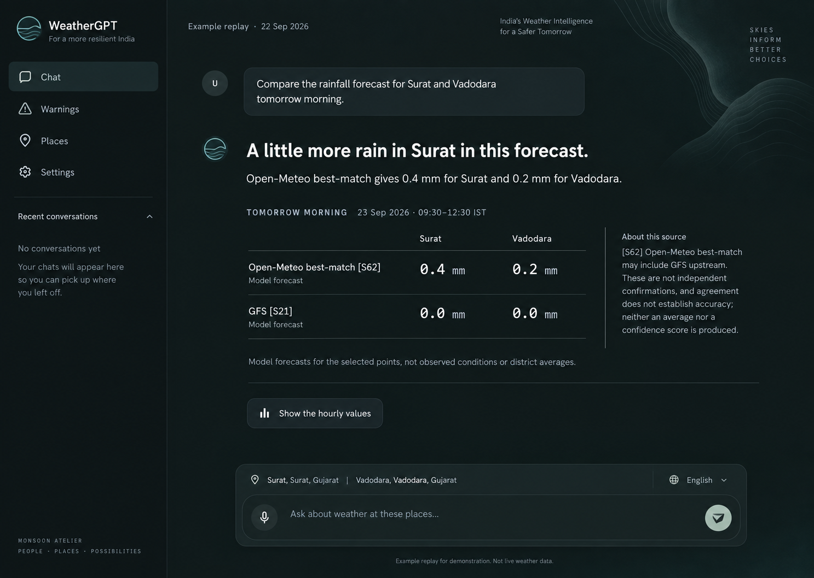
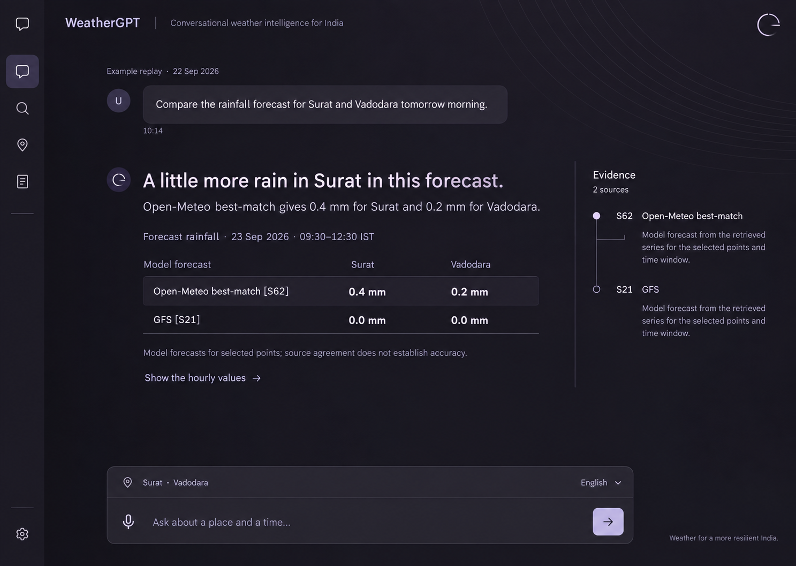
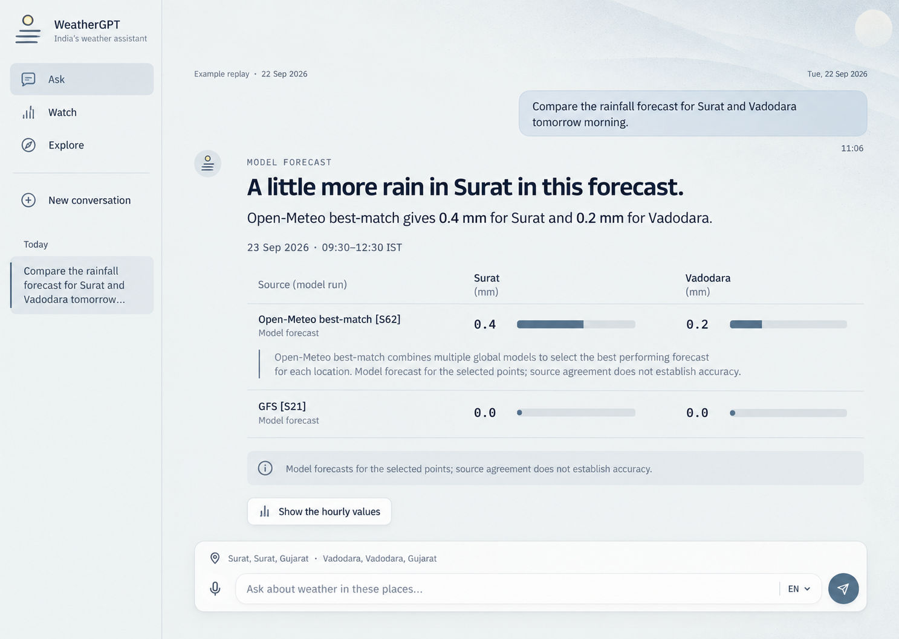

# WeatherGPT — motion, atmosphere and a more distinctive chat

22 September 2026 · Revised design exploration · No production frontend changes

The user's new direction is explicit: flagship animation and meticulous detail, a classy and rich palette, a weather identity that can be felt quietly, and no glassmorphism. This supersedes the glass material choices in the current frontend. The previous [live audit and complete surface inventory](../2026-09-22-overhaul/design-brief.md) remain the functional brief. This document develops the visual and interaction direction further; it does not claim animation has been implemented or tested.

## The creative position

**A quiet weather instrument that comes alive when you use it.** The distinctive object is a small horizon mark. It belongs to WeatherGPT in the rail, gives an actual working turn its visual rhythm, and becomes still again beside the answer. The atmosphere is felt around the reading area. The intelligence is visible in how an answer keeps its place, period, evidence and next question together.

Richness should come from a deliberate family of near-neutrals, accurate type spacing, fine boundaries, opaque material and motion that has weight. There should be an identifiable gesture without a logo-sized spectacle occupying the conversation. A pale accent occupies very little of the page; official warning colours keep their separate meaning.

The present app already animates. Its styles include slow auras, birds, pulses, stage transitions and glass blur. More independent effects will not create the requested finish. The overhaul should replace those competing behaviours with a small, consistent motion vocabulary. The seven earlier background experiments are useful evidence: in those trials the background became the subject. The new brief permits atmospheric exploration again, but its success must be judged beside a long answer, not an empty welcome screenshot.

## Three visual systems

These are proposed identities, not approved tokens. All three use the same captured comparison so differences in styling do not hide differences in task complexity. The generated images are stills of a finished answer; their motion is specified below.

| Direction | Material and palette | Composition | Signature interaction |
| --- | --- | --- | --- |
| Monsoon Atelier | Graphite with a deep petrol undertone; sea-silver ink; opaque charcoal controls | Narrow history rail, central readable answer, source detail in the margin | A horizon mark with a gentle airflow rhythm; source detail grows beside its citation |
| Meridian | Almost neutral aubergine, pewter and pale graphite-lilac; no luminous purple | Compact icon rail; broader negative space; a small evidence index beside the answer | A meridian glyph acknowledges work; a precise bracket visually connects a selected claim and source |
| Cloudlight | Cool mineral paper, porcelain controls and storm ink; no cream/terracotta | Continuous light reading surface; source detail opens inline | A subtle pressed-control feel; rows unfold like a carefully typeset page |

### Proposed colour foundations

| Token role | Monsoon Atelier | Meridian | Cloudlight |
| --- | --- | --- | --- |
| Ground | `#101918` | `#17151d` | `#eef0ef` |
| Rail | `#0c1212` | `#100f15` | `#e2e7e7` |
| Opaque raised surface | `#1b2928` | `#25222e` | `#f8f9f8` |
| Primary ink | `#e8eeea` | `#f0ecf4` | `#252d31` |
| Secondary ink / pale accent | `#9fb8b4` | `#c6bdd8` | `#55616a` |
| Light-theme action ink | — | — | `#536e83` |

A calculation of just primary and secondary ink against the flat ground gives 15.20:1 / 8.51:1, 15.51:1 / 10.05:1, and 12.24:1 / 5.55:1 respectively. These are design-token calculations, not accessibility acceptance: every actual background extreme, control state, warning wash and rendered small label still needs testing.

Use two type roles: a humanist sans for prose and UI, a restrained mono for values and provenance. Anek plus IBM Plex Mono are available in the project; Inter is the alternative for Meridian. The existing Indic font paths must be exercised with real text, not assumed to match a Latin mockup. Do not animate letters individually: it damages reading and script shaping. Use a 4px spacing rhythm, mostly 8–14px control radii, and larger rounding only where the composer requires it. Values should have tabular alignment without turning every paragraph into a terminal.

## The background has three jobs

1. **Set the material.** A matte base remains steady underneath every word. Any grain is static, very fine and absent from tiny text. The rail and composer are opaque; blur is not a substitute for separation.
2. **Locate the light.** A restrained change near the outer margin suggests the hour. An hour-based visual uses a named clock. A genuinely solar position requires a held location and correct calculation; without it the mark is an abstract brand shape, not a sun-position claim.
3. **Give the frame a slow life.** One atmospheric layer may move a few pixels at the edge during welcome or a working state. Its contrast must be barely perceptible in a still. When reading or typing, the ground settles. Start with a single 24–40 second ambient pass rather than an endless loop; test whether even that earns its place.

No birds crossing a sentence, snow or rainfall over the answer, pointer-following spotlight, giant orbiting sphere, moving gradient under text, animated noise, or scroll hijacking. Condition-specific visuals appear only beside the observation or forecast that actually carries the condition and its time. A two-place comparison cannot borrow one city's conditions for the whole screen. Unknown conditions have no pictorial substitute. The neutral brand mark never implies a warning, current weather or model confidence.

## Choreography: ask → work → read → inspect → continue

Timings below are starting design values, not universal rules or measured implementation performance. Motion must be interruptible. An action takes effect immediately; animation accompanies it rather than postponing it.

| Moment | Behaviour | Starting specification | Detail that makes it credible |
| --- | --- | --- | --- |
| Focus composer | Inset boundary becomes clearer; send affordance responds to nonempty text | 100–140ms colour transition; no field travel | Caret and focus are immediate. No animated placeholder while typing |
| Press send | Send icon contracts slightly and becomes Stop; submitted question takes its place above | Press 80ms, state transition 180–220ms | Preserve the submitted wording and draft on failure. Do not morph the whole textarea into the message |
| Start work | Horizon mark opens a small gap; one real stage line appears | 180–240ms entrance; gentle mark movement only while busy | Actual engine events drive text. No invented thoughts, progress percentage or intelligence score |
| Long wait | Current stage remains visible, with elapsed time and a working Stop control | No increasing bounce, speed or brightness | Repeated stages stay in Work history. A long request is not disguised as almost complete |
| Evidence arrives | A complete meaningful block becomes readable immediately | Optional 120–180ms opacity, at most 3–4px movement | Never delay ready evidence for a stagger. Don't expose unverified prose during a verification gate |
| Answer completes | Working mark returns to its steady geometry and status becomes the actual outcome | 180–220ms settle, no celebration | Answered, partial, missing, failed and cancelled remain distinct |
| Open citation | Source detail opens from the citation's side or immediately under its owning row | 220–280ms, restrained spring or ease-out | Keep the citation on screen; no cross-page flight or text stretching |
| Close citation | Detail returns to its origin and focus returns to the trigger | 140–180ms | Reopening mid-close reverses from the current position |
| Select plotted datum | Label and corresponding source row receive the same focus treatment | Immediate value; 80–120ms emphasis | Numerals never count up. Missing values never animate through zero |
| Follow up | Selected refinement appears in the composer or sends its explicit question, per existing contract | 120–180ms local feedback | Both place and source context remain visible; don't infer a new intention |
| Copy claim | Local copy control becomes a tick and 'Copied' briefly | 120–160ms icon swap; about 1.5s acknowledgement | Show success only after clipboard success. Failure remains actionable |
| Change thread | Preserve rail position, load the selected conversation, restore its reading position | Small 120–180ms fade once ready | Don't replay every historical message's entrance animation |
| Expand rail | Icons retain their anchors; labels reveal as width settles | 180–240ms | No spring overshoot shifting the reading target; keyboard access remains available |
| Record voice | Explicit recording state with Stop, Cancel and duration | Small steady indicator; input level only from actual signal | A decorative waveform must not pretend to be captured audio. Transcript stays editable |
| Theme transition | Surfaces change together | 180–240ms crossfade at most | No circular light burst or full-screen wipe |
| Error / no data | Outcome sentence appears in the same answer position, with suitable next action | Simple appearance, no shake | 'Not issued' is different from a transport error; stale evidence keeps its age |

One motion governor should decide between idle, composing, working, reading and inspecting. It controls the atmospheric layer and the weather mark, while local components own their small transitions. The reduced-motion preference disables travel and decorative movement; focus, state changes and content remain fully perceivable. A user-facing atmosphere setting can additionally keep the background still. This is a proposed control, not a current feature.

Frequent interactions deserve less animation. Keyboard shortcuts may act immediately. Avoid attaching a spring to every label, adding generic `transition: all`, or animating the full streamed message subtree on every token. Prefer opacity and transforms where appropriate, but never scale text as a cheap way to animate a reading panel.

## Rework the entire chat, not just the surrounding skin

The shell gives three pieces of information immediately: which conversation this is, which places the answer resolved, and where to continue. The question is visually subordinate to the response while remaining easy to edit. Global held place and answer places use different labels; the recorded two-city answer must not sit ambiguously beside 'No place held'.

The answer should read as a complete explanation. Its evidence becomes a comparison, passage or claim directly below the sentence that needs it. A date line states the actual validity interval. A source label combines a recognisable product name and the registry ID. The utility controls are present but modest. Follow-ups remain reachable above the fixed composer, including when the answer is long.

For the captured replay, S62 gives Surat 0.4mm and Vadodara 0.2mm for 23 September 2026, 09:30–12:30 IST. S21 gives 0.0mm for each. Show these as a compact, equally labelled place-by-source comparison. Do not put a giant 0.0 from S21 immediately under prose about 0.4 from S62 with no clear relationship. The separate IMD point at 11:30 has a different temporal support and must remain separate. Do not fabricate hourly curves from these totals. Source agreement does not establish accuracy; products may share upstream data. This is a visual replay, not current advice.

The source detail needs product, issue or run where available, validity, retrieval time, location/cell, and physical/printed page for documents. Unknown issue dates stay unknown. If a published document was pruned, its 410 response should name what remains. A beautifully animated drawer that loses ownership is a failed design.

Long names wrap or disclose cleanly. Touch targets keep their dimensions even when the glyph is small. Tooltips supplement labels rather than hide the only way to understand an icon. Menus open from the button that owns them. Dialogs restore focus. Language changes use the verified output and script paths; typography cannot manufacture language support.

## Reference study: 15 additional pages

Together with the first pass's 12 references, this makes 27 reference pages across both explorations. This is a curated study, not a claim that 27 products were fully audited. Review methods are explicit: browser sample, article/documentation, or creator description. Public examples only; no course purchased or paid assets imported. Screenshots are research evidence, not licensed application assets.

| Reference | Inspected | What informs WeatherGPT | What is rejected |
| --- | --- | --- | --- |
| [Transitions.dev](https://transitions.dev/) | Live panel toggle and screenshot; collection text | Origin-aware disclosure, deliberate exit, contextual icon state | Generic effects catalogue pasted into every component |
| [Emil Kowalski — Train Your Judgement](https://emilkowal.ski/ui/train-your-judgement) | Interactive accordion sample and screenshot; article | Compare easing, interruption, travel and frequent-use costs | Treating a prescribed duration as proof an interaction feels good |
| [Rauno — Craft](https://rauno.me/craft) | Gallery text and partial browser capture; several previews remained placeholders | Small spatial interactions, focus and continuity as areas to prototype | Claiming the whole gallery's motion was inspected |
| [Rauno — Invisible Details of Interaction Design](https://rauno.me/craft/interaction-design) | Essay | Anchoring, interruptibility and natural continuation | Decorative physics disconnected from the user's action |
| [UI Labs — Mariana Castilho](https://www.uilabs.dev/) | Gallery and screenshot; component descriptions | Contextual toolbar, local state transformations, inline feedback | Glass blur and moving targets; the author flags a tags experiment as unsuitable for production |
| [Josh Comeau — Spring Physics](https://www.joshwcomeau.com/animation/a-friendly-introduction-to-spring-physics/) | Article | Use spring properties intentionally for a small set of physical controls | Bouncy numerical evidence or global spring defaults |
| [Animations.dev](https://animations.dev/) | Public course overview | Judgement, practice and animation purpose | Requiring a paid course for this overhaul |
| [Dribbble — The Penguin Design, Weather App Animation](https://dribbble.com/shots/21209777-Weather-App-Animation) | Browser preview, Play→Pause state, screenshots; creator text | Weather can have an economical distinctive motion signature | Full-screen rainfall and cartoon conditions behind reading text |
| [Dribbble — Rajdip Mitra, Weather App Interaction Concept](https://dribbble.com/shots/5984116-Weather-App-Interaction-Concept) | Creator page description and palette, not a frame-by-frame motion review | A discovery reference for changes between weather states | Saturated red/orange as a general brand background beside hazard colours |
| [Dribbble — Charlie Osborne, Cloudy Sunny Animation](https://dribbble.com/shots/3988177-Weather-App-Cloudy-Sunny-Animation) | Creator page description and palette | Compact weather-icon study to inform an original mark | Copying the illustration or drawing an unsourced condition |
| [Rive — JcToon, Weather Icon Animation](https://www.rive.app/marketplace/704-1377-weather-icon-animation/) | Creator listing | A benchmark category for a small stateful weather emblem | Assuming an asset is licensed or a runtime dependency is necessary |
| [Paper Shaders](https://shaders.paper.design/) | Official catalogue | Grain and controlled atmospheric material as an optional prototype | Fluted glass, water distortion, liquid metal and a busy full-screen shader |
| [Motion — accessibility](https://motion.dev/docs/react-accessibility) | Official documentation | Reduced-motion policy and custom handling for atmospheric effects | Assuming a library-wide switch automatically covers CSS and canvas |
| [Motion — layout animation](https://motion.dev/docs/react-layout-animations) | Official documentation | Shared element continuity and correct treatment of fixed/scrollable containers | Scale-distorted text and layout animation on every streaming update |
| [Apple — Designing Fluid Interfaces](https://developer.apple.com/videos/play/wwdc2018/803/) | Official session page/transcript, not full video playback | Responsiveness and continuity across an interaction | Copying touch-only gestures into desktop web without visible controls |

The previous pass adds Linear, HeroUI, assistant-ui, Raycast, Observable Plot, earth.nullschool, MapLibre, Met Office and three other Dribbble examples. Those decisions and exact links are retained in the first brief rather than rewritten as new research.

## Implementation choices after a visual is selected

HeroUI v3, Motion 12, Lucide, Radix popover, React 19 and Tailwind 4 are already declared in the frontend. The first implementation should use those foundations. Custom SVG and existing Motion can implement a horizon mark, local feedback and source transitions. HeroUI supplies control behaviour; the selected tokens provide the material and visual character.

Do not add Rive, GSAP and a shader runtime together to signal ambition. Rive is justified only if an authored stateful illustration demonstrably exceeds a small SVG. Paper Shaders is an optional, isolated atmosphere experiment with a static fallback; it must earn its GPU and bundle cost. Use the installed APIs actually available, not a new documentation feature without checking the installed version. Assistant-ui is an anatomy reference, not a mandate to replace WeatherGPT's governed engine.

The first runnable slice should include the welcome, real composer, work/stop, a complete two-source answer, source open/close, and a follow-up. Include partial, unavailable and stale examples alongside success. Prototype the atmospheric mark there and judge it with a dense real answer. This is the next step after selection, not work completed in this pass.

Then carry the same tokens and motion to Watch, source/document depth, the place panel, saved conversations, command/search menus, settings and the remaining registered views from the first inventory. Warning severity never inherits the atmospheric tint. Maps and plots only animate transitions with a meaningful spatial or temporal relationship; their values retain source ownership.

## What would count as flagship execution

- A recorded uninterrupted ask→answer→citation→follow-up journey, plus cancellation and slow-network variants. A still image cannot pass this gate.
- At 1440px, 768px and 360px, and at 200% zoom: no lost composer, obscured follow-up or sideways page scrolling caused by controls. Narrow-screen browser checks remain distinct from real-device acceptance.
- Keyboard and touch activation, Escape/focus restoration, screen-reader output, reduced-motion preference, Indic composition, long names and multilingual paragraphs all work in the actual selected design.
- No jump when opening a source, receiving an answer, changing threads, restoring scroll or using the composer at a different height. Ready content never waits for a cinematic entrance.
- Measure frame behaviour and input response on named hardware. Aim for no long animation-induced main-thread task and smooth frame pacing; do not report a frame-rate target as a measured result. Stop animation in a hidden tab and keep the settled answer idle.
- Check contrast across the full atmospheric range and each opaque surface. Grain, decoration and warning colours receive their own scrutiny.
- Replay the captured two-source question plus unseen places and a natural correction. Every number, unit, validity interval, source, unsupported task and missing state survives layout, copy and export unchanged.

No build, performance, accessibility or PS acceptance is claimed here. The deliverables are a researched creative direction, a component-level motion specification and three independent visual concepts. The next meaningful review is an animated working chat, once a visual target is chosen.

## Generated stills and review notes

Numbering follows the order the images were displayed in the conversation: 1 Monsoon Atelier, 2 Meridian, 3 Cloudlight. The image model produced approximately the requested viewport ratio; the code implementation must use the actual 1440×1024 target and measure responsive behaviour. These images are visual proposals, never evidence fixtures.

All three preserve the four supplied rainfall values and the example interval. They also contain generated incidental details that are not accepted product requirements. Remove the added slogans, decorative message times, and unrequested branding copy. The first image incorrectly shows no conversations despite an active turn and omits clear New conversation/Watch access. The second's icon rail needs explicit accessible names and discoverable labels, and its evidence index needs the actual source metadata rather than generic repeated descriptions. Neither image establishes the content of a full source record.

The third image invents an explanatory sentence about best-match model selection; replace it with the governed source description and retain the upstream-dependence qualification. Its two bars do not visually maintain the requested 2:1 ratio and must be drawn from a common numerical scale or removed. The repeated qualification and long unbroken explanation should become one readable source-owned note. 'Source (model run)' also overstates what the row identifies: use 'Forecast product' unless the actual run is present.

The dark images have more visible atmospheric contour work than the starting motion spec permits beside a long answer. Reduce it in the implementation until the reading area wins. Some controls have softly shaded edges; implement them as explicitly opaque matte surfaces, with no backdrop filter. A still cannot establish whether an apparent material is glass, nor whether any proposed movement feels smooth. The absence of blur, correct evidence, accessible controls and the complete motion sequence remain implementation checks.
