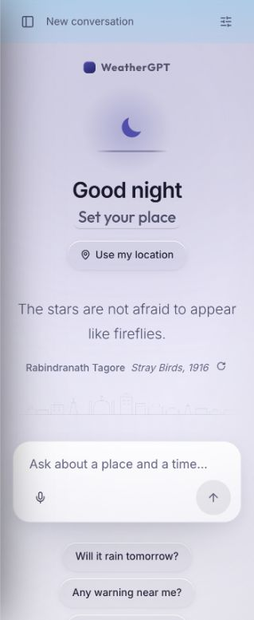
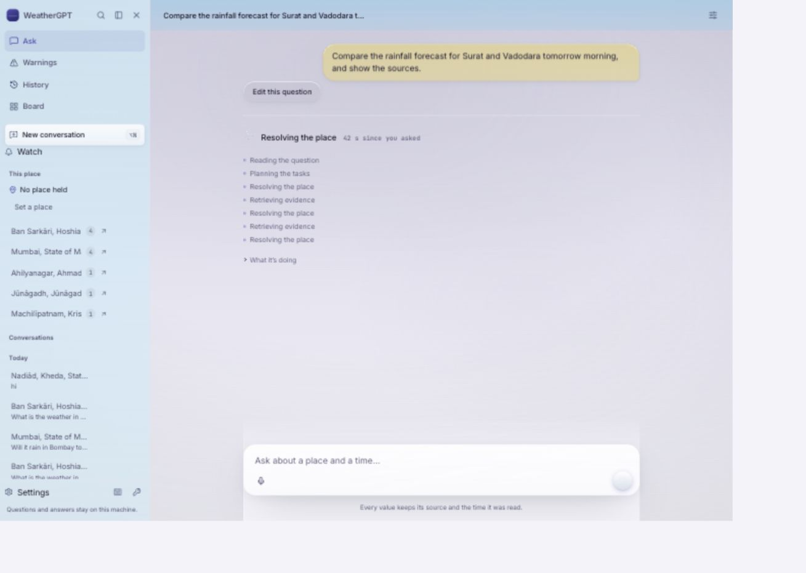
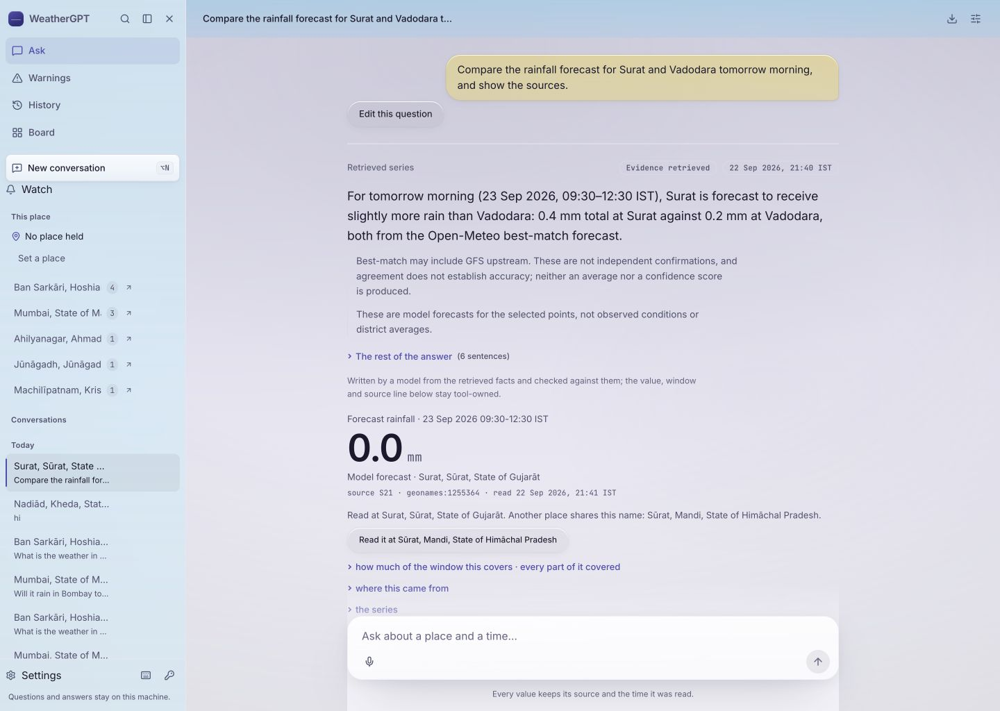
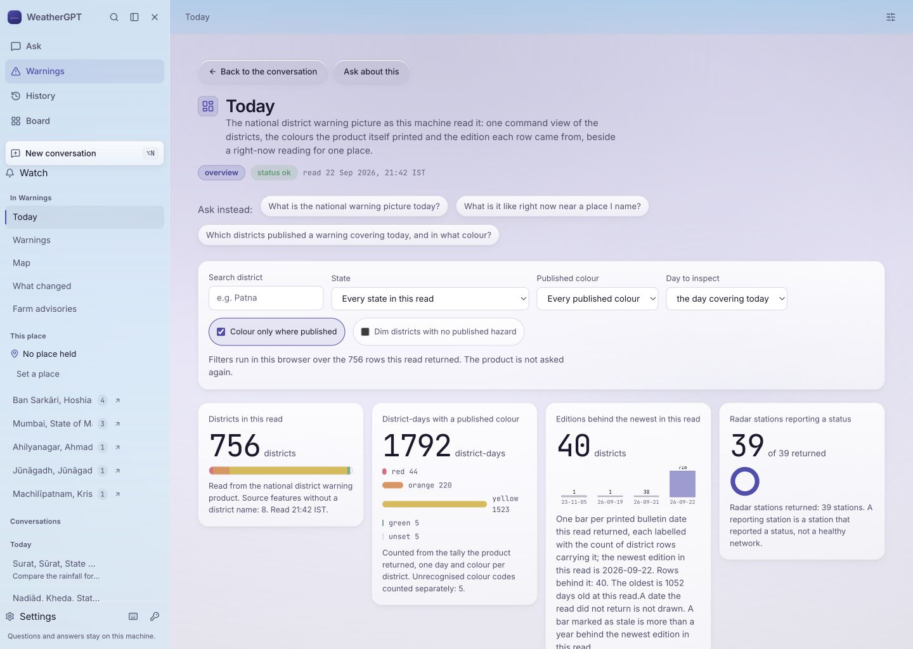
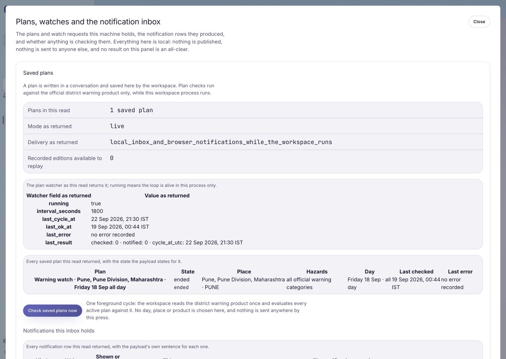
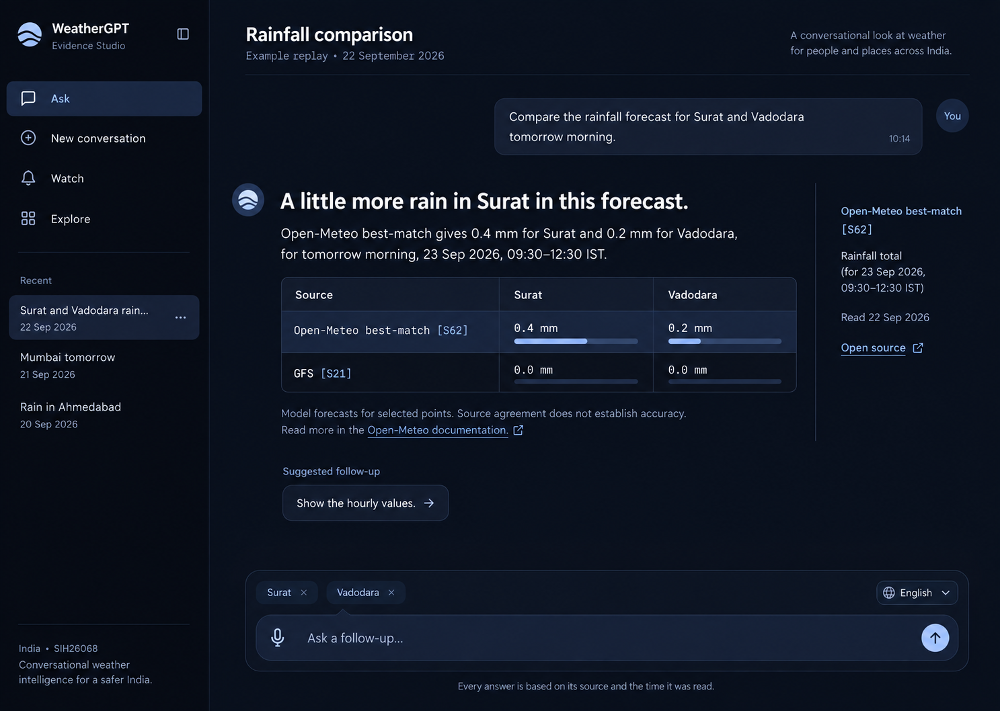
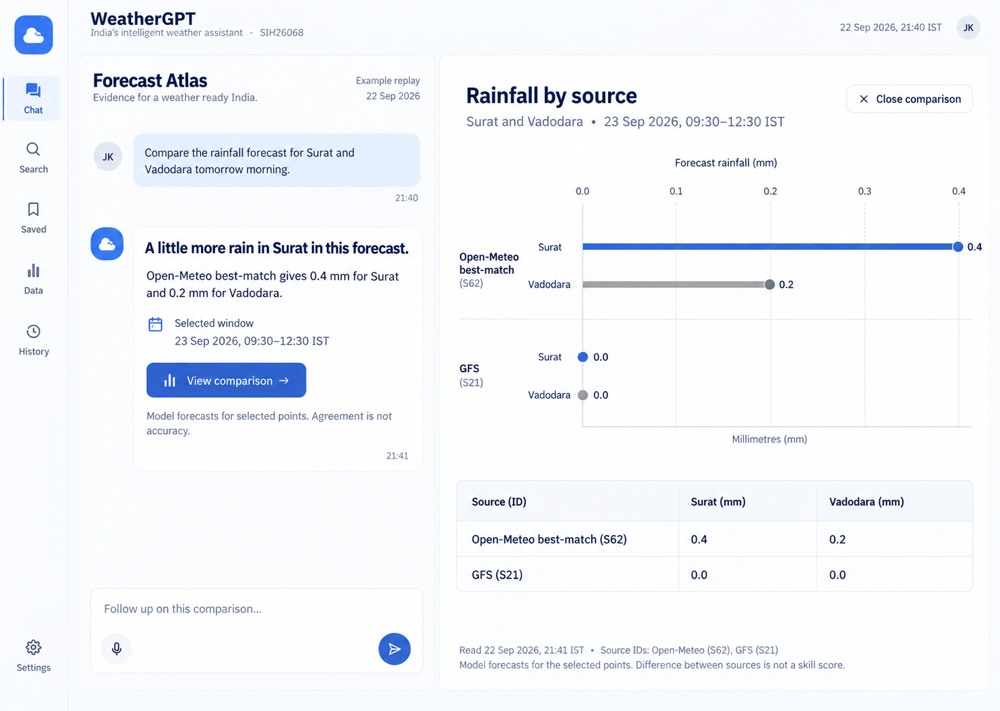
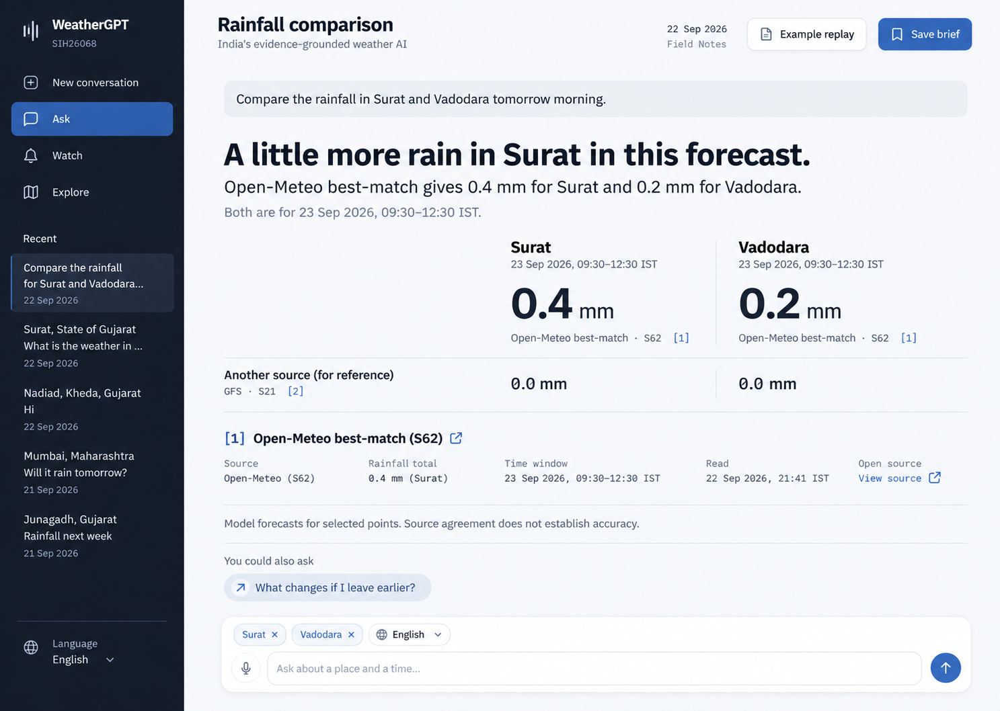

# WeatherGPT — a frontend worthy of the answer

22 September 2026 · Design exploration and proposed overhaul · Not an implementation or acceptance claim

The design thesis: **WeatherGPT should feel like a capable weather analyst working beside the reader.** Its distinctive moment is a question becoming an understandable answer, then an inspectable comparison, source passage or warning. Typography, interaction and evidence ownership should make that feel effortless.

The user asked to brainstorm first. This pass produces a live-screen critique, a reference study, three independent visual concepts and a detailed overhaul inventory. Production frontend files and acceptance trackers are unchanged. The existing engine, retrieval contracts, source ownership and unsupported states remain the foundation.

## 1. What the current experience gets wrong

This is a sampled live review, not a claim that every route has been audited. The local app was inspected at `127.0.0.1:8765`. A fresh comparison was submitted through the UI. No watch was created and no push subscription was enabled.

| Step | Observed experience | Health and design consequence |
| --- | --- | --- |
| 1. Open the welcome | Greeting, location action, poem and composer on a pale sky; captured at the browser's narrow default width | Functional invitation, weak explanation of the product's distinctive usefulness. The poem occupies substantial space before a first question. |
| 2. Ask about two places | Working state accumulates repeated planning, resolving and retrieval stages | Useful transparency, poor summarisation. Keep one current status visible, retain the event history under a disclosure, and never animate fictional progress. |
| 3. Read the comparison | The answer leads with S62 best-match totals of Surat 0.4 mm and Vadodara 0.2 mm; the first prominent claim is S21 rainfall of 0.0 mm | High-priority presentation ambiguity. Source-specific values need a common comparison structure. This observation does not establish that the numerical data are wrong. |
| 4. Open Warnings | Lands on Today. Introductory text, suggested questions and a large filter panel precede a row of four counters | The national warning picture is subordinated to controls and inventory metrics. Put the relevant warning reading and geographic picture first. |
| 5. Open Watch | A near-full-screen modal begins with system fields, service state and delivery identifiers | The lifecycle is exposed like an operator report. Lead with the reader's watches, last checks and notifications; keep operational diagnostics available beneath them. |

### Specific findings to carry into implementation

**The answer is fragmented.** A generic “Retrieved series” heading, evidence status, opening prose, repeated qualifications, “The rest of the answer”, a model-authorship byline and several standalone values compete for the reader's attention. Six additional sentences of this answer sit under a generic fold. Meaningful answer content should be readable as a coherent response. Progressive disclosure should follow content roles, not simply hide everything after the first sentence.

**The source names are too far from the comparison.** “source S21” is technically precise but demands prior knowledge. Show “GFS · S21” alongside its value, and place it next to the corresponding best-match values. Keep the exact source record reachable. Different products and sampling windows must remain separate; the IMD 11:30 point must not silently join a 09:30–12:30 accumulated total.

**Place context appears inconsistent.** The sampled answer resolves Surat and Vadodara while the rail says “No place held”. A globally held place and the places of a particular answer are different concepts. The UI needs explicit names for them. A comparison should show both answer places without silently changing the global hold.

**Everything looks similarly touchable.** Glass pills, tinted cards and elevation appear across navigation, suggestions, filters and explanations. Limit elevation to transient overlays and controls that benefit from it. Use spacing and type for ordinary information.

**Watch mixes user and operator vocabulary.** Fields such as `interval_seconds` and `local_inbox_and_browser_notifications_while_the_workspace_runs` should have plain-language equivalents with exact diagnostics available. The live DOM also contains an old limitation saying no push service or subscription exists alongside an opt-in push section. That wording needs reconciliation against the authoritative payload and current implementation before any copy is changed; it is not evidence of successful delivery.

**Accessibility is not established by these captures.** Small provenance text, muted controls, long location names and narrow layouts need measured contrast, keyboard, zoom and screen-reader checks. The narrow screenshot is not a real-device mobile acceptance test. Only one fresh completed conversation was inspected; no fluency, forecast skill or end-to-end voice claim follows.

## 2. Reference study — what earns a place here

References were consulted on 22 September. “Visual” means a page was opened and its screenshot inspected; “documentation” means the primary page was read, not that its complete interaction was tested. A reference is an influence, not an asset licence or proof of usability.

| Reference | Review | What to use | What to leave behind |
| --- | --- | --- | --- |
| [Linear — March 2026 design refresh](https://linear.app/now/behind-the-latest-design-refresh) | Visual and article | Quiet navigation, stable action locations, clearer foreground hierarchy | Reproducing its issue-tracker structure or merely copying a dark palette |
| [Dribbble — Orix weather map and precipitation](https://dribbble.com/shots/27447337-Weather-App-UI-Mobile-Map-Precipitation-Dashboard) | Visual and designer explanation | Focused layer selection and local detail emerging from a geographic view | Decorative gauges, unverified meteorological values, temperature colours reused as warning levels |
| [Dribbble — Ajex AI assistant](https://dribbble.com/shots/26442088-AI-Assistant-App-From-Research-to-Final-UI) | Visual | A recognisable conversational identity | The large luminous orb: it does not explain WeatherGPT's competence |
| [Dribbble — Kapil desktop weather](https://dribbble.com/shots/18228563-Weather-app-design-for-desktop) | Visual | Clear hierarchy between place and weather reading | Illustrated landscape as the main attraction; this has already failed in WeatherGPT's own history |
| [HeroUI v3](https://heroui.com/en/docs/react/getting-started) | Visual and official documentation | Composable accessible controls with focus and keyboard foundations | Default component styling treated as an entire product design |
| [assistant-ui](https://www.assistant-ui.com/) | Official documentation | Message, composer, source and streaming interaction anatomy | Replacing the existing conversation runtime before proving compatibility |
| [Raycast](https://www.raycast.com/) | Official product page | Fast keyboard access, clear commands and consistent action language | A command palette becoming the only way to discover a feature |
| [Observable Plot](https://observablehq.com/plot/) | Official documentation | Labelled marks, common scales and small multiples for comparison | Decorative curves and transforms that silently recompute governed quantities |
| [earth.nullschool](https://earth.nullschool.net/about.html) | Official product documentation | Make field, level, valid time and model inseparable from the visual | A permanently animated globe behind a conversation |
| [Motion for React](https://motion.dev/docs/react) | Official documentation | Interruptible panel transitions and motion tied to actual state | Looped ornament, animated numbers suggesting intermediate measurements |
| [MapLibre GL JS](https://maplibre.org/maplibre-gl-js/docs/) | Official documentation | A candidate for geographic exploration if existing map tools cannot meet the selected design | A large new dependency or map-tile network requirement without measured need |
| [Met Office warnings](https://weather.metoffice.gov.uk/warnings-and-advice/uk-warnings) | Official page | Spatial and temporal warning navigation as a pattern | Importing UK warning semantics, colours or thresholds into IMD products |

The three Dribbble examples are deliberately not three templates to copy. They show useful presentation techniques and tempting mistakes. The strongest direction combines production interaction discipline with WeatherGPT's own source and time semantics.

Local visual captures: `ref-linear-detail.png`, `ref-dribbble-weather.png`, `ref-dribbble-assistant.png`, `ref-dribbble-desktop.png`, `ref-heroui.png`. Other references above are documentation research only.

## 3. Three directions to judge on the same question

All three concepts use the same captured Surat/Vadodara comparison, labelled as an example replay. Weather values are evidence content for a design exercise, not a current forecast recommendation. Generated images remain visual proposals: text, plot positions, source labels and exact typography require verification in code.

### Evidence Studio

A dark, carefully spaced conversation with a compact inline comparison and a source note opening beside the sentence that owns it. The answer stays central; the evidence appears at the reader's point of interest. A good default for the hero chat.

Palette: midnight `#0a0f1a`, rail `#070b14`, raised `#131b2b`, paper `#edf1f7`, secondary `#a3b1c6`, instrument blue `#a8c7fa`. Humanist sans for reading; IBM Plex Mono for provenance. The signature is the anchored source margin, not the background.

### Forecast Atlas

A cool light workspace where a comparison opens into a broad analytical canvas beside a compact conversation. Common scales make differences inspectable. A strong direction for Compare, History and scientific exploration; a heavier default for a simple question.

Palette: sky paper `#f5f8fc`, white `#ffffff`, line `#dce4ed`, navy `#17304c`, slate `#51667d`, blue `#315db3`. The signature is continuity between a sentence and its comparison figure. The canvas closes without losing the thread.

### Field Notes

A graphite rail and bright continuous reading surface. The conversation produces a well-composed briefing with source-specific comparisons and inline document depth. Particularly promising for bulletins, agricultural advice and long answers.

Palette: graphite `#151d29`, porcelain `#f8fafc`, control white `#ffffff`, ink `#1c2939`, secondary `#5c6a7a`, cobalt `#4165a0`. The signature is a useful, inspectable briefing that retains its meaning when copied or exported.

These are layout and interaction choices as well as palettes. A selected direction should become one coherent system. The exact type family is still a visual decision; script coverage must use the project's actual language fonts. The current code uses Inter/Outfit/JetBrains Mono, while older docs name Anek/IBM Plex Mono; implementation must deliberately resolve that difference instead of assuming the old document describes the screen.

### Generated concept gallery

The numbering below is the order the generated results appeared in the conversation.

Visual review notes before implementation: the small bars in concept 1 are not a trustworthy quantitative scale and should become correctly scaled marks or be removed. Its incidental message clock is generated decoration, not recorded evidence. Concept 2 gives the comparison substantial space but makes the chat secondary and omits a clear Watch entry; both need attention if it is selected. Concept 3 labels GFS “for reference”, which must not be confused with the product's formal reference-only status; use “GFS forecast” without inventing a classification. Its proposed travel follow-up should be replaced with a neutral time refinement unless travel intent actually exists. All three introduce tentative marks and navigation details; they are not approved branding, newly implemented routes or new product capabilities.

The generated image is a visual target, never an evidence fixture. Original structured packets govern every fact, status and source in the eventual implementation.

## 4. The hero conversation, meticulously specified

| Component | Proposed behaviour and finish | Acceptance condition |
| --- | --- | --- |
| Welcome | Small distinctive mark, useful invitation, held place if any, composer in the first screen; a few concrete examples | A new reader understands what they can ask without scrolling or setting a place first |
| Rail | Stable Ask, Watch and exploration access, searchable recent conversations; long labels truncate with accessible full names | Existing destinations and deep links stay reachable; narrow drawers restore focus |
| Thread header | Human-readable topic and explicit current answer context; contextual save/menu actions | A two-place question never masquerades as a single globally held location |
| Composer | Multiline input, visible focus, clear send/stop, draft retention, transcript editing | Enter/Shift+Enter, Indic IME composition, retry and navigation preserve intended text |
| Working turn | One current stage, elapsed time if useful, expandable actual work record | No fictional percentage, fake thinking text, or loss of cancel control |
| Main answer | Complete useful prose, clear paragraphs, lists only when useful | No first-sentence rule silently hides the actual answer; partial tasks remain explicit |
| Comparison | One governed place × source table with shared units/window where valid | Numbers align with the source the prose names; incompatible windows are visibly separated |
| Numeric claim | Measure, value, unit, place, evidence kind, source and time belong together | Copy/print/export preserve that same tuple; zero and missing remain distinct |
| Citations | Human source name plus ID; click or keyboard opens claim-specific context | No hover-only access; unrelated source evidence never appears under a claim |
| Source detail | Product, publisher, issue time, valid interval, retrieval time, passage/page or model cell | An unknown issue time stays unknown; retrieval time never becomes publication time |
| Qualification | Material limitations adjacent to the claim; general method explanations unfold below | Safety-relevant exceptions remain visible; no regex-based deletion of engine prose |
| Follow-up | Few context-specific refinements; corrections explain what will change | Place, period, variable, source and language continuity survive the action |
| Copy and save | Compact actions with visible completion feedback | Clipboard contains what the reader chose; hidden disclosures are not copied accidentally |
| Error and absence | Distinguish transport failure, stale fallback, not issued, held layout and unsupported quantity | Every case offers an appropriate next step without pretending data exist |
| Voice and language | Visible language, explicit recording state, editable transcript, cancel and text fallback | Recognition, supported answer writing and speech output are separately represented |

Suggested source files to work through: `src/gpt/Workspace.tsx`, `Rail.tsx`, `TopBar.tsx`, `Welcome.tsx`, `Composer.tsx`, `WorkingTurn.tsx`, `ReadingPanel.tsx`; `src/chat/AnswerTurn.tsx`; `src/flagship/Claim.tsx`, `Work.tsx`, `provenance.ts`; `src/charts/ChartBlock.tsx` and `VizFigure.tsx`. Paths here are relative to `frontend/`.

The answer renderer must consume existing structured evidence. If useful structure is absent, add the smallest explicit rendering contract at the engine boundary. Never ask a second free-form model to reinterpret numerical facts for a chart.

## 5. Every frontend surface has a job

This is a design inventory of the 19 registered views, plus the place destination and cross-cutting surfaces. It is not a fresh runtime acceptance result for every row.

| Surface | Proposed first useful screen and key detail |
| --- | --- |
| Ask | A natural answer with evidence opening from the claim that owns it |
| Dashboard / Board | A concise place overview connecting station observation, forecast and warning, each with its own clock |
| Today | The national published warning picture, with date and geographic scope before inventory counts |
| Warnings | Place/date reading and clearly labelled published severity; validity and absent data remain visible |
| Map | Geographic canvas with a compact time selector, named legend and selected district detail; table alternative |
| Forecast | Readable hourly/daily sequence, explicit accumulation windows, gaps and source continuity |
| Observations | Station identity, distance, measurement time and staleness before secondary metrics |
| Farm advisories | District and edition, then actual crop/stage passages; parent warnings and incomplete context retain ownership |
| Air quality | Pollutant/value/time and whether modelled or observed; never invent an AQI category |
| What changed | Two named editions with additions and omissions; absence in a new edition is not a withdrawal |
| Climate records | Period and geographic record, then a labelled series and its missingness; no decorative trend claims |
| Sea and rivers | Separate wave/discharge products, answering cell and distance; unsupported gauge/level quantities stay explicit |
| Aviation | ICAO station, report kind and time, decoded conditions, then the exact report; no operational clearance |
| Ensemble spread | Variable, valid time, member distribution and source; no invented probability or confidence |
| Forecast verification | Matched forecast/reference window, metric and sample count; method unfolds beside the plot |
| Compare places | Synchronized places and windows, common scales only for compatible quantities, source-specific rows |
| Published documents | Searchable catalogue by family/place/issue, result excerpt and readable passage/page context |
| Briefcase | Saved briefing list with place and period; open the preserved evidence behind each brief |
| Sources and settings | Reader preferences first, connection/capability details in an operator section; secrets never rendered |
| Place page | One persistent destination for that place, with observation/forecast/warning separation and related conversations |
| Watch and inbox | Human watch sentences, active/ended state, last check, delivery outcome, and explicit opt-in channel controls |
| Global interactions | Place picker, search, shortcuts, menus, dialogs, owner gate, loading/error/empty/offline states use one component language |

Ask and Watch should have obvious entry points. The rest should be available through coherent exploration groups and answer-linked depth. Whether the current four homes become three primary destinations is a proposal to test, not an excuse to delete working routes. Reading widths and data widths should differ: prose needs a comfortable measure; matrices and maps need the available canvas.

## 6. Libraries and skills: choose a small coherent stack

The repository already declares React 19, TypeScript, Vite, Tailwind v4, HeroUI 3.2.6, Motion, Lucide, TanStack Query/Virtual and a Radix popover. Keep those foundations. Use HeroUI for shared controls after checking its actual v3 APIs. Keep Lucide as the single icon vocabulary and use Motion for meaningful transitions. A library's accessibility foundations still require whole-app verification.

Keep the existing governed chart renderer unless a chosen visual calls for something it cannot express cleanly. Observable Plot is the first additional chart candidate to evaluate in a bounded comparison prototype. MapLibre is optional, subject to map requirements, bundle weight, tile access and offline behaviour. Study assistant-ui's patterns without replacing the current engine transport, history and task accounting simply to adopt its runtime.

Do not combine several complete design systems. Adding HeroUI, shadcn, another chat kit and a decorative component marketplace all at once would create competing tokens, focus rules and interaction styles. Any borrowed component must earn a specific role and pass the same states as the native kit.

Skills applied in this pass: Product Design context/audit/ideation, Frontend Design, Image Generation. Existing browser tools were used for live inspection. The relevant capabilities were available, so no additional plugin, dependency or credential installation was necessary for brainstorming. Implementation should load Product Design image-to-code after a visual is chosen, and reuse the existing React, accessibility and visual verification harnesses.

## 7. What makes this feel finished

Use a 4px spacing rhythm, a small consistent radius scale, comfortable 16px body text and readable provenance. Keep high contrast stable across daylight/night appearance. Weather-driven background colour must not change the meaning of a warning or undermine legibility. Theme changes should preserve spatial hierarchy.

Motion starts from actions: pressing send, opening source depth, changing a comparison, copying a claim. Keep it brief, interruptible and reduced-motion aware. Never interpolate data values or make changing text appear more certain. Preserve the scroll anchor while an answer streams; when the reader scrolls away, offer a return-to-latest control rather than pulling them back.

The memorable interaction to prototype first: ask a two-place question → see a coherent source-labelled comparison → open a source without losing the sentence → change the time in the same conversation → copy the comparison with its provenance. This demonstrates the system's intelligence through a useful journey.

## 8. Implementation sequence and exit gates

1. **Lock the visual target.** Choose a concept, refine it if necessary, then define tokens and a small control sheet. Produce welcome, completed answer, long answer and source-open states before expanding the design.
2. **Build the hero journey.** Port the shell, composer, working state, complete answer and comparison/source depth on actual packets. Preserve the old rendering path until the new journey is checked. No backend model/retrieval rewrite is implied.
3. **Finish Watch and geographic warnings.** Make subscription, checking and actual delivery states legible. Use the existing semantics; don't restyle an unverified outcome as success.
4. **Recompose every guided surface.** Work through the inventory by related families: current weather; warnings/map/changes; documents/agriculture; history/comparison/verification; marine/aviation/air quality/ensemble; settings and saved material.
5. **Polish all states and verify.** Review 360px, 768px and 1440px, keyboard-only use, zoom, reduced motion, long place names, meaningful Indic-script samples, interrupted requests, absence, stale data and source disagreement. Real mobile and fluent-language acceptance remain separate gates.

Use the existing `typecheck`, build and Vitest checks, the route/axe/visual harness and repository audits appropriate to each change. Compare rendered screens against the selected target in the same state and viewport. A screenshot is not interaction verification, and a passing regression suite is not taste or full PS acceptance.

Acceptance of the comparison requires matching source, place, quantity, unit and interval across prose, figure, table, clipboard and export. Acceptance of citations requires opening the correct supporting evidence. Acceptance of every view requires a useful opening, working controls during loading/failure, and no lost route. Record deviations instead of describing the result as universally perfect.

## 9. Relationship to the standing project record

Reviewed the PS summary, product review, hardening registry, critical review/overlay structure, master-plan design sections, mature system, guided-surface batch, current light/material changes, answer-page changes, surface-purpose review and toolchain record. The current implementation and new screenshots take precedence over stale visual descriptions.

Continuity to preserve: P01/P02 attribution and provenance; P03 and F01/F02 complete task/context handling; P06/P10/P11 and R02/R08 alert meaning and delivery; P07/R09/F07/A06 bulletin context; P08/R01/R10/F03/F04 place identity; P12/P13/F10/A02 language honesty; P15/R11/R12/A07 evidence-backed progress. Specialist restrictions from docs/23 and the later source/engine work remain binding.

No P/R/F/A finding is promoted or closed by this design exploration. The hardening registry's dates and older snapshots are not current readiness evidence. The hosting hold was lifted in docs/108, but this request is for design brainstorming; no deployment is part of this pass.

**Decision needed next:** choose the visual direction, or identify the parts to combine into a revised target. Then implement one complete hero conversation before scaling its components to the rest of the product.
