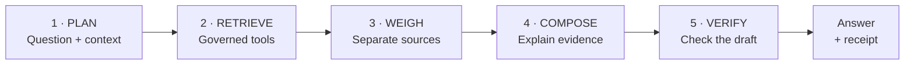

<div align="center">

# WeatherGPT

### Ask the sky. Trace the answer.

**India’s weather, in your own words—with the evidence attached.**

Smart India Hackathon 2026 · **SIH26068** · Disaster Management<br>
Ministry of Earth Sciences / India Meteorological Department<br>
**Team Void Pointers · 118709**

[Presentation](WeatherGPT_SIH26068_VoidPointers_FINAL.pdf) · [Product tour](#a-place-to-start-a-conversation-to-continue) · [PS coverage](#all-eight-features-one-prototype) · [Run locally](#run-locally)

</div>


Weather information is spread across forecast charts, station reports, warning maps and agricultural bulletins. **WeatherGPT brings those sources into one conversation.** A farmer can find a district’s crop advisory, a citizen can ask about tomorrow’s rain, and a researcher can explore a historical record—then inspect what supports the answer.

The working prototype combines **conversational retrieval, Indian-language answers, voice input, a visual dashboard and inspectable evidence receipts**. The language model interprets and explains; weather tools retrieve the records and calculate the values.

<sub>Current delivery: desktop web prototype. Product captures below were taken on 25 September 2026. They show dated results, not current weather advice. The submission video is being prepared.</sub>

## For farmers · The crop, the stage and the published advice

**“What does the latest district agromet bulletin say for cotton in Ahmedabad, Gujarat? Include the crop stage, issue date and advice.”**

Krishi Salah retrieves the district’s agricultural bulletin and explains the passages relevant to the crop. In the **25 September rehearsal**, the answer identified the **22 September 2026 Ahmedabad edition**, cotton at **squaring / flowering / boll formation**, and the crop guidance on **page 3**. The same answer retained the weather summary on page 1 and general advice on page 2.

The bulletin’s irrigation guidance is conditional on **available irrigation facilities and soil moisture**. Those conditions belong with the advice; a forecast alone cannot establish whether a particular field needs watering. Pest-management and nutrient guidance stay attributed to the publisher, with crop stage and edition visible.


The reader can open or download the saved source PDF from the passage. A missing crop row, old edition or unrecognised layout remains explicit. This is access to published district guidance; individual-field suitability and nationwide advisory acceptance remain to be validated. [Actual farmer answer and source passage](research/reviews/readme-20260925/README.md).

## Warnings · What did IMD publish for my district?

**“What warning colour has IMD published for Patna district today?”**

The recorded answer returned **orange for Patna on 25 September 2026**, naming **heavy rain, thunderstorm/lightning/squall and strong surface winds** from IMD’s district-warning product. Its evidence identifies **S15 · district 364**, bulletin time **05:30 IST**, retrieval **08:00 IST**, and the derived day window **25 Sep 00:00 → 26 Sep 00:00 IST**.


The answer distinguishes today from the following published days. Its calendar-day windows are derived from the bulletin date and the publisher’s day selector, and that derivation is stated. A green day means **“No warning in this product”**; a missing row stays **unknown**. Neither becomes a blanket assurance of safety.

**Chetavani Relay · From reading to monitoring:** Watch brings together the local plan/watch and inbox controls. The implemented delivery path includes an outbox and consent-based Web Push. A live changed edition reaching a real phone, acknowledgement, update and cancellation still need end-to-end acceptance. SMS/IVR remain proposed extensions.

<details>
<summary><strong>Explore the national district-warning map</strong></summary>

Choose a published date, find a district and inspect the colour from IMD’s district-day rows. An absent row is not filled green. Warning text inside an older agricultural bulletin remains source context, separate from a current official warning.


</details>

## A place to start, a conversation to continue

Choose a place, choose an answer language, and ask normally. The home screen brings the question box forward, with a place-aware daylight arc and the latest available nearby station reading. Its source, reporting time and distance stay visible. The solar arc is calculated; the skyline is decorative.

Ask supports follow-ups, corrections and questions about the evidence. You can reopen conversations, search their contents, copy a claim with its source, or save a conversation as Markdown. Details unfold beneath the answer that owns them.


**One conversation, recorded on 25 September 2026:**

| What the reader asks | What the prototype retains or changes | Retrieved rainfall totals |
|---|---|---|
| “Will it rain in Pune, Maharashtra tomorrow?” | Resolves Pune and the returned **26 Sep 00:30 → 27 Sep 00:30 IST** window. | GFS: **0.0 mm** · IMD multi-model: **0.0 mm** |
| “And the day after?” | Keeps Pune and rainfall; advances to **27 Sep 00:30 → 28 Sep 00:30 IST**. | GFS: **0.0 mm** · IMD multi-model: **0.0 mm** |
| “Actually, I meant Mumbai, Maharashtra.” | Changes the place to Mumbai; keeps the second window and rainfall request. | GFS: **0.0 mm** · IMD multi-model: **1.0 mm** |

These are point-model forecasts from **S21 / Open-Meteo GFS** and **S16 / IMD Mausamgram**, retrieved at **15:46 IST**. The table preserves the actual returned windows. In the correction turn, the prose checks rejected a model draft and the tool-rendered answer remained available, with that fallback disclosed. [Inspect the recorded conversation](research/reviews/readme-20260925/README.md).

## Vaani · Ask in your language

Language belongs in the conversation itself. Select Hindi or Gujarati, type a question in that language, and the answer retains the same evidence cards and source trail. The selector remembers your choice; it offers languages that have a recorded passing writing check.

<table>
<tr>
<td width="50%"><strong>Hindi · Ahmedabad temperature</strong><br><a href="docs/images/submission/hindi-temperature.png"></a></td>
<td width="50%"><strong>Gujarati · Ahmedabad rainfall</strong><br><a href="docs/images/submission/gujarati.png"></a></td>
</tr>
</table>

**Changing the language must preserve the evidence.** The rendering layer checks protected values, units, dates, places and identifiers, as well as the requested script. Source quotations remain in their original wording; safety-critical wording is held or templated. A failed rendering is disclosed instead of being counted as a successful translation.

**Voice input follows a reviewable path:** microphone → Sarvam speech recognition → editable transcript → **Use text** → send through the same answer pipeline. The user can correct a misheard place before asking the question. Recorded audio is sent to the configured speech service.

<details>
<summary><strong>Which languages and speech paths have been measured?</strong></summary>

The [language ledger](data/registry/language-support.json), measured on **15 September 2026**, records 22 Indian languages plus English. Its tests measure service reach, script and protected-value checks—not native-speaker fluency.

| Direction | Recorded result | Scope |
|---|---|---|
| Written output | **19 / 23** passed the measured gate | English, Hindi, Gujarati, Bengali, Assamese, Bodo, Dogri, Kannada, Kashmiri, Konkani, Maithili, Malayalam, Marathi, Nepali, Odia, Punjabi, Sanskrit, Telugu and Urdu. |
| Recognition and speech synthesis | **10 / 23** passed each service probe | English, Hindi, Bengali, Gujarati, Kannada, Malayalam, Marathi, Odia, Punjabi and Telugu; recognition probes used synthesised audio. |
| Held writing results | **4 / 23** failed | Tamil, Sindhi, Manipuri and Santali retain their individual failure reasons. |

The current React chat exposes microphone input. A speech-synthesis backend exists, but **a Listen control is not wired into this answer surface**. Some labels, source quotations and caveats remain English. Native-speaker review, human microphone/noisy-field validation and a complete rural voice journey remain open. [Measurement and limitations](docs/52-language-and-voice-measurement.md).

</details>

## Pramaan · Open the receipt behind a claim

An answer should let the reader ask **“Where did that come from?”** without starting a new search. Open **“where this came from”** beneath a value to inspect its evidence receipt, or open the answer’s **Evidence** section for its sources and editions.


| A receipt makes inspectable… | Why it matters |
|---|---|
| **Value, unit and calculation method** | A window total can be distinguished from a single hourly value. |
| **Place/entity and exact time window** | A point forecast is not silently presented as a district average. |
| **Source product, address and retrieval time** | IMD output, global model output and station reports keep separate identities. |
| **Record locator and evidence version, where available** | A claim can be followed back to the retrieved record. |
| **For bulletins: district, crop/stage, printed issue date and physical page** | Published advice keeps its original context and edition. |

**Satya Gate** is the submission’s name for the checks around generated answers: numbers, units, evidence references, links, language and required qualifications are checked before the model’s draft is used. Rejected prose falls back to tool-rendered wording. Missing metadata stays explicit—the captured receipt itself reports an unrecorded evidence-kind field, while the owning card identifies model output.

Here, **verified means checked against retrieved evidence**. It does not certify a forecast’s future accuracy, authenticate every publisher, or guarantee that all semantic errors have been eliminated.

## The dashboard · Explore the place you asked about

Open **Board → Dashboard** for a visual reading of the selected place. A forecast-day selection updates the hourly charts. Nearby observations retain their station and distance; district warnings retain the publisher’s date and colour. The assistant remains reachable for the next question.


The supporting views turn a conversation into an inspectable workflow:

| Workflow | What the reader can do | Boundary kept visible |
|---|---|---|
| **Jalvayu Lens · History** | Retrieve published rainfall/temperature records, inspect charts and calculate descriptive trends over supported periods. | Missing years, source periods and geographic comparability constrain the result; a historical slope is not a future projection. |
| **Forecast comparison and ensembles** | Compare source-labelled outputs over matched windows and inspect member spread. | Best-match can share GFS lineage. Agreement or spread is not a confidence or skill score. |
| **Aviation, marine and rivers** | Read supported METAR/TAF reports, modelled waves/discharge and available published bulletins. | No flight status or operational clearance; discharge is not an observed water level, danger level or flood extent. |
| **Air quality, documents and saved briefs** | Explore modelled air quality, search indexed documents and keep source-linked briefs. | Modelled air quality is not a local sensor reading; saved evidence retains its original age. |

## All eight features, one prototype

Mapped to the [repository’s summary of the supplied SIH26068 statement](docs/00-problem-statement.md). This table describes implemented paths and their acceptance limits, not an overall completion score.

| PS feature | Present implementation | What remains to establish |
|---|---|---|
| **1 · Real-time weather retrieval** | Refreshable model products, latest-available station reports, IMD warnings and district nowcasts. | Freshness, station quality and reliable coverage across unfamiliar places. |
| **2 · Natural-language querying** | Validated tool plans, multi-turn context, corrections, checked answer composition and source inspection. | Representative acceptance of unfamiliar and compound requests. |
| **3 · NWP integration, such as GFS / WRF** | GFS, best-match and IMD Mausamgram retrieval with source-labelled comparison. | WRF is not connected; scientific forecast-skill validation remains open. |
| **4 · Alerts and early-warning dissemination** | District applicability, warning map, local monitoring, inbox/outbox and consent-based push path. | Live edition → real-device notification → acknowledgement/update/cancel acceptance and origin authentication. |
| **5 · Location-based forecasts and advisories** | Selected coordinates, district/crop retrieval, printed edition/page evidence and cited answers. | Nationwide advisory acceptance, difficult layouts and field applicability. |
| **6 · Indian-language support** | Language selection, guarded rendering, recorded capabilities and Hindi/Gujarati browser examples. | Native-speaker quality review and complete translation of the user journey. |
| **7 · Climate and historical analysis** | Published records, deterministic summaries/trends, charts and supported reanalysis windows. | Broader research coverage, boundary comparability and scientific review. |
| **8 · Voice for rural accessibility** | Browser recording, Sarvam recognition, transcript review and submission to chat; synthesis backend. | Current-chat spoken playback, noisy-field/mobile journeys and field-user acceptance. |

The PS also expects a **mobile-based platform and scalable ingestion**. Responsive web layouts, a PWA/service-worker foundation and bounded ingestion are implemented; real-device accessibility, dependable low-connectivity use and service-scale operation remain acceptance work. Criterion-level evidence lives in the [PS scorecard](data/registry/ps-scorecard.json).

## How an answer is built



**Mausam Setu, the data layer,** connects public IMD products—including Mausamgram, district warnings/nowcasts, stations and bulletins—with governed global forecasts, observations and historical records. Credential-gated products remain identified as such; a registered source is not automatically a working chat capability. [Source ledger](data/registry/source-review.json).

Structured tools own numerical calculations. The document index retains source family, geography, issue date, physical page and document hash. On-demand district refresh serves the place the reader asked about; the resident refresh worker maintains the background queue. A retrieval that finds nothing can trigger **one** validated re-plan, but a genuine absence is allowed to remain the answer. [Retrieval](docs/142-fetching-what-a-reader-asked-for.md) · [Refresh worker](docs/143-the-refresh-that-never-stops.md) · [Bounded re-planning](docs/145-asking-again-when-the-first-answer-was-nothing.md).

**Implemented stack:** React 19, TypeScript, Vite, HeroUI and Motion; a Python workspace server; SQLite evidence/document stores; configurable DeepSeek, OpenRouter or local Ollama; Sarvam translation and speech. Runtime state is stored locally. Configured hosted models receive request/evidence context, and Sarvam receives text/audio for its services—**this is not an entirely offline or India-only processing claim**.

## Try the evaluator’s route

Run the app, select a real place, and follow this sequence. Values and availability will change with the source edition and run date.

| Step | Try this | Inspect |
|---|---|---|
| **Start with a farmer** | `What does the latest district agromet bulletin say for cotton in Ahmedabad, Gujarat? Include the crop stage, issue date and advice.` | Crop-specific passages, retained conditions, original page and edition. |
| **Check official warnings** | `What warning colour has IMD published for Patna district today?` → open **Watch**. | Publisher’s district colour, hazard text, validity and monitoring controls. |
| **Ask, then continue** | `Will it rain in Pune, Maharashtra tomorrow?` → `And the day after?` → `Actually, I meant Mumbai, Maharashtra.` | Retained context, changed place/window and separate source totals. |
| **Check the claim** | Open **where this came from** and **Evidence**. | Product, retrieved time, calculation and locator. |
| **Change language** | Select Hindi: `अहमदाबाद, गुजरात में कल अधिकतम तापमान कितना रहेगा?` | Requested script, temperature range and samples, source identities and any downgrade note. |
| **Explore visually** | Select Pune → **Board → Dashboard** → choose a forecast day. | Hourly chart, nearby station and district warning. |
| **Read the record** | `Show the annual rainfall trend for India from 2000 to 2024.` | Period, underlying series, units and descriptive method. |
| **Try voice** | Record a short question → inspect/correct the transcript → **Use text** → send. | Recognition is reviewed before it becomes a query. |

## Run locally

Use **Python 3.9+ and Node.js 20**. Source retrieval needs internet access; full model-written conversation needs a configured model provider. From a fresh checkout:

```bash
git clone https://github.com/Abhichandani-Yash-Manish/WeatherGPT_.git
cd WeatherGPT_
python3 -m venv .venv
source .venv/bin/activate
python -m pip install -r requirements-dev.txt
cd frontend
npm ci
npm run build
cd ..
```

Configure backend credentials through environment variables or ignored local configuration. Keep keys out of source files and the browser.

| Configuration | Purpose |
|---|---|
| `DEEPSEEK_API_KEY` + `WEATHERGPT_PROVIDERS=deepseek` | Use the DeepSeek provider. |
| `OPENROUTER_API_KEY` + `WEATHERGPT_PROVIDERS=cloud_free` | Use the configured free-model routing policy. |
| `WEATHERGPT_PROVIDERS=local` + `WEATHERGPT_MODEL=<installed-model>` | Use a running local Ollama service and a model you have installed. |
| `WEATHERGPT_SARVAM_API_KEY` | Enable the hosted translation and speech paths. |

```bash
python -m weathergpt_data.workspace --port 8765
```

Open **[localhost:8765](http://127.0.0.1:8765/#/assistant)**. Runtime stores and caches are created locally. A fresh checkout does not include this machine’s accumulated bulletin index; cold retrieval/indexing takes time and may report missing evidence. Provider quotas and source availability affect response times. The [deployment notes](docs/118-deploying-this-workspace.md) describe the container path and its unvalidated limits.

<details>
<summary><strong>Reproduce the checks and inspect the evidence</strong></summary>

From the repository root, with the virtual environment active:

```bash
python scripts/verify_all.py
python -m pytest tests/ -q                      # 1637 Python tests
cd frontend
npm test
```

The last recorded full product gate, **23 September 2026**, passed **21 steps**, including **1,637 Python tests** and **596 React checks**. It also recorded sampled accessibility checks and layouts at 360, 768 and 1440 pixels. These are scoped regression and browser results, not forecast accuracy, universal accessibility or full PS acceptance. [Recorded verification](docs/163-chat-reading-and-selected-controls.md).

For this README, the [25 September evidence record](research/reviews/readme-20260925/README.md) preserves fresh authored questions, actual outputs, screenshot provenance and documentation checks. It is separate from broad acceptance testing.

</details>

## From this prototype to field use

The next validation priorities are **real-device warning delivery**, **native-speaker and noisy-field voice journeys**, **mobile/low-connectivity use**, and **nationwide document and sustained-load acceptance**. WRF, SMS/IVR, broader satellite/radar integration and an India-hosted production deployment belong to the proposed trajectory; they are not presented here as demonstrated capabilities.

WeatherGPT is a student-built prototype for SIH26068, not an IMD-endorsed operational warning service. Publisher attribution stays with the source; production access and redistribution permissions require separate review.

<div align="center">

**A useful answer. A visible source. A clear next question.**

[Problem statement](docs/00-problem-statement.md) · [Acceptance scorecard](data/registry/ps-scorecard.json) · [Source ledger](data/registry/source-review.json) · [Implementation account](docs/140-the-full-account.md)

</div>
